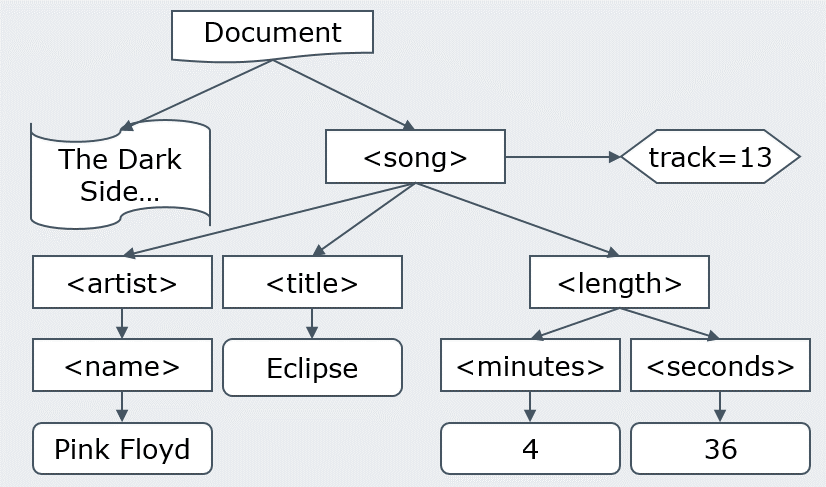
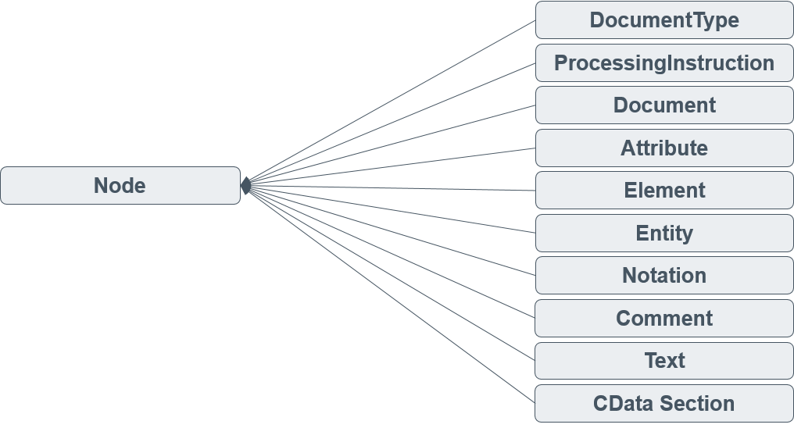
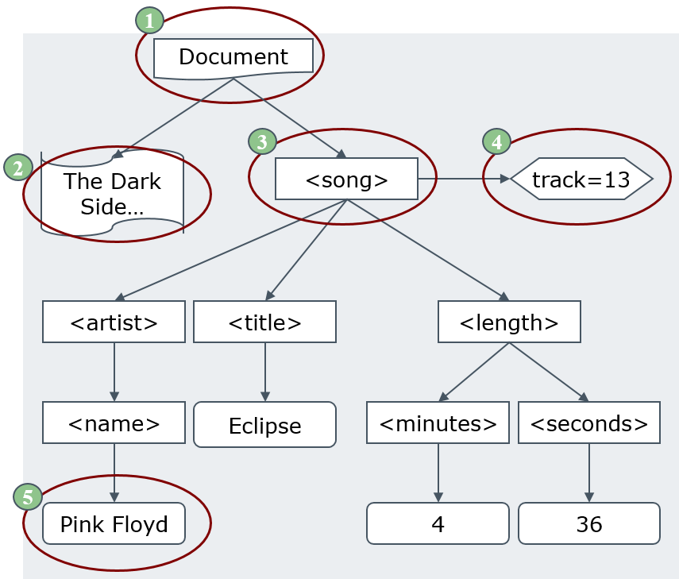
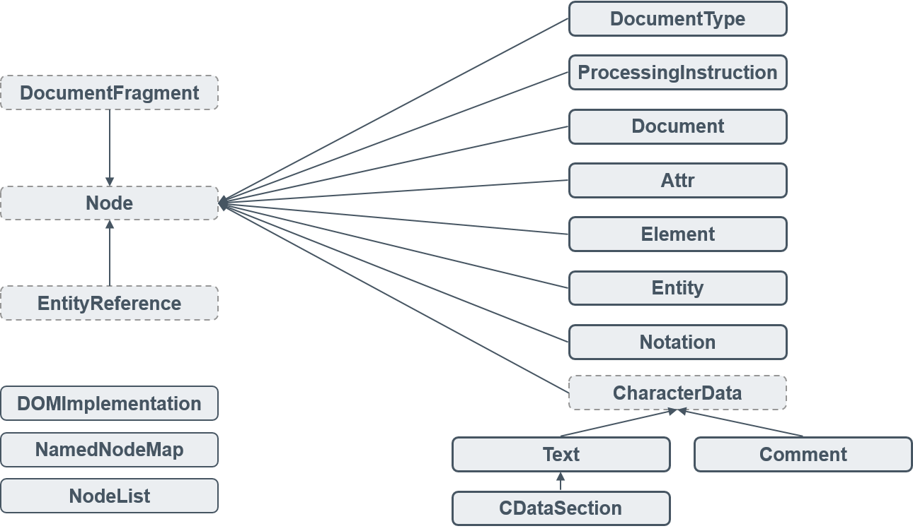
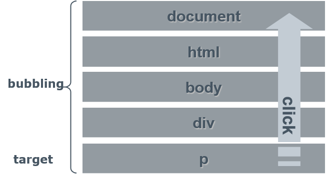
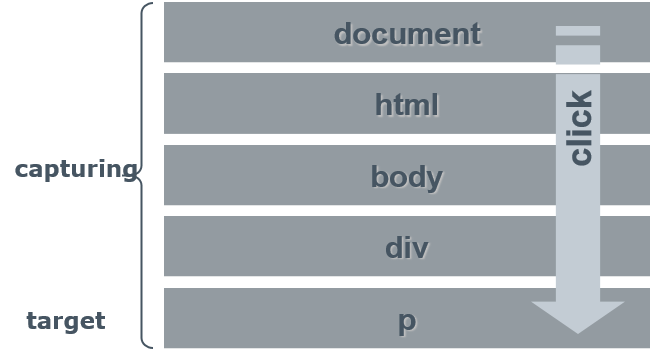
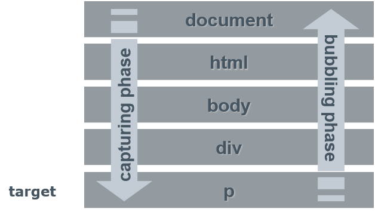

<!----------------- BEGIN SLIDE 001 -------------------------->
> 001


#  Document Object Model (DOM)   

***XML, HTML, CSS and Events***


Giuseppe Della Penna

Università degli Studi di L'Aquila   
giuseppe.dellapenna@univaq.it   
http://people.disim.univaq.it/dellapenna

**Document version: 051025**

> *This document is based on the slides of the Web Engineering course, translated into English and reorganized for a better reading experience. It is not a complete textbook or technical manual, and should be used in conjunction with all other teaching materials in the course. Please report any errors or omissions to the author.*

> This work is licensed under CC BY-NC-SA 4.0. To view a copy of this license, visit https://creativecommons.org/licenses/by-nc-sa/4.0

**Table of Contents**

<!----------------- BEGIN TOC -------------------------->

 - [1. Object Models](#1-object-models)

 - [2. The XML DOM](#2-the-xml-dom)

    - [2.1. How the DOM views XML](#21-how-the-dom-views-xml)

    - [2.2. DOM Objects](#22-dom-objects)

    - [2.3. The Node Object](#23-the-node-object)

    - [2.4. Traversing the tree through Node](#24-traversing-the-tree-through-node)

    - [2.5. Manipulating the tree through Node](#25-manipulating-the-tree-through-node)

    - [2.6. The Document object](#26-the-document-object)

    - [2.7. The Element Object](#27-the-element-object)

    - [2.8. The NodeList and NamedNodeMap objects](#28-the-nodelist-and-namednodemap-objects)

 - [3. DOM HTML](#3-dom-html)

    - [3.1. The HTMLDocument Object](#31-the-htmldocument-object)

    - [3.2. The HTMLElement Object](#32-the-htmlelement-object)

    - [3.3. The HTMLFormElement Object](#33-the-htmlformelement-object)

    - [3.4. The HTMLInputElement Object](#34-the-htmlinputelement-object)

    - [3.5. The HTMLSelectElement and HTMLOptionElement Objects](#35-the-htmlselectelement-and-htmloptionelement-objects)

    - [3.6. The HTMLAnchorElement and HTMLImageElement Objects](#36-the-htmlanchorelement-and-htmlimageelement-objects)

 - [4. DOM HTML: CSS](#4-dom-html-css)

    - [4.1. The CSSStyleSheet Object](#41-the-cssstylesheet-object)

    - [4.2. The CSSRule and CSSStyleRule Objects](#42-the-cssrule-and-cssstylerule-objects)

    - [4.3. The CSSStyleDeclaration Objects](#43-the-cssstyledeclaration-objects)

    - [4.4. Accessing the style of an element](#44-accessing-the-style-of-an-element)

    - [4.5. The CSS2Properties Interface](#45-the-css2properties-interface)

 - [5. DOM HTML: Events](#5-dom-html-events)

    - [5.1. The DOM Event Model](#51-the-dom-event-model)

    - [5.2. Event Bubbling](#52-event-bubbling)

    - [5.3. Event Capturing](#53-event-capturing)

    - [5.4. Event Propagation](#54-event-propagation)

    - [5.5. Event Handlers](#55-event-handlers)

    - [5.6. Event Structure](#56-event-structure)

 - [6. Further reading](#6-further-reading)

    - [6.1. DOM Compatibility](#61-dom-compatibility)

    - [6.2. References](#62-references)


<!------------------- END TOC -------------------------->

<!------------------- END SLIDE 001 -------------------------->

<!----------------- BEGIN SLIDE 002 -------------------------->
> 002

## 1. Object Models

An **object model** defines: 

- The **objects** used to represent and manipulate a particular type of information. 

- The **interfaces** used to interact with these objects. 

- The **semantics** of these objects and interfaces. 

- The **relationships** and interactions between these objects. 

In our case, the object model is applied to the structure of XML documents. 

<!------------------- END SLIDE 002 -------------------------->

<!----------------- BEGIN SLIDE 003 -------------------------->
> 003

## 2. The XML DOM


*The base DOM*

<!------------------- END SLIDE 003 -------------------------->

<!----------------- BEGIN SLIDE 004 -------------------------->
> 004


The XML Document Object Model (DOM) is a generic object model applicable to all the documents written in an XML-based language. 

The XML DOM: 

- Provides a representation of XML documents compatible with many popular programming languages. 

- Encapsulates every characteristic feature of XML (elements, attributes, comments, ...) in a specific object, which provides a manipulation interface. 

- Allows to manipulate the document structure in an object-oriented manner. 

<!------------------- END SLIDE 004 -------------------------->

<!----------------- BEGIN SLIDE 005 -------------------------->
> 005


There are various versions of the DOM, structured into *levels*: 

- **Level 1**: Basic DOM, defines the main interfaces that contain methods and attributes of common use. 

- **Level 2**: Modifies some methods of level 1, and adds support for *namespaces* and node *cloning*. 

- **Level 3**: Introduces new methods and interfaces for faster *navigation* in the document, to support node *types* and for *serialization*. 

<!------------------- END SLIDE 005 -------------------------->

<!----------------- BEGIN SLIDE 006 -------------------------->
> 006

### 2.1. How the DOM views XML


**The DOM represents the document as a tree structure**. 

Actually, the structure is a "forest" since it can also contain multiple distinct trees. 

The DOM defines only a logical view on the data: it does not specify how it will be actually stored in memory. 

However, users accessing the document via the DOM interface, will actually "see" it as a tree. 

<!------------------- END SLIDE 006 -------------------------->

<!----------------- BEGIN SLIDE 007 -------------------------->
> 007

####  Example

The following XML document

```xml
<!-- The Dark Side of The Moon, 
 track 13 -->    
<song track="13">    
 <artist>  
  <name>Pink Floyd</name>     
 </artist>  
 <title>Eclipse</title>      
 <length>  
  <minutes>4</minutes>  
  <seconds>36</seconds>    
 </length>  
</song>  
```

corresponds to this document tree



<!------------------- END SLIDE 007 -------------------------->

<!----------------- BEGIN SLIDE 008 -------------------------->
> 008

####  Elements of the DOM tree


The tree is composed of generic **nodes**, each of which has a more specific classification, depending on its function within the document.



<!------------------- END SLIDE 008 -------------------------->

<!----------------- BEGIN SLIDE 009 -------------------------->
> 009

####  Example of DOM tree



<!----------------- COLUMN 001  -------------------------->


Node **types**:
- (1) *Document* node.
- (2) *Comment* node.
- (3) *Element* node.
- (4) *Attribute* node.
- (5) *Text* node.

Node **relationships**:
- (2,3) are *children* of (1)
- (1) is the *parent* of (2,3)
- (3) is a *sibling* of (2)
- (4) is an *attribute* of (3) (special extra-tree relation)

<!------------------- END SLIDE 009 -------------------------->

<!----------------- BEGIN SLIDE 010 -------------------------->
> 010

### 2.2. DOM Objects



<!------------------- END SLIDE 010 -------------------------->

<!----------------- BEGIN SLIDE 011 -------------------------->
> 011

### 2.3. The Node Object


DOM nodes are represented by objects of class **Node**. 

- Nodes of type Element and Document can have zero or more child nodes. 

- Each node, except the Document, has a parent node. 

The Node interface includes basic operations that apply to any node (regardless of its specific type). 

Each node also implements some derived interfaces, which include more specific operations for their actual type. 

*Note: As the DOM is constantly evolving, the specification provided here is simplified and written using a generic IDL. Please refer to the official specification (see references at the end of this document) for complete and updated interfaces*.    

<!------------------- END SLIDE 011 -------------------------->

<!----------------- BEGIN SLIDE 012 -------------------------->
> 012

####  Interface


```java
interface Node {   
 const unsigned short ELEMENT_NODE = 1;    
 //… other constants: see below       
 readonly attribute DOMString nodeName;        
 attribute DOMString nodeValue;      
 attribute DOMString textcontent; //L3      
 readonly attribute unsigned short nodeType;        
 readonly attribute Node parentNode;        
 readonly attribute NodeList childNodes;        
 readonly attribute Node firstChild;        
 readonly attribute Node lastChild;        
 readonly attribute Node previousSibling;        
 readonly attribute Node nextSibling;        
 readonly attribute NamedNodeMap attributes;        
 readonly attribute Document ownerDocument;        
 Node insertBefore(in Node newChild,in Node refChild);            
 Node replaceChild(in Node newChild, in Node oldChild);            
 Node removeChild(in Node oldChild);        
 Node appendChild(in Node newChild);        
 boolean hasAttributes(); // L 2    
 boolean hasChildNodes();    
};
```

<!----------------- COLUMN 001  -------------------------->

The attribute *nodeType* allows to identify the specific type of node through a series of constants defined in the *Node* interface : 

- `ELEMENT_NODE`: the node is an **element** 

- `ATTRIBUTE_NODE`: the node is an **attribute** 

- `TEXT_NODE`: the node is **text** 

- `CDATA_SECTION_NODE`: the node is a **CDATA** section 

- `ENTITY_REFERENCE_NODE`: the node is an **entity reference** 

- `ENTITY_NODE`: the node is an **entity** 

- `PROCESSING_INSTRUCTION_NODE`: the node is a **PI** 

- `COMMENT_NODE`: the node is a **comment** 

- `DOCUMENT_NODE`: the node is a **document** (not the root!) 

- `DOCUMENT_TYPE_NODE`: the node is a **DOCTYPE** declaration

- `DOCUMENT_FRAGMENT_NODE`: the node is a **document** **fragment** 

- `NOTATION_NODE`: the node is a **NOTATION** 

<!------------------- END SLIDE 012 -------------------------->

<!----------------- BEGIN SLIDE 013 -------------------------->
> 013

####  nodeName and nodeValue


|**Node type**  |**nodeName** |**nodeValue**
|---|---|---|
|**Element**|Tag name  |null|
|**Attr**|Attribute name  |Attribute value  |
|**Text**|"#text"|Associated text |
|**CDATASection**|"#cdata-section"|Associated text |
|**EntityReference**|Entity name  |null|
|**Entity**|Entity name  |null|
|**ProcessingInstruction**|Target attribute value   |Content xcept target   |
|**Comment**|"#comment"|Associated text |
|**Document**|"#document"|null|
|**DocumentType**|Name of the document type      |null|
|**DocumentFragment**|"#document-fragment"|null|
|**Notation**|Name of the NOTATION   |null|


<!------------------- END SLIDE 013 -------------------------->

<!----------------- BEGIN SLIDE 014 -------------------------->
> 014

### 2.4. Traversing the tree through Node


The Node interface provides several attributes to traverse the DOM tree : 

- `ownerDocument` returns the Document that contains the current node. 

- `firstChild`  and `lastChild` return the first and the last child node of the current node. 

- `parentNode` returns the parent of current node. 

- `previousSibling` and `nextSibling` return the previous and next sibling (relative to their parent) of the current node. 

- `childNodes` returns the list of children of the current node (a NodeList, see below).   

- `attributes` returns the list of attributes of the current node (a NamedNodeMap).   

   - The objects returned by `childNodes` and `attributes` usually have also an array-like interface. 

<!------------------- END SLIDE 014 -------------------------->

<!----------------- BEGIN SLIDE 015 -------------------------->
> 015

### 2.5. Manipulating the tree through Node


The *Node* interface has also some methods which allow to manipulate its children: 

- `appendChild(n)`:  append a node *n* to the list of children of the current node 

- `removeChild(n)`:  removes a node from the list of children of the current node. 

- `replaceChild(n, o)`:  replaces a child node *o* with a new node *n*. 

- `insertBefore(n, r)`:  inserts a node *n* in the list of children, placing it before a particular child *r*. 

- There is also the `textContent`  attribute that, if assigned to a string, replaces the children of the current node with a single text node containing the string itself. This attribute is also available for reading. 

The applicability of these methods depends on the actual type of the node. If the operation is not available (e.g., `appendChild` on a *Text* node), a *DOMException* is raised. 

<!------------------- END SLIDE 015 -------------------------->

<!----------------- BEGIN SLIDE 016 -------------------------->
> 016

### 2.6. The Document object


The **Document** object is a special Node that represents the entire XML document. 

Generally, when an XML document is loaded in memory, the corresponding Document object is created and returned. 

The Document children are the document root element and all the comments and processing instruction that precede and follow it. 

The attribute `documentElement` points directly to the root element of the XML document. 

All the nodes to be included in the document should be created by its `CreateX()` methods 

<!------------------- END SLIDE 016 -------------------------->

<!----------------- BEGIN SLIDE 017 -------------------------->
> 017

####  Interface


```java
interface Document : Node {     
 readonly attribute DocumentType doctype;        
 readonly attribute DOMImplementation implementation;        
 readonly attribute Element documentElement;        

 Element createElement(in DOMString tagName);  DocumentFragment createDocumentFragment();            
 Text createTextNode(in DOMString data);    
 Comment createComment(in DOMString data);      
 CDATASection createCDATASection(in DOMString data);      
 ProcessingInstruction createProcessingInstruction(in DOMString target, in DOMString data);        
 Attr createAttribute(in DOMString name);        
 EntityReference createEntityReference(in DOMString name);        
 NodeList getElementsByTagName(in DOMString tagname);        
 Element getElementById(in DOMString elementId); //L2        
}
```

<!----------------- COLUMN 001  -------------------------->

*Document* inherits from Node all the traversal an manipulation functionalities. 

The `getElementById` method returns the only element present in the document that has the given value in its attribute of ID type. 

The `getElementsByTagName` method will be illustrated in the Element object. 

<!------------------- END SLIDE 017 -------------------------->

<!----------------- BEGIN SLIDE 018 -------------------------->
> 018

####  Examples


```javascript
var e,r;    
/*1*/r = document.createElement("Radice");    

/*2*/document.appendChild(radice);    

/*3*/for(i=1; i<10; i++)
 radice.appendChild(  
  document.createElement("nodo"+i));    

/*4*/e = radice.firstChild.nextSibling;  

radice.insertBefore( 
 /*5*/document.createComment("Nodo 2"),e);    

/*6*/e.appendChild(document.createTextNode("Due"));    

/*7*/e.textContent = "Due - bis";    

radice.appendChild( 
 /*8*/document.createProcessingInstruction("php", "echo('pippo');"));     
```

<!----------------- COLUMN 001  -------------------------->

The DOM interfaces are in the **org.w3c.dom** package 

(1) creates an element using `createElement`  and passing the node name as parameter.  

(2) creates the document root by appending an element with `appendChild` directly to the Document. 

(3) puts a set of child nodes in the root. 

(4) gets the first sibling of the first child of the root (i.e., the second child of the root). 

(5) creates a comment with `createComment` and inserts it before the node retrieved.  

(6) creates a text fragment and appends it to the contents of the element retrieved in step 4. 

(7) sets directly the text content of the node (removing all of its contents - only available in DOM Level 3). 

(8) creates a PI with target "php" and content "echo('pippo');" and appends it to the document root.      

<!------------------- END SLIDE 018 -------------------------->

<!----------------- BEGIN SLIDE 019 -------------------------->
> 019

The following code fragment

```javascript
var e,r;    
r = document.createElement("Radice");    

document.appendChild(radice);   
 
for(i=1; i<10; i++)
 radice.appendChild(  
  document.createElement("nodo"+i));    

e = radice.firstChild.nextSibling;  

radice.insertBefore( 
 document.createComment("Nodo 2"),e);    

e.appendChild(document.createTextNode ("Due"));   

e.textContent = "Due - bis";   

radice.appendChild( 
 document.createProcessingInstruction(  
 "php", "echo('pippò);"));    
```

<!----------------- COLUMN 002  -------------------------->

Creates the XML structure below:

```xml
<Radice>  
 <nodo1/>
 <!--Nodo 2-->  
 <nodo2>Due - bis</nodo2>  
 <nodo3/>
 <nodo4/>
 <nodo5/>
 <nodo6/>
 <nodo7/>
 <nodo8/>
 <nodo9/><?php echo('pippò);?>    
</Radice>  
```

<!------------------- END SLIDE 019 -------------------------->

<!----------------- BEGIN SLIDE 020 -------------------------->
> 020

### 2.7. The Element Object

```java
interface Element : Node {     
 readonly attribute DOMString tagName;        

 DOMString getAttribute(in DOMString name);        

 void setAttribute(in DOMString name, in DOMString value);            

 void removeAttribute(in DOMString name);        

 Attr getAttributeNode(in DOMString name);        
 Attr setAttributeNode(in Attr newAttr);        
 Attr removeAttributeNode(in Attr oldAttr);        

 NodeList getElementsByTagName(in DOMString name);        

 void normalize();    
}
```

<!----------------- COLUMN 001  -------------------------->

**Element** objects represent nodes of type element. 

The *Element* interface inherits all the traversal and manipulation functionalities from the Node interface, and adds attributes and methods for manipulating attributes. 

- `getAttribute(s)`:  returns the value of attribute *s*. 

- `setAttribute(s, v)`:  creates the attribute *s* and sets its value to *v*, or updates the value of *s* if it already exists. 

- `removeAttribute(s)`:  removes the attribute *s*. 

The `tagName` attribute returns the name of the element tag.

The `getElementsByTagName` method returns the children of the current element which have a specific (tag) name (i.e., filters `childNodes`).  

The `normalize` method is used to merge adjacent *Text* nodes in the subtree controlled by the element. 

<!------------------- END SLIDE 020 -------------------------->

<!----------------- BEGIN SLIDE 021 -------------------------->
> 021

####  NodeSelector interface


```java
interface NodeSelector {   
  Element querySelector(DOMString selectors);    
  NodeList querySelectorAll(DOMString selectors);      
}
```

<!----------------- COLUMN 001  -------------------------->

The *NodeSelector* interface is implemented by the *Document* and *Element* objects and allows you to select descendant nodes using CSS3 selectors.

The two methods accept CSS selectors (also composite) and return, in the case of `querySelector`, the first element that matches the selector among the descendants of the object to which it is applied, while in the case of `querySelectorAll` a *NodeList* with all matches is returned.

*This is a relatively new feature, but it is now supported by all modern browsers (see https://developer.mozilla.org/en-US/docs/Web/API/Document_object_model/Locating_DOM_elements_using_selectors). Previously, the same thing was only possible using helper libraries such as JQuery*. 

<!------------------- END SLIDE 021 -------------------------->

<!----------------- BEGIN SLIDE 022 -------------------------->
> 022

####  Examples


```javascript
var e,r;    

/*1*/
r = document.createElement("Radice");    
 document.appendChild(radice);    
 
for(i=1; i<10; i++)
 radice.appendChild(  
  document.createElement("nodo" + i));    

e = radice.firstChild.nextSibling;  

/*2*/e.setAttribute ("a1","v1");  

/*3*/var list =   
 radice.getElementsByTagName ("nodo5");  

for(i=0; i<list.length(); i++)   
 /*4*/(list.item(i)).setAttributeNS ("prfx","attr", "val");          

/*5*/var e2 =   
 radice.querySelector(".pippo, .pluto");      

/*6*/var list2 =   
 radice.querySelectorAll("nodo5");  
```

<!----------------- COLUMN 001  -------------------------->

The DOM interfaces are in the **org.w3c.dom** package 

(1) `createElement` returns a new *Element* object. 

(2) `setAttribute`  is an easy way to create an attribute. 

(3) get all the children of the root element that are named "nodo5".    

(5) `querySelector` returns the first element with class "pippo" or "pluto" among the root descendants.       

(6) with this  `querySelectorAll` we get the same result as in step 4.


<!------------------- END SLIDE 022 -------------------------->

<!----------------- BEGIN SLIDE 023 -------------------------->
> 023

The following code fragment

```javascript
var e,r;    

r = document.createElement("Radice");    
document.appendChild(radice);   
 
for(i=1; i<10; i++)
radice.appendChild( 
document.createElement("nodo" + i));   

e = radice.firstChild.nextSibling;  

e.setAttribute ("a1","v1"); 

var list = 
radice.getElementsByTagName("nodo5"); 

for(i=0; i<list.length(); i++)   
(list.item(i)).setAttributeNS ("prfx","attr", "val");          
```

<!----------------- COLUMN 001  -------------------------->

Creates the XML structure below:

```xml
<Radice>  
 <nodo1/>
 <nodo2 a1="v1"/>
 <nodo3/>
 <nodo4/>
 <nodo5 xmlns:N="prfx" N:attr="val"/>    
 <nodo6/>
 <nodo7/>
 <nodo8/>
 <nodo9/>
</Radice>  
```

<!------------------- END SLIDE 023 -------------------------->

<!----------------- BEGIN SLIDE 024 -------------------------->
> 024

### 2.8. The NodeList and NamedNodeMap objects


```java
interface NodeList {   
 Node item(in unsigned long index);      
 readonly attribute unsigned long length;        
}

interface NamedNodeMap {   
 Node getNamedItem(in DOMString name);        
 Node setNamedItem(in Node arg) raises(DOMException);            
 Node removeNamedItem(in DOMString name) raises(DOMException);            
 Node item(in unsigned long index);      
 readonly attribute unsigned long length;        
}

list = radice.childNodes;  
if (list.item(8) != null)  radice.insertBefore(    
 document.createComment("otto"),list.item(8));      
f = document.createElement ("Qwerty");  
f.setAttribute ("a", "v"); 
nmp = f.attributes;   
nmp.getNamedItem("a").value 
```

<!----------------- COLUMN 001  -------------------------->

Various DOM methods return lists. 

The **NodeList** object allows to manage an ordered list of nodes. 

- The `length` attribute returns the length of the list. 

- The `item(i)` method returns the i-th node in the list.   

The **NamedNodeMap** object contains nodes which can be accessed through an index (as in  *NodeList*),  as well as through their name (i.e., their `nodeName`  attribute). 

<!------------------- END SLIDE 024 -------------------------->

<!----------------- BEGIN SLIDE 025 -------------------------->
> 025

## 3. DOM HTML

*The web page DOM*

<!------------------- END SLIDE 025 -------------------------->

<!----------------- BEGIN SLIDE 026 -------------------------->
> 026

The DOM seen so far provides methods for accessing and manipulating generic documents based on the XML meta language. 

For XML-based languages ​​such as XHTML, the W3C has defined also a specific DOM, derived from the XML one. 

HTML(5) also uses the same DOM, in this case "virtually forcing" a more "rigid" view of the markup (e.g. closing all elements).  

This HTML DOM provides all the classes and properties seen so far, but defines also some derived interfaces used to quickly perform the most common operations on the web pages structure:    

- A Document-derived class that provides a richer interface for accessing the HTML document   

- A number of Element-derived classes provide direct access to the most common properties of the corresponding HTML elements    

- However, the DOM is constantly evolving: see the "living standard" at https://dom.spec.whatwg.org 

<!------------------- END SLIDE 026 -------------------------->

<!----------------- BEGIN SLIDE 027 -------------------------->
> 027

The DOM Level 2 has also introduced several new features specific to the XHTML DOM: 

- Some new classes model the cascading style sheets and their application to XHTML elements. 

- An event model allows building dynamic web pages, by capturing and managing events such as user clicks. 

<!------------------- END SLIDE 027 -------------------------->

<!----------------- BEGIN SLIDE 028 -------------------------->
> 028

### 3.1. The HTMLDocument Object


```java
interface HTMLDocument : Document {     
 attribute DOMString title;      
 readonly attribute DOMString referrer;        
 readonly attribute DOMString domain;      
 readonly attribute DOMString URL;      
 attribute HTMLElement body;    
 readonly attribute HTMLCollection images;      
 readonly attribute HTMLCollection applets;      
 readonly attribute HTMLCollection links;        
 readonly attribute HTMLCollection forms;        
 readonly attribute HTMLCollection anchors;        
 attribute DOMString cookie;    
 void open();  
 void close();    
 void write(in DOMString text);      
 void writeln(in DOMString text);      
 NodeList getElementsByName(in DOMString elementName);        
 NodeList getElementsByClassName(in DOMString names);        
}

interface HTMLCollection {    
 readonly attribute unsigned long length;         
 Node item(in unsigned long index);       
 Node namedItem(in DOMString name);         
}
```

<!----------------- COLUMN 001  -------------------------->

**HTMLDocument** objects provide access to the entire DOM document using the functions inherited from the Document objects

In addition, some new attributes are present to quickly access: 

- The \<body\> Element (`body`)

- All the \ items   (`images`)

- All the \<applet\> elements (`applets`)

- All the \<a\> elements with href   (`links`)

- All the \<form\> elements (`forms`)

- All the \<a\> elements with name (`anchors`)

The lists are returned as HTMLCollection objects.   

It is also possible to read the uri of the document   (`URL`) and any cookies associated with it (`cookie`)

The `open` method opens the document as a stream for writing. Its current contents are deleted. 

The `write` and `writeln` methods allow to write in the document after a call to `open`. In many cases, the first call to one of these functions determines an implicit `open`. 

There are also (in latest browsers)  **methods for selecting items based on advanced criteria** such as 

- The value of the *name* attribute (`getElementsByName`)

- One or more classes assigned to them (`getElementsByClassName`)

<!------------------- END SLIDE 028 -------------------------->

<!----------------- BEGIN SLIDE 029 -------------------------->
> 029

### 3.2. The HTMLElement Object


```java
interface HTMLElement : Element {     
 attribute DOMString id;    
 attribute DOMString title;      
 attribute DOMString lang;      
 attribute DOMString dir;    
 attribute DOMString className;      

 //The following attributes are NOT PART  OF THE L2 DOM INTERFACE, BUT THEY ARE DE FACTO STANDARDS   
 readonly attribute HTMLElement offsetParent;        
 readonly attribute long offsetTop;      
 readonly attribute long offsetLeft;      
 readonly attribute long offsetHeight;      
 readonly attribute long offsetWidth;      

 //Elements available in most modern browsers 
 readonly attribute DOMTokenList classList;        
  void remove();    
 attribute DOMString innerHTML;      
 NodeList getElementsByName(in DOMString elementName);        
 NodeList getElementsByClassName(in DOMString names);        
}
```

<!----------------- COLUMN 001  -------------------------->

In general, the interfaces connected to particular HTML elements have **attributes corresponding to the characteristic attributes of the element itself**. 

- The HTMLElement interface exposes the attributes common to all the HTML elements, i.e., id and class (here called className)     

The current HTML DOM **does not have functions or attributes that return the size or the position of the elements**. 

- For elements positioned with CSS, it is often possible to read such values through the properties left, top, width, and height. 

- In general, the DOM implemented in various programming languages  provides a series of semi-standard attributes `offsetX`,  where X can be Top, Left, Width, Height. 

- The size and position of an element are always relative to its container, indicated by `offsetParent`.  

**In DOM implemented by modern browsers**, other helpers are available, such as 

- `classList` returns a list of the classes that are included in the  *class* attribute. This list can be manipulated using the `add`, `remove`, and `toggle` methods to add or remove individual classes. 

- `remove` removes the element from the DOM (without having to go through the parent node as in the base DOM)  

- `innerHTML` allows you to directly manipulate (read and write) the HTML structure contained in the element. In particular, it allows you to create subtrees without having to go through createElement, appendChild, etc.      

- The `getElementsByName` and `getElementsByClassName` methods, with the same semantics as those found in Document, but with a scope limited to the descendants of the element to which they are applied.

<!------------------- END SLIDE 029 -------------------------->

<!----------------- BEGIN SLIDE 030 -------------------------->
> 030

### 3.3. The HTMLFormElement Object


```java
interface HTMLFormElement : HTMLElement {     
 readonly attribute HTMLCollection elements;        
 readonly attribute long length;      
 attribute DOMString name;      
 attribute DOMString acceptCharset;      
 attribute DOMString action;      
 attribute DOMString enctype;      
 attribute DOMString method;      
 attribute DOMString target;    
 void submit();    
 void reset();  
}
```
<!----------------- COLUMN 001  -------------------------->

The HTMLFormElement class has attributes for all the \<form\> element attributes  

The `elements` attribute gives access to the collection of form fields, whose number is indicated by `length` 

The `submit` and `reset` methods have the same function as the corresponding buttons on the form.

<!------------------- END SLIDE 030 -------------------------->

<!----------------- BEGIN SLIDE 031 -------------------------->
> 031

### 3.4. The HTMLInputElement Object

```java
interface HTMLInputElement : HTMLElement {     
 attribute DOMString defaultValue;      
 attribute boolean defaultChecked;      
 readonly attribute HTMLFormElement form;        
 attribute DOMString accept;      
 attribute DOMString accessKey;      
 attribute DOMString align;      
 attribute DOMString alt;    
 attribute boolean checked;      
 attribute boolean disabled;      
 attribute long maxLength;    
 attribute DOMString name;      
 attribute boolean readOnly;      
 attribute unsigned long size;      
 attribute DOMString src;      
 attribute long tabIndex;    
 attribute DOMString type;      
 attribute DOMString useMap;      
 attribute DOMString value;      
 void blur();    
 void focus();  
 void select();    
 void click();  
};
```

<!----------------- COLUMN 001  -------------------------->

The HTMLInputElement object corresponds to \<input\> fields  

Many attributes are present, due to the multiple uses of \<input\>. However, only those allowed by the current `type` can be read and set 

The `select` method selects the text in the input field

The `click` method simulates a mouse click on the input field (of type button)

<!------------------- END SLIDE 031 -------------------------->

<!----------------- BEGIN SLIDE 032 -------------------------->
> 032

### 3.5. The HTMLSelectElement and HTMLOptionElement Objects


```java
interface HTMLSelectElement : HTMLElement {     
 readonly attribute DOMString type;        
 attribute long selectedIndex;    
 attribute DOMString value;      
 attribute unsigned long length;      
 readonly attribute HTMLFormElement form;        
 readonly attribute HTMLOptionsCollection options;        
 attribute boolean disabled;      
 attribute boolean multiple;    
 attribute DOMString name;      
 attribute long size;    
 attribute long tabIndex;    
 void add(in HTMLElement element, in HTMLElement before)            
 void remove(in long index);      
 void blur();    
 void focus();  
}
interface HTMLOptionElement : HTMLElement {     
 readonly attribute HTMLFormElement form;        
 attribute boolean defaultSelected;      
 readonly attribute DOMString text;      
 readonly attribute long index;      
 attribute boolean disabled;      
 attribute DOMString label;      
 attribute boolean selected;    
 attribute DOMString value;      
}
```

<!----------------- COLUMN 001  -------------------------->

The HTMLSelectElement object corresponds to \<select\> controls  

As any field in a form, this class has a reference to the container HTMLFormElement 

The `options` collection contains all the nested HTMLOptionElement objects corresponding to \<option\> elements. The number of options is indicated by   `length` 

The `selectedIndex` attribute gives the index of the currently selected `options` item (-1 in case of no selection), while `value` contains a copy of the `value` for the selected option. 

The `add` method adds a HTMLOptionElement to the list at the specified location, and   `remove` allows to remove it. 

The `blur` and `focus` methods are used to control the field focus. 

The HTMLOptionElement object we may note the the     `index` attribute, which indicates the position of the option in the list, and the `selected` attribute, which determines its selection state.

<!------------------- END SLIDE 032 -------------------------->

<!----------------- BEGIN SLIDE 033 -------------------------->
> 033

### 3.6. The HTMLAnchorElement and HTMLImageElement Objects


```java
interface HTMLAnchorElement : HTMLElement {     
 attribute DOMString accessKey;      
 attribute DOMString charset;      
 attribute DOMString coords;      
 attribute DOMString href;      
 attribute DOMString hreflang;      
 attribute DOMString name;      
 attribute DOMString rel;      
 attribute DOMString rev;      
 attribute DOMString shape;      
 attribute long tabIndex;    
 attribute DOMString target;    
 attribute DOMString type;      
 void blur();    
 void focus();  
};

interface HTMLImageElement : HTMLElement {     
 attribute DOMString name;      
 attribute DOMString align;      
 attribute DOMString alt;    
 attribute DOMString border;      
 attribute long height;    
 attribute long hspace;    
 attribute boolean isMap;      
 attribute DOMString longDesc;      
 attribute DOMString src;      
 attribute DOMString useMap;      
 attribute long vspace;    
 attribute long width;    
};
```

<!----------------- COLUMN 001  -------------------------->

Other examples of objects representing HTML elements: HTMLAnchorElement (\<a\>) and HTMLImageElement (\).       

The attributes of the interface correspond to those of the element. 

Objects corresponding to "interactive" elements, such as links, always have the `focus` and `blur` methods. 

<!------------------- END SLIDE 033 -------------------------->

<!----------------- BEGIN SLIDE 034 -------------------------->
> 034

## 4. DOM HTML: CSS


*The DOM interface to style sheets*    

<!------------------- END SLIDE 034 -------------------------->

<!----------------- BEGIN SLIDE 035 -------------------------->
> 035

For manipulating CSS styles applied to documents (HTML), the Level 2 DOM defines a series of new classes:   

- Classes for representing style sheets  *(CSSStyleSheet)*   

- Classes for the representation of the CSS rules  *(CSSStyleRule)*   

- Classes for representing specific style properties *(CSSStyleDeclaration)*.   

You can access the calculated style for an element or the style declared in the element itself.

<!------------------- END SLIDE 035 -------------------------->

<!----------------- BEGIN SLIDE 036 -------------------------->
> 036

### 4.1. The CSSStyleSheet Object

```java
interface CSSStyleSheet : stylesheets::StyleSheet {       
 readonly attribute CSSRule ownerRule;        
 readonly attribute CSSRuleList cssRules;        
 
 unsigned long insertRule(in DOMString rule, in unsigned long index)            
 
 void deleteRule(in unsigned long index);        
};
```

<!----------------- COLUMN 001  -------------------------->

The *CSSStyleSheet* interface allows to interact with the style sheets embedded in a document. 

The interface allows to insert, modify and delete **style rules** from a CSS document. 

It is usually used only to create **dynamic stylesheets**. For the dynamic HTML it is preferable to manipulate the style applied to the elements rather than the rules that generate it.   

<!------------------- END SLIDE 036 -------------------------->

<!----------------- BEGIN SLIDE 037 -------------------------->
> 037

### 4.2. The CSSRule and CSSStyleRule Objects

```java
interface CSSRule {   
 const unsigned short UNKNOWN_RULE = 0;    
 const unsigned short STYLE_RULE = 1;    
 const unsigned short CHARSET_RULE = 2;    
 const unsigned short IMPORT_RULE = 3;    
 const unsigned short MEDIA_RULE = 4;    
 const unsigned short FONT_FACE_RULE = 5;    
 const unsigned short PAGE_RULE = 6;    

 readonly attribute unsigned short type;        
 attribute DOMString cssText;      
 readonly attribute CSSStyleSheet parentStyleSheet;        
 readonly attribute CSSRule parentRule;        
};


interface CSSStyleRule : CSSRule {     
 attribute DOMString selectorText;      
 readonly attribute CSSStyleDeclaration style;      
};
```

<!----------------- COLUMN 001  -------------------------->

The *CSSRule* interface represents a generic CSS rule , as indicated by the `type` attribute. 

- The most interesting rules are those of type STYLE\_RULE, represented by the derived class CSSStyleRule.   

Each *CSSStyleRule* represents a single CSS style rule. 

- A *CSSStyleRule* consists of a string, that contains the rule selector, and a list of style attributes, set in a *CSSStyleDeclaration*.  

<!------------------- END SLIDE 037 -------------------------->

<!----------------- BEGIN SLIDE 038 -------------------------->
> 038

### 4.3. The CSSStyleDeclaration Objects

```java
interface CSSStyleDeclaration {   
 attribute DOMString cssText;      

 DOMString getPropertyValue(in DOMString propertyName);        
 CSSValue getPropertyCSSValue(in DOMString propertyName);        
 DOMString removeProperty(in DOMString propertyName);        
 DOMString getPropertyPriority(in DOMString propertyName);        
 void setProperty(in DOMString propertyName, in DOMString value, in DOMString priority);                

 readonly attribute unsigned long length;        
 DOMString item(in unsigned long index);      
 readonly attribute CSSRule parentRule;        
};
```

<!----------------- COLUMN 001  -------------------------->

A *CSSStyleDeclaration* represents a set of settings for the style attributes 

The `item` method is used to read the text corresponding to each setting (`length` is the total number of settings) 

It is possible to read the value and the priority assigned to a particular attribute using the methods `getPropertyValue`  and `getPropertyPriority` 

It is also possible to set or reset the value and the priority of a particular attribute through the `setProperty` method ,or delete the setting of an attribute with `removeProperty`.  

<!------------------- END SLIDE 038 -------------------------->

<!----------------- BEGIN SLIDE 039 -------------------------->
> 039

### 4.4. Accessing the style of an element


```java
interface ViewCSS : views::AbstractView {       
 CSSStyleDeclaration getComputedStyle(    
  in Element elt, in DOMString pseudoElt);        
};

interface ElementCSSInlineStyle {   
 readonly attribute CSSStyleDeclaration style;      
};
```

<!----------------- COLUMN 001  -------------------------->

The *ViewCSS* interface allows to read the *calculated* style of an element (which is **read-only**). In JavaScript, this interface is implemented by the *window* object. 

The *ElementCSSInlineStyle* interface allows to **read and edit** style rules included in the *style* of an element. The HTMLElement class implements this interface in browsers that support the DOM Level 2.  

<!------------------- END SLIDE 039 -------------------------->

<!----------------- BEGIN SLIDE 040 -------------------------->
> 040

### 4.5. The CSS2Properties Interface

```java
interface CSS2Properties { 
 attribute DOMString background; attribute DOMString backgroundAttachment; attribute DOMString backgroundColor;                
 attribute DOMString backgroundImage; attribute DOMString backgroundPosition; attribute DOMString backgroundRepeat;                  
 attribute DOMString border; attribute DOMString borderCollapse; attribute DOMString borderColor;                   
 attribute DOMString borderSpacing; attribute DOMString borderStyle; attribute DOMString borderTop;                  
 attribute DOMString borderRight; attribute DOMString borderBottom; attribute DOMString borderLeft;                  
 attribute DOMString borderTopColor; attribute DOMString borderRightColor; attribute DOMString borderBottomColor;                  
 attribute DOMString borderLeftColor; attribute DOMString borderTopStyle; attribute DOMString borderRightStyle;                  
 attribute DOMString borderBottomStyle; attribute DOMString borderLeftStyle; attribute DOMString borderTopWidth;                  
 attribute DOMString borderRightWidth; attribute DOMString borderBottomWidth; attribute DOMString borderLeftWidth;                  
 attribute DOMString borderWidth; attribute DOMString bottom; attribute DOMString clear; attribute DOMString clip;                    
 attribute DOMString color; attribute DOMString content; attribute DOMString counterIncrement;                 
 attribute DOMString counterReset; attribute DOMString cursor; attribute DOMString direction; attribute DOMString display;                      
 attribute DOMString cssFloat; attribute DOMString font; attribute DOMString fontFamily; attribute DOMString fontSize;                      
 attribute DOMString fontSizeAdjust; attribute DOMString fontStretch; attribute DOMString fontStyle;                   
 attribute DOMString fontVariant; attribute DOMString fontWeight; attribute DOMString height; attribute DOMString left;                        
 attribute DOMString letterSpacing; attribute DOMString lineHeight; attribute DOMString listStyle;                   
 attribute DOMString listStyleImage; attribute DOMString listStylePosition; attribute DOMString listStyleType;                   
 attribute DOMString margin; attribute DOMString marginTop; attribute DOMString marginRight;                   
 attribute DOMString marginBottom; attribute DOMString marginLeft; attribute DOMString maxHeight;                   
 attribute DOMString maxWidth; attribute DOMString minHeight; attribute DOMString minWidth; attribute DOMString overflow;                        
 attribute DOMString padding; attribute DOMString paddingTop; attribute DOMString paddingRight;                   
 attribute DOMString paddingBottom; attribute DOMString paddingLeft; attribute DOMString position;                 
 attribute DOMString quotes; attribute DOMString right; attribute DOMString size; attribute DOMString textAlign;                      
 attribute DOMString textDecoration; attribute DOMString textIndent; attribute DOMString textShadow;                  
 attribute DOMString textTransform; attribute DOMString top; attribute DOMString verticalAlign; attribute DOMString visibility;                      
 attribute DOMString width; attribute DOMString wordSpacing; attribute DOMString zIndex;                  
};
```

<!----------------- COLUMN 001  -------------------------->

*CSSProperties* is an optional interface used to quickly access the CSS properties, as an alternative to the `getProperty` and `setProperty` methods of the   *CSSStyleDeclaration* interface. If implemented, **it is usually available from all the objects that implement also the CSSStyleDeclaration interface**.                  

<!------------------- END SLIDE 040 -------------------------->

<!----------------- BEGIN SLIDE 041 -------------------------->
> 041

## 5. DOM HTML: Events

*The DOM interface to the outside world*  

<!------------------- END SLIDE 041 -------------------------->

<!----------------- BEGIN SLIDE 042 -------------------------->
> 042

### 5.1. The DOM Event Model


The DOM event model, available from the level 2, provides the interfaces and semantics of a generic event handling system for HTML documents.

The DOM event model is built from a common subset of the custom event management features originally developed in different browsers, to ensure some interoperability.

<!------------------- END SLIDE 042 -------------------------->

<!----------------- BEGIN SLIDE 043 -------------------------->
> 043

### 5.2. Event Bubbling

Each event has a **target** element, which is the one on which it was generated.

- For example, a click on a text generates a click event on the paragraph that contains that text.

- The target is determined by inspecting the DOM tree, which can sometimes differ from what the user "sees"! 

After activating the corresponding event handler on its target, the event is passed to all the target ancestor elements, in the order given by the DOM hierarchy, until it gets to the Document object. This behavior is called      **event bubbling**.

- As we will see, you can stop bubbling after capturing an event.  

<!------------------- END SLIDE 043 -------------------------->

<!----------------- BEGIN SLIDE 044 -------------------------->
> 044


A click on the text of the paragraph starts a bubbling process which "shows" the event to all the registered handlers for that type of event on the ancestors of the activated \<p\> element. 


<!----------------- COLUMN 001  -------------------------->

```html
<html>
 <body>
  <div>
   <p>Testo</p>  
  </div>
 </body>
</html>
```

<!----------------- COLUMN 002  -------------------------->



<!------------------- END SLIDE 044 -------------------------->

<!----------------- BEGIN SLIDE 045 -------------------------->
> 045

### 5.3. Event Capturing


In *event capturing* events traverse the DOM hierarchy in the opposite direction to the event bubbling.

The event is shown to all the ancestor elements of the target, according to the DOM hierarchy, starting from the document object and ending on the target itself.

Browsers always perform first a *capturing* *phase* and then a *bubbling phase* for each event. Event handlers can be registered to respond to one of these two phases.

<!------------------- END SLIDE 045 -------------------------->

<!----------------- BEGIN SLIDE 046 -------------------------->
> 046


A click on the text of the paragraph activates a capturing process that *first* "shows" the event to all the handlers for that type of event registered *in capture mode* that are among the ancestors of the activated \<p\> element. 

<!----------------- COLUMN 001  -------------------------->

```html
<html>
 <body>
  <div>
   <p>Testo</p>
  </div>
 </body>
</html>
```

<!----------------- COLUMN 002  -------------------------->



<!------------------- END SLIDE 046 -------------------------->

<!----------------- BEGIN SLIDE 047 -------------------------->
> 047

### 5.4. Event Propagation


Each event is propagated first in capturing phase and then in bubbling phase. 

<!----------------- COLUMN 001  -------------------------->

```html
<html>
 <body>
  <div>
   <p>Testo</p>  
  </div>
 </body>
</html>
```

<!----------------- COLUMN 002  -------------------------->



<!------------------- END SLIDE 047 -------------------------->

<!----------------- BEGIN SLIDE 048 -------------------------->
> 048

### 5.5. Event Handlers


```java
interface EventTarget {   
 void addEventListener(in DOMString type, in EventListener listener, in boolean useCapture);                

 void removeEventListener(in DOMString type, in EventListener listener, in boolean useCapture);                

 boolean dispatchEvent(in Event evt);        
};
```

<!----------------- COLUMN 001  -------------------------->

Each element of an HTML document, and the *HTMLDocument* object itself, may declare one or more handlers for certain events.

An *EventListener* is usually represented by a function that takes as input a parameter of type Event.

The `addEventListener` allows to add a *listener* to an element for a particular type of event (*type*), optionally activating the capture mode (*useCapture*)

Is is also possible to delete an existing listener with  `removeEventListener`.

<!------------------- END SLIDE 048 -------------------------->

<!----------------- BEGIN SLIDE 049 -------------------------->
> 049

####  Compatibility


**To maintain compatibility with the event model previously used by some browsers**, *EventTarget* objects also have a set of attributes called "onX", where X is a valid type of event.  

Assigning an *EventListener* (typically a function) to one of these attributes is equivalent to adding it, in bubbling mode, to the event type corresponding to the attribute you set. 

Setting one of these attributes to  *null* only removes the listener that may have been added through the attribute itself.

<!------------------- END SLIDE 049 -------------------------->

<!----------------- BEGIN SLIDE 050 -------------------------->
> 050

### 5.6. Event Structure

```java
interface Event {   
 const unsigned short CAPTURING_PHASE = 1;    
 const unsigned short AT_TARGET  = 2;    
 const unsigned short BUBBLING_PHASE = 3;    

 readonly attribute DOMString type;        
 readonly attribute EventTarget  target;      
 readonly attribute EventTarget  currentTarget;        
 readonly attribute unsigned short eventPhase;        
 readonly attribute boolean bubbles;        
 readonly attribute boolean cancelable;        
 readonly attribute DOMTimeStamp timeStamp;        

 void stopPropagation();    
 void preventDefault();    
};
```

<!----------------- COLUMN 001  -------------------------->

When an *EventListener* is activated, it receives an *Event* object (or a more specific derived class) that describes the event to manage.

The `target` attribute identifies the element on which the event occurred.

The `currentTarget` attribute indicates the element that is currently managing the event (which the listener belongs to)

- During the bubbling phase, the   `target` remains unchanged, while the `currentTarget` is set to the actual element to which the event is passed.

The `stopPropagation` method stops the event bubbling (which occurs when `bubbles` is true)

The `preventDefault` method prevents the browser to execute the default action, if any, associated with the event (if `cancelable` is true).

<!------------------- END SLIDE 050 -------------------------->

<!----------------- BEGIN SLIDE 051 -------------------------->
> 051

####  Mouse Events

```java
interface MouseEvent : UIEvent {     
 readonly attribute long screenX;      
 readonly attribute long screenY;      
 readonly attribute long clientX;      
 readonly attribute long  clientY;      
 readonly attribute boolean ctrlKey;        
 readonly attribute boolean shiftKey;        
 readonly attribute boolean altKey;        
 readonly attribute boolean metaKey;        
 readonly attribute unsigned short  button;        
 readonly attribute EventTarget relatedTarget;        
};
```

<!----------------- COLUMN 001  -------------------------->

The recognized mouse events are the following:

- **mousedown** (pressing a mouse button on an item)

- **mouseup** (releasing a mouse button on an item)

- **click** (pressing and releasing a mouse button on an item)

- **mouseover** (the mouse entered the area of an element: *relatedTarget* indicates the element from which it just exited, if any)

- **mouseout** (the mouse exited the area of an element: *relatedTarget* indicates the element in which it is entered, if any)

- **mousemove** (the mouse moves in over an element).

A mouse event is accompanied by detailed information about the status of the pointer and keyboard at the time of the event:

- `screenX`,  `screenY` report the mouse coordinates relative to the screen.

- `clientX` ,`clientY` report the coordinates of the mouse relative to the browser window.

- `ctrlKey`, `altKey`, `metaKey`,  `shiftKey` indicate which of the corresponding keys on the keyboard were pressed at the time of the event.

- `button` indicates which mouse button was pressed (0 = left, 1 = center, 2 = right).  

<!------------------- END SLIDE 051 -------------------------->

<!----------------- BEGIN SLIDE 052 -------------------------->
> 052

####  Keyboard Events


```java
interface KeyboardEvent : UIEvent {     
 readonly attribute DOMString key;        
 readonly attribute DOMString code;      
 readonly attribute unsigned long location;      
 readonly attribute boolean ctrlKey;        
 readonly attribute boolean shiftKey;        
 readonly attribute boolean altKey;        
 readonly attribute boolean metaKey;        
 readonly attribute boolean repeat;        
 readonly attribute boolean isComposing;        
 boolean getModifierState (DOMString keyArg);        
};
```

<!----------------- COLUMN 001  -------------------------->

**The W3C Level 2 model has currently no keyboard events**: individual browsers have proprietary methods to report these events, but there are also some de facto standards, which are being integrated in the Level 3 W3C standard (not yet final).

The recognized keyboard events are the following:

- **keydown** (pressing a keyboard button)

- **keyup** (releasing a keyboard button)

- **keypress** (pressing and releasing a keyboard button)

A keyboard event is accompanied by detailed information about the keyboard state at the time of the event:

- IE , Mozilla and others report the pressed character code in the `keyCode` event property.

- Some older browsers use the  `which` property.

- Other browsers use the `charCode` property.

- In the *DOM Level 3 Events*, the *KeyboardEvent* interface (shown here) contains two strings `code` (character code) and `key` (string representing the character). 

<!------------------- END SLIDE 052 -------------------------->

<!----------------- BEGIN SLIDE 053 -------------------------->
> 053

####  HTML Events


Some HTML objects can be notified of their specific events:

- **load** (the document, its frames, or an object is fully loaded).

- **unload** (the document was removed from the window or frame).

- **abort** (the loading of an object has been interrupted).

- **error** (error in a script or loading an image).

- **select** (text was selected in an input or textarea field).  

- **change** (a form control has lost its focus and its content changed since it got the focus).  

- **submit** (the form is being sent).

- **reset** (the form is being reset).

- **focus** (a form control is about to receive the focus).

- **blur** (a form control is about to lose focus).

- **resize** (an element has been resized).

- **scroll** (the content of an element has been scrolled). 

- **DOMContentLoaded** (the document has been fully loaded and parsed. This does not include completing the loading of style sheets, images, and subframes. This event as been recently introduced, corresponding to the         *ready* of libraries such as JQuery). 

<!------------------- END SLIDE 053 -------------------------->

<!----------------- BEGIN SLIDE 054 -------------------------->
> 054

## 6. Further reading


<!------------------- END SLIDE 054 -------------------------->

<!----------------- BEGIN SLIDE 055 -------------------------->
> 055

### 6.1. DOM Compatibility


All the features introduced with ECMAScript 5, 6 and beyond, as well as all the new features related to the HTML DOM that are gradually adopted by the most modern browsers **are obviously not compatible with older ones**.

When creating a script, it is always necessary to ask yourself **which browsers are the target** (and therefore also the audience of users) and check if the (advanced) features you intend to use are compatible with them.

- To check the compatibility of a certain function/API, you can search on **MDN** (*https://developer.mozilla.org/en-US/docs/Web*) or sites like *https://caniuse.com/*.

For features with little support in older browsers, it is useful, in order to expand the audience of supported browsers, to **include in your scripts the corresponding polyfills** , i.e. libraries that integrate unsupported features into browsers through appropriate workarounds. 

- Try using the libraries generated by *https://polyfill.io*, which allows you to automatically download polyfills only for the features you are interested in and only if necessary for the browser that requires them.   

<!------------------- END SLIDE 055 -------------------------->

<!----------------- BEGIN SLIDE 056 -------------------------->
> 056

### 6.2. References


**DOM Living Standard**   
https://www.w3.org/TR/dom/  

<!------------------- END SLIDE 056 -------------------------->

