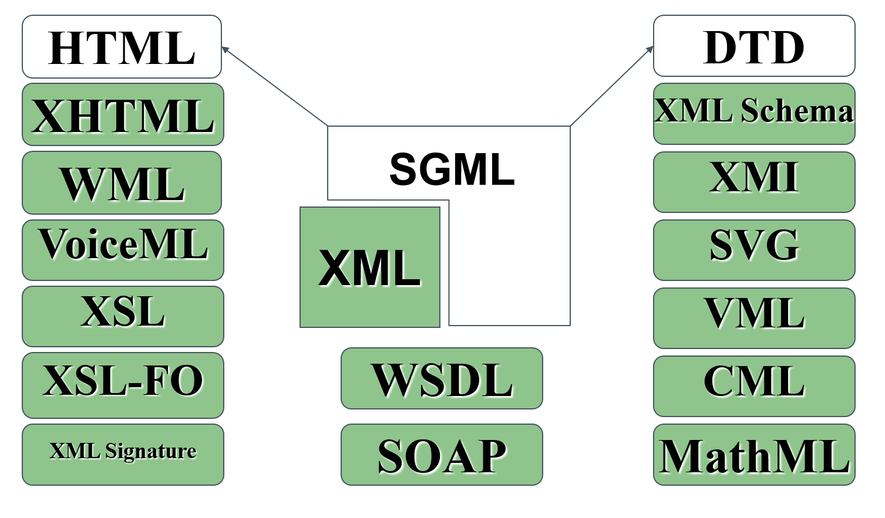
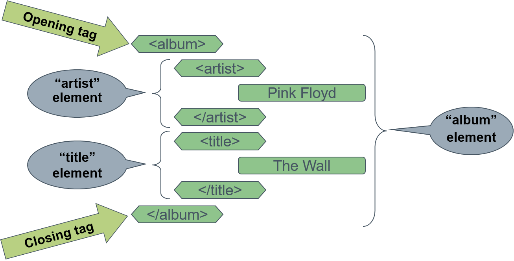

<!----------------- BEGIN SLIDE 001 it -------------------------->

#  eXtensible Markup Language (XML)    


<!----------------- COLUMN 1 -------------------------->

> 001


***Basic Concepts***


Giuseppe Della Penna

Università degli Studi di L'Aquila   
giuseppe.dellapenna@univaq.it   
http://people.disim.univaq.it/dellapenna

> *This document is based on the slides of the Web Engineering course, translated into English and reorganized for a better reading experience. It is not a complete textbook or technical manual, and should be used in conjunction with all other teaching materials in the course. Please report any errors or omissions to the author.*

> This work is licensed under CC BY-NC-SA 4.0. To view a copy of this license, visit https://creativecommons.org/licenses/by-nc-sa/4.0

<!----------------- BEGIN TOC -------------------------->

 - [1. Introduction to XML](#1-introduction-to-xml)

    - [1.1. The XML Family](#11-the-xml-family)

    - [1.2. XML: Pros and Cons](#12-xml-pros-and-cons)

    - [1.3. XML: Applications](#13-xml-applications)

    - [1.4. An Example of XML Document](#14-an-example-of-xml-document)

 - [2. The Structure of an XML document](#2-the-structure-of-an-xml-document)

 - [3. Prologue: XML Declaration](#3-prologue-xml-declaration)

    - [3.1. Text encoding](#31-text-encoding)

    - [3.2. Unicode](#32-unicode)

 - [4. Document Type Definitions and XML grammars](#4-document-type-definitions-and-xml-grammars)

 - [5. Prologue: DOCTYPE Declaration](#5-prologue-doctype-declaration)

 - [6. Elements](#6-elements)

    - [6.1. Structure](#61-structure)

    - [6.2. Basic Rules](#62-basic-rules)

    - [6.3. Syntax](#63-syntax)

    - [6.4. Hierarchy](#64-hierarchy)

 - [7. Attributes](#7-attributes)

    - [7.1. Basic Rules](#71-basic-rules)

    - [7.2. Syntax](#72-syntax)

 - [8. Namespaces](#8-namespaces)

    - [8.1. Syntax](#81-syntax)

    - [8.2. Examples](#82-examples)

 - [9. Entities](#9-entities)

    - [9.1. Use](#91-use)

    - [9.2. Syntax](#92-syntax)

 - [10. Text](#10-text)

 - [11. CDATA sections](#11-cdata-sections)

 - [12. Processing Instructions](#12-processing-instructions)

 - [13. Comments](#13-comments)

 - [14. Validation of XML Documents](#14-validation-of-xml-documents)

 - [15. References](#15-references)


<!------------------- END TOC --------------------------> 

<!------------------- END SLIDE 001 it -------------------------->

<!----------------- BEGIN SLIDE 002 it -------------------------->

## 1. Introduction to XML


<!----------------- COLUMN 1 -------------------------->

> 002


XML is a *metalanguage*,  i.e., a language that is used to create other languages. 

In particular, XML defines the basic rules for creating ***markup*** **languages**, i.e., languages ​​whose content (text) is structured by special delimiters called *tags*. 

XML derives from **SGML**, another well metalanguage used mainly in professional settings (e.g., publishing).   

Compared to SGML, XML has been greatly **simplified** and small **extensions** have been added to make it more user friendly. 

<!------------------- END SLIDE 002 it -------------------------->

<!----------------- BEGIN SLIDE 003 it -------------------------->

### 1.1. The XML Family


<!----------------- COLUMN 1 -------------------------->

> 003


 

<!------------------- END SLIDE 003 it -------------------------->

<!----------------- BEGIN SLIDE 004 it -------------------------->

### 1.2. XML: Pros and Cons


<!----------------- COLUMN 1 -------------------------->

> 004


XML is easy to learn and use:

- XML allows developers to easily create **ad-hoc languages** ​​to contain **structured information**. 

- XML is completely **text-based**, so it is human readable and can be easily hand-edited. It Supports UNICODE, so it is suitable for all types of languages.    

- The structures defined with XML are useful for creating platform-independent and self-descriptive **data structures**. 

- The **automatic processing** of an XML language is particularly simple and efficient. The strict syntactic rules of XML-based languages ​​make them very suitable for automatic processing. 

- Since XML is actually written as plain text, XML data can be easily and safely **transported using the HTTP protocol** through firewalls (SOAP, web services). 

<!------------------- END SLIDE 004 it -------------------------->

<!----------------- BEGIN SLIDE 005 it -------------------------->


<!----------------- COLUMN 1 -------------------------->

> 005

On the other hand, XML introduces some new complexity issues:

- XML documents, because of their textual structure and tags, tend to be much more large than the corresponding binary format. 

- XML manipulation libraries are not as fast as the ad-hoc parsers written for specific formats, especially the binary ones.

- In general the use of XML is more expensive in terms of necessary resources (network, memory and CPU time required for decoding it, etc..) 

<!------------------- END SLIDE 005 it -------------------------->

<!----------------- BEGIN SLIDE 006 it -------------------------->

### 1.3. XML: Applications


<!----------------- COLUMN 1 -------------------------->

> 006


Despite the disadvantages seen, the use of XML is widespread:   

- **Web Services**    
SOAP, WSDL, …

- **Science**   
MathML, CML,… 

- **Web and Publishing**     
XHTML, WML, VoiceML, XSL, XSL-FO, …  

- **Multimedia**    
SMIL, SVG,…

- **Definition of formal structures**       
XMLSchema, XMI,… 

- **Security**    
XML Encryption, XML Signature 

<!------------------- END SLIDE 006 it -------------------------->

<!----------------- BEGIN SLIDE 007 it -------------------------->

### 1.4. An Example of XML Document


<!----------------- COLUMN 1 -------------------------->

> 007


```xml
<?xml version="1.0" encoding="UTF-8"?>    
<?xml-stylesheet type="text/xsl" href="C:\Documenti\Collection.xsl"?>        
<!DOCTYPE collection SYSTEM "C:\DocumentiCollection.dtd">  
<collection xmlns="www.univaq.it/~gdellape/esempio/">        
 <CD owner="giuseppe">       
  <song album="darkside" track="13">         
   <title>Eclipse</title>       
   <length>67</length>       
  </song>   
  <song album="darkside" track="6">         
   <artist>Gilmour, Wright</artist>       
   <title>Time</title>       
   <length>120</length>     
   <comment> <!CDATA[Time has gone…]]></comment>           
  </song>   
  <album ID="darkside">      
    <artist>Pink Floyd</artist>       
    <title>The Dark Side of the Moon</title>       
    <year>1963</year>       
  </album>   
 </CD>   
</collection>  
``` 

<!------------------- END SLIDE 007 it -------------------------->

<!----------------- BEGIN SLIDE 008 it -------------------------->

## 2. The Structure of an XML document


<!----------------- COLUMN 1 -------------------------->

> 008


An XML document consists of a *prologue* and a *body* 

The body of the document may contain: 

- **text**

- **tags** (element delimiters)

- **annotations** (comments) 

- **processing instructions** (instructions for external automatic processors) 

- **entities** (similar to macros) 

In addition, tags may contain **attributes** and **namespaces**. 

<!------------------- END SLIDE 008 it -------------------------->

<!----------------- BEGIN SLIDE 009 it -------------------------->

## 3. Prologue: XML Declaration


<!----------------- COLUMN 1 -------------------------->

> 009


```xml
<?xml version="1.0" encoding="UTF-8"?> 
```

 


<!----------------- COLUMN 2 -------------------------->


The first line of the prologue is the **XML declaration**, which is *mandatory* and must appear at *the very beginning of the document*. 

The expression `<?xml` is called **the opening tag** of the XML declaration. The statement is closed by the symbol `?>`. 

Within the statement, there are two expressions of the form **name = "value"**. This type of notation is used to define an **attribute** contained in the tag. An attribute refines or extends the meaning of a tag, and it is widely used in XML.

The attributes of the XML declaration are: 

- `version`: (required) indicates the version of XML used. 

- `encoding`: (optional) is the name of the character encoding used in the document (default: UTF-8)  

- `standalone`: ​​(optional) if true *yes* indicates that the file does not refer to other external files. (default:   *no*) 

<!------------------- END SLIDE 009 it -------------------------->

<!----------------- BEGIN SLIDE 010 it -------------------------->

### 3.1. Text encoding


<!----------------- COLUMN 1 -------------------------->

> 010


**XML documents are made up mostly of text**, so it is important to understand how this can be represented on a machine. 

A **character set** (*charset*) defines the set of characters (letters, numbers, punctuation, symbols,...) necessary for a particular purpose (not necessarily related to digital transmission and preservation). 

An **encoded character set**  is a set of characters that have each been assigned a unique number. The elements of an encoded character set are also known as   **code points**. A code point, therefore, represents the position of a character in the encoded character set: for example, the code point for the letter "á" in the Unicode encoded character set is 225.   

**Character encoding**  finally defines the way in which the encoded character set (or rather its numerical code points) will be mapped onto bytes to be saved on digital media and transmitted over the network. 

Many historical character encoding standards (for example ISO 8859, which is still widely used) use a single byte for each code point which simply represents the position of the character in the set. For example, the "A" in the ISO 8859-1 code set is the 65th character, and is therefore encoded as a byte with the value of 65.      

When communicating textual information it is therefore necessary to specify the set in use and the corresponding encoding, so that these characters can be represented reliably. 

<!------------------- END SLIDE 010 it -------------------------->

<!----------------- BEGIN SLIDE 011 it -------------------------->

### 3.2. Unicode


<!----------------- COLUMN 1 -------------------------->

> 011


The **Unicode Consortium** has defined a large character set that includes all those needed for any writing system in the world. 

The Unicode standard is fundamental to the architecture of the Web and operating systems, and is gradually replacing specific character sets created in the past by various organizations, such as ISO.  

The first 65536 code points in the Unicode character set constitute the  **Basic Multilingual Plane** (BMP), which includes most of the most commonly used characters. There are also approximately one million additional code points available for **additional characters**, including emoji. 

Although the Unicode character set is unique, there are more than one encodings available:  **UTF-8**, **UTF-16** and **UTF-32**.

  - UTF-8 uses  **one byte** to represent characters in the **ASCII** set, **two bytes** for the most common characters in other alphabets, **three bytes** for the rest of the BMP, and **four bytes** for supplementary characters. 

  - UTF-16 uses two bytes for any character in the BMP and four bytes for additional characters.  

  - UTF-32 uses four bytes for all characters.  

So, although the code point for the letter "á" in the Unicode character set is always 225, in UTF-8 it is represented by two bytes.    

In HTML, and on the Internet in general,  **Unicode with UTF-8 encoding is currently considered the standard**. 

<!------------------- END SLIDE 011 it -------------------------->

<!----------------- BEGIN SLIDE 011b it -------------------------->


<!----------------- COLUMN 1 -------------------------->

> 011b

Incredibly, even the malicious use of Unicode character encodings can exploit some vulnerabilities that allow, for example, the theft of information.      

**UTF-7, originally defined to encode BMP only, allowed alternative encodings of ASCII characters such as "\<" and "\>". Older versions of Internet Explorer**could be tricked into interpreting a page as UTF-7, and in this case the sequences +ADw- and +AD4-, which most validators treat as plain text, were transformed into "\<" and "\>" allowing XSS attacks.   

Since **many characters from different languages can visually resemble each other**, it is possible to trick a user into browsing a site whose address is visually similar to that of a secure site, even if the characters it contains are actually different, and will therefore lead to a malicious site (    **homography** attacks), for example using the Cyrillic character "а" (Unicode 0430) instead of the ASCII character (Unicode 0041) 

<!------------------- END SLIDE 011b it -------------------------->

<!----------------- BEGIN SLIDE 012 it -------------------------->

## 4. Document Type Definitions and XML grammars


<!----------------- COLUMN 1 -------------------------->

> 012


XML documents can (and should) be associated to **a formal specification that defines the language used** in the document and its syntax rules. 

The default XML way to create this specification is the *document type definition* (DTD)

If a document has an associated DTD, you must include a DOCTYPE declaration in the prologue that declares the association. This statement inherits the syntax of the corresponding SGML one.

However, there are other formalisms for the definition of XML languages, such as **schemas**, which use different association methods. 

<!------------------- END SLIDE 012 it -------------------------->

<!----------------- BEGIN SLIDE 013 it -------------------------->

## 5. Prologue: DOCTYPE Declaration


<!----------------- COLUMN 1 -------------------------->

> 013


```xml
<!DOCTYPE RootElement ExternalDTDReference [InternalDTDSubset]>
```

 


<!----------------- COLUMN 2 -------------------------->


The declaration begins with the tag `<!DOCTYPE` and is closed by the symbol `>`. Inside there are the following:

- **RootElement** *(mandatory)* is the document root element name, i.e., the name of the tag that will contain the entire document. 

- **ExternalDTDReference** *(optional)* points to a file that contains the DTD itself, and may be: 

    - `SYSTEM "uri"`,   an *uri* which identifies an external file. 

    - `PUBLIC "pubid" "uri"`   where *pubid* is a unique identifier for the DTD and *uri* points to a file that contains it. 

- **InternalDTDSubset** *(optional)* is a DTD, or a DTD fragment, which can be specified directly within the document. 

<!------------------- END SLIDE 013 it -------------------------->

<!----------------- BEGIN SLIDE 014 it -------------------------->

## 6. Elements


<!----------------- COLUMN 1 -------------------------->

> 014


**Elements** are the base of the structure of XML documents. 

An element is a **piece of data**, ***limited and identified*** (by name) by a *tag*. 

The content of an element is anything that appears between its opening tag and its closing tag. 

Elements can be nested, i.e., elements may be part of the contents of an outer element. 

<!------------------- END SLIDE 014 it -------------------------->

<!----------------- BEGIN SLIDE 015 it -------------------------->

### 6.1. Structure


<!----------------- COLUMN 1 -------------------------->

> 015


 

<!------------------- END SLIDE 015 it -------------------------->

<!----------------- BEGIN SLIDE 016 it -------------------------->

### 6.2. Basic Rules


<!----------------- COLUMN 1 -------------------------->

> 016


- Element names are **case-sensitive**. 

- **Each element must be closed**, that is, its closing tag must appear before the end of the document. 

- In the case of nested elements, **end tags must appear in reverse order of opening**, i.e., the element contents cannot "overlap". 

- Every XML document must have **a unique "root" element**, where all the others are nested. 

<!------------------- END SLIDE 016 it -------------------------->

<!----------------- BEGIN SLIDE 017 it -------------------------->

### 6.3. Syntax


<!----------------- COLUMN 1 -------------------------->

> 017


```xml
[1] <name>  
   
[2] </name>  

[3] <name/>  

<a>
 <b/>
 <c>
  Text 
  <d>
   <e/>
  </d>
 </c>
</a>
```
 


<!----------------- COLUMN 2 -------------------------->


The opening tag of an element has the form shown in (1), where *name* is the name of the element. The corresponding closing tag is shown in (2) 

Finally, some elements may be empty: in this case you can omit the closing tag writing the opening in the abbreviated form shown in (3). 

<!------------------- END SLIDE 017 it -------------------------->

<!----------------- BEGIN SLIDE 018 it -------------------------->

### 6.4. Hierarchy


<!----------------- COLUMN 1 -------------------------->

> 018


```xml
<a>
  <b>
   Text 
  </b>
  <c>
   <d/>
  </c>
</a>
```

 


<!----------------- COLUMN 2 -------------------------->


Nested elements create the **tree** **structure** of XML documents. 

Within this structure it is possible to define some useful "relationships": 

- *a* is the **root** node 

- *b* and c are the **children** of *a*, the *text* is the child of *b*, *d* is the child of *c*

- *c* is the **parent** of *d*, *b* is the parent of the *text*, *a* is the parent of *b* and *c*

- *b* and *c* are **brothers** 

- *b*, *c*, *d* and the *text* are **descendants** of *a*, *d* is a descendant of *c*, the *text* is a descendant of *b* 

- *a* is a **ancestor** of *b*, *c*, *d* and *text*, *b* is an ancestor of the *text*, *c* is an ancestor of *d*. 

<!------------------- END SLIDE 018 it -------------------------->

<!----------------- BEGIN SLIDE 019 it -------------------------->

## 7. Attributes


<!----------------- COLUMN 1 -------------------------->

> 019


Attributes allow you to specify **properties of the elements**, modifying or better defining their meaning. 

Attributes are **inserted within the opening tag** of the elements. 

The **order** in which attributes appear in the opening tag is not significant. 

The value of an attribute should be **simple**: otherwise it is better to use a nested element to contain it. 

<!------------------- END SLIDE 019 it -------------------------->

<!----------------- BEGIN SLIDE 020 it -------------------------->

### 7.1. Basic Rules


<!----------------- COLUMN 1 -------------------------->

> 020


- Attribute names are **case-sensitive**. 

- The same element cannot contain two attributes with the same name. 

- Attributes with no value (only name) are not allowed. 

- The attribute value must be specified **between single or double quotes**. 

- The value may contain **entity references**, but no other structure (XML elements, processing instructions, etc.). 

<!------------------- END SLIDE 020 it -------------------------->

<!----------------- BEGIN SLIDE 021 it -------------------------->

### 7.2. Syntax


<!----------------- COLUMN 1 -------------------------->

> 021


```xml
[1] <tag attribute="value">

[2] <tag attr1="val1" attr2="val2">

[3] <tag attribute=' "value" '>


<a x="txt" y="2">  
 <c> Text
  <d>
   <e z="abc123"/>
  </d>
 </c>
</a>
```

 


<!----------------- COLUMN 2 -------------------------->


The basic syntax for an attribute inserted in the opening tag of an element is shown in (1) 

To specify multiple attributes it is enough to separate them with one or more spaces as shown in (2) 

To include quotation marks in an attribute value, you must use quote different from the one used to surround the value itself (3) 

<!------------------- END SLIDE 021 it -------------------------->

<!----------------- BEGIN SLIDE 022 it -------------------------->

## 8. Namespaces


<!----------------- COLUMN 1 -------------------------->

> 022


Namespaces are used to **declare membership of elements and attributes to a particular XML language**, providing a semantics. 

They are particularly useful if **multiple languages ​​are mixed in the same document**, with possible name collisions. 

The **namespace declarations** are inserted in the opening tags, similar to an attribute, and are valid within the element and its contents. 

<!------------------- END SLIDE 022 it -------------------------->

<!----------------- BEGIN SLIDE 023 it -------------------------->

### 8.1. Syntax


<!----------------- COLUMN 1 -------------------------->

> 023


```xml
[1] <name xmlns:prf="uri">    

[2] <name xmlns="uri">    

[3] <name xmlns="uri" xmlns:prf="uri">    
```

 


<!----------------- COLUMN 2 -------------------------->


The explicit namespace declaration (1), inserted into an opening tag, indicates that all the elements whose name is prefixed by *"prf:"*   (namespace prefix) will be considered as belonging to the namespace identified by  *uri*.  

The special standard namespace declaration (2) indicates the namespace of all the elements with no explicit namespace prefix. 

In each element it is possible to declare multiple explicit namespace prefixes, but only one default namespace (3)   

*URI used in such declarations are only conventional identifiers associated with different namespaces, and do not point to any particular internet resource*. 

<!------------------- END SLIDE 023 it -------------------------->

<!----------------- BEGIN SLIDE 024 it -------------------------->

### 8.2. Examples


<!----------------- COLUMN 1 -------------------------->

> 024


```xml
<a xmlns="ns1" xmlns:html="ns2">
 <b/>
 <html:p>< html:b>text</ html:b> 
  <c xmlns="ns3" ><d/></c>
  <d/>
  <e xmlns:xsl="ns4" xsl:attr="val"> 
   <xsl:f>text</ xsl:f> 
  </e>
 </html:p> 
</a>
```

 


<!----------------- COLUMN 2 -------------------------->


Understanding namespaces is important in order to manage complex XML documents and their semantics. 

In this example: 

- The namespace "*ns1*" contains the elements *a*, *b*, *d*, *e*. 

- The namespace "*ns2*" contains elements *html:p*, *html:b*.     

- The namespace "*ns3*" contains the elements *c* and *d*. 

- The namespace "*ns4*" contains the *xsl:attr* attribute and the *xsl:f* element    

Note that there are two elements *d* in the document, belonging to different namepsaces. 

<!------------------- END SLIDE 024 it -------------------------->

<!----------------- BEGIN SLIDE 025 it -------------------------->

## 9. Entities


<!----------------- COLUMN 1 -------------------------->

> 025


In XML parlance documents are composed by a set of *entities*. 

Each character is a *character entity*, each tag is an entity and the document itself is an entity. 

Each entity, except for the document and the external DTD, has a name. 

The entities are divided into *parsed* and *unparsed*: 

- Each *parsed* entity has a corresponding textual value. The XML parser replaces the entity with its value when it parses the document. 

- An *unparsed* entity, however, is not replaced by the parser, and can have even a binary value, accessible via the *notations*. 

<!------------------- END SLIDE 025 it -------------------------->

<!----------------- BEGIN SLIDE 026 it -------------------------->

### 9.1. Use


<!----------------- COLUMN 1 -------------------------->

> 026


Parsed entities are a handy way to insert strings in the document referring to an external definition, instead of writing them explicitly. 

They are useful if there are **characters that cannot directly** typed, or to **expand strings used frequently**, or to write **characters that are not explicitly allowed in a context**, such as quotation marks or the '\<' and '\>' symbols. 

<!------------------- END SLIDE 026 it -------------------------->

<!----------------- BEGIN SLIDE 027 it -------------------------->

### 9.2. Syntax


<!----------------- COLUMN 1 -------------------------->

> 027


```xml
[1] &name;  

[2] &#number; 

[3] &#xnumber;  


&gt;   =  >    
&lt;   = <  
&quot; =  "    
&amp;  =  &    
&#32;  =  [space]     
&#x20; =  [space]     
```
 


<!----------------- COLUMN 2 -------------------------->


For **parsed** entities:

- **General entities**,  which can represent any string, are defined in the DTD and the XML document refers to them using the syntax (1), where *name* is the name of the entity. 

- **Character entities**, which represent single UNICODE characters, are referred with the syntax (2), where *number* is the decimal code for the UNICODE character, or with the syntax (3), where   *number* is the hexadecimal code for the UNICODE character. 

<!------------------- END SLIDE 027 it -------------------------->

<!----------------- BEGIN SLIDE 028 it -------------------------->

## 10. Text


<!----------------- COLUMN 1 -------------------------->

> 028


The text that can be inserted in XML documents **includes all the characters defined in UNICODE**. 

- You can insert special or reserved characters using **character entities**. 

- You can insert predefined strings using **general entities**. 

- **You can not explicitly use the characters '\>', '\<' and '&'**, for which you should always use the corresponding character entities. 

<!------------------- END SLIDE 028 it -------------------------->

<!----------------- BEGIN SLIDE 029 it -------------------------->

## 11. CDATA sections


<!----------------- COLUMN 1 -------------------------->

> 029


```xml
<![CDATA[ 
<< &pippo;   
solo testo!<
>> 
]]>
```

 


<!----------------- COLUMN 2 -------------------------->


CDATA sections explicitly define **areas where there is only text**. 

Within CDATA sections the parser does not look for elements, attributes, entities, and other XML structures  

The opening tag of a CDATA section is the string `<![CDATA[`, while the closing tag of `]]>`, which obviously can not appear in the content. 

<!------------------- END SLIDE 029 it -------------------------->

<!----------------- BEGIN SLIDE 030 it -------------------------->

## 12. Processing Instructions


<!----------------- COLUMN 1 -------------------------->

> 030


```xml
<?target  data ?>
```

```xml
[1] <?xml-stylesheet type="text/xsl" href="style.xslt"?>      
[2] <?php echo "hello" ?>  
```

 


<!----------------- COLUMN 2 -------------------------->


The Processing Instructions (PIs) are used to **pass extra information to programs that manipulate the XML file** and can appear anywhere in the document. 

The general form of a PI has an opening tag like `<?target` where *target* identifies which application will process the instruction, and a closing tag `?>`. 

Note that the XML declaration is nothing more than a processing instruction.   

Inside the tag you can write any type of textual data. The only rule is that the data cannot contain the sequence "?\>". The two examples below are respectively (1) the PI that associates an XSL style sheet to a document and (2) a PHP script. 

<!------------------- END SLIDE 030 it -------------------------->

<!----------------- BEGIN SLIDE 031 it -------------------------->

## 13. Comments


<!----------------- COLUMN 1 -------------------------->

> 031


```xml
<!– This is a XML (and SGML) comment -->     
```

 


<!----------------- COLUMN 2 -------------------------->


Comments are useful to humans, and are ignored by XML manipulation programs. They may appear anywhere except within the value of an attribute. 

The comments follow the syntax of SGML: the opening tag of a comment is the sequence `<!--`, 
and the closing tag is the sequence `-->`.    
The content of the comment is generic text, which should not contain the closing sequence. 

<!------------------- END SLIDE 031 it -------------------------->

<!----------------- BEGIN SLIDE 032 it -------------------------->

## 14. Validation of XML Documents


<!----------------- COLUMN 1 -------------------------->

> 032


**An XML document is** ***well formed*** if it respects the general syntax rules seen in the previous slides. 

**An XML document is** ***valid*** if it is well formed and meets the syntactic and semantic rules contained in the associated DTD. 
*A document with no DTD is never valid*. 

There are **validating and** **not validating parsers**. The latter may ignore any DTD, except for the definition of general entities. 

<!------------------- END SLIDE 032 it -------------------------->

<!----------------- BEGIN SLIDE 033 it -------------------------->

## 15. References


<!----------------- COLUMN 1 -------------------------->

> 033


**XML specification from the W3C**      
http://www.w3c.org/TR/XML/ 

<!------------------- END SLIDE 033 it -------------------------->
