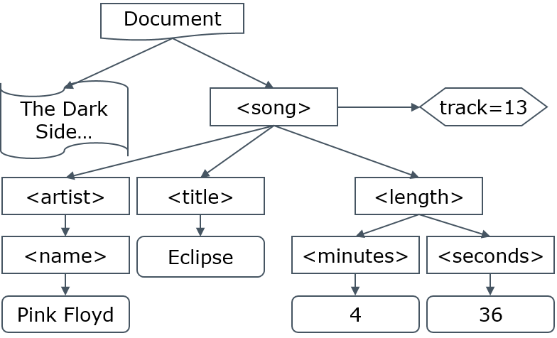
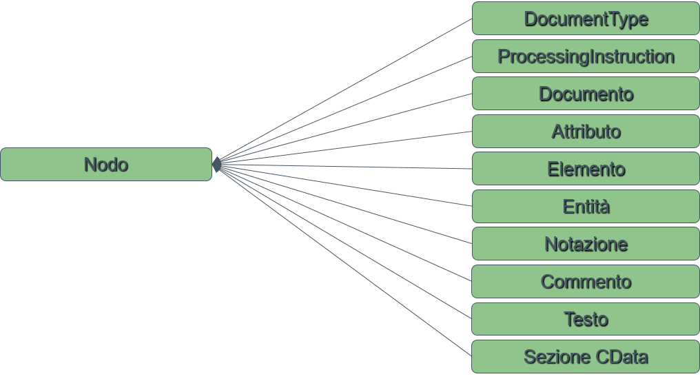
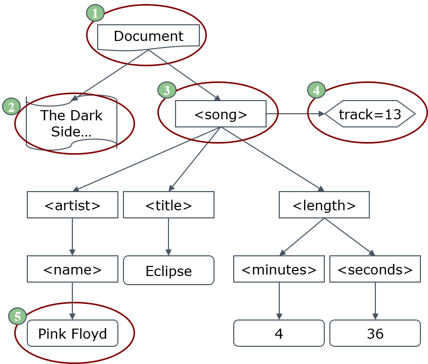
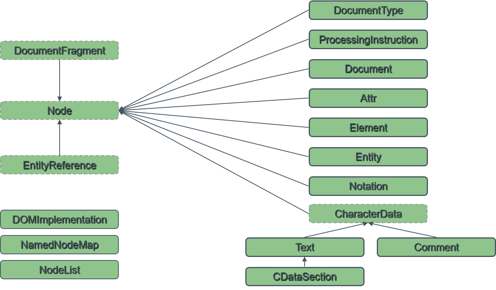
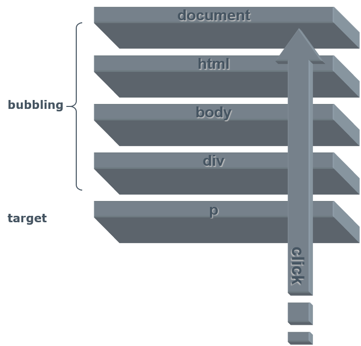
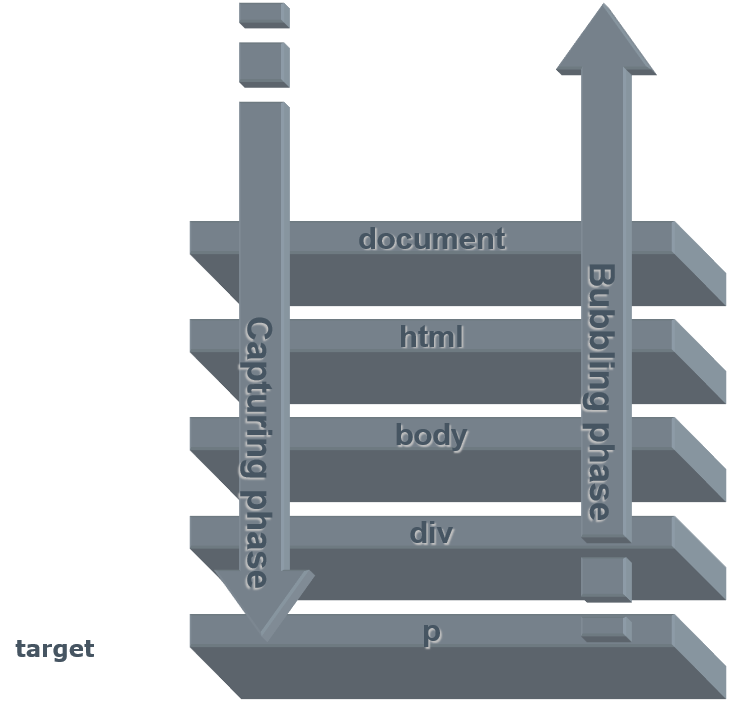

<!----------------- BEGIN SLIDE 001 -------------------------->
> 001


# Document Object Model (DOM)   

**XML, HTML, CSS ed Eventi**

Giuseppe Della Penna

Università degli Studi di L'Aquila   
giuseppe.dellapenna@univaq.it   
http://people.disim.univaq.it/dellapenna

**Versione documento: 051025**

> *Questo documento si basa sulle slide del corso di Web Engineering, riorganizzate per una migliore esperienza di lettura. Non è un libro di testo completo o un manuale tecnico, e deve essere utilizzato insieme a tutti gli altri materiali didattici del corso. Si prega di segnalare eventuali errori o omissioni all'autore.*

> Quest'opera è rilasciata con licenza CC BY-NC-SA 4.0. Per visualizzare una copia di questa licenza, visitate il sito https://creativecommons.org/licenses/by-nc-sa/4.0

<!----------------- BEGIN TOC -------------------------->


<!------------------- END TOC -------------------------->

<!------------------- END SLIDE 001 -------------------------->

<!----------------- BEGIN SLIDE 002 -------------------------->
> 002

## I Modelli a Oggetti


Un **modello ad oggetti** definisce:

- Gli **oggetti** usati per rappresentare e manipolare un particolare tipo di informazione.

- Le **interfacce** usate per interagire con gli oggetti definiti.

- La **semantica** richiesta dagli oggetti e dalle interfacce definite.

- Le **relazioni** e interazioni tra le interfacce e gli oggetti definiti.

Nel nostro caso, il modello a oggetti è applicato alla struttura dei documenti XML.

<!------------------- END SLIDE 002 -------------------------->

<!----------------- BEGIN SLIDE 003 -------------------------->
> 003

## DOM XML


*Il DOM di base*

<!------------------- END SLIDE 003 -------------------------->

<!----------------- BEGIN SLIDE 004 -------------------------->
> 004


Il Document Object Model (DOM) XML è un modello a oggetti generico applicabile a tutti i documenti XML.

Il DOM XML:

- Fornisce una rappresentazione dei documenti XML compatibile con i più noti linguaggi di programmazione.

- Incapsula ogni elemento caratteristico di XML (elementi, attributi, commenti…) in un oggetto specifico, che ne fornisce una interfaccia di manipolazione.

- Permette di manipolare la struttura del documento in maniera object-oriented.

<!------------------- END SLIDE 004 -------------------------->

<!----------------- BEGIN SLIDE 005 -------------------------->
> 005


Esistono varie versioni del DOM, strutturate in *livelli*:

- **Livello 1**: definisce gli elementi DOM di base con interfacce contenenti i metodi e gli attributi di uso più comune.

- **Livello 2**: Modifica alcuni metodi del livello 1, e introduce il supporto ai *namespaces* e alla *clonazione* dei nodi.

- **Livello 3**: Introduce nuovi metodi e interfacce per una *navigazione* più rapida nel documento, per il supporto dei *tipi* di nodo e per la *serializzazione*.

<!------------------- END SLIDE 005 -------------------------->

<!----------------- BEGIN SLIDE 006 -------------------------->
> 006

### La vista del DOM su XML


**Il DOM rappresenta i documenti come una struttura ad albero**.

In realtà, la struttura è una "foresta" perché può anche contenere più alberi distinti.

Il DOM definisce solo la sua vista logica sui dati: non specifica come debbano essere effettivamente strutturati in memoria.

Tuttavia, l'utente che accede al documento tramite l'interfaccia DOM, lo "vedrà" effettivamente come un albero.

<!------------------- END SLIDE 006 -------------------------->

<!----------------- BEGIN SLIDE 007 -------------------------->
> 007

#### Esempio

Il documento XML che segue

```xml
<!-- The Dark Side of The Moon, 
 track 13 -->    
<song track="13">    
 <artist>  
  <name>Pink Floyd</name>     
 </artist>  
 <title>Eclipse</title>      
 <length>  
  <minutes>4</minutes>  
  <seconds>36</seconds>    
 </length>  
</song>  
```

<!----------------- COLUMN 001  -------------------------->

corrisponde a questo albero



<!------------------- END SLIDE 007 -------------------------->

<!----------------- BEGIN SLIDE 008 -------------------------->
> 008

#### Elementi dell'albero DOM


L'albero è composto da generici **nodi**, ognuno dei quali ha una classificazione più specifica a seconda della sua funzione all'interno del documento.

<!----------------- COLUMN 001  -------------------------->




<!------------------- END SLIDE 008 -------------------------->

<!----------------- BEGIN SLIDE 009 -------------------------->
> 009

#### Esempio di albero DOM




<!----------------- COLUMN 001  -------------------------->


**Tipi** di nodo:
- (1) Nodo *documento*.
- (2) Nodo *commento*.
- (3) Nodo *elemento*.
- (4) Nodo *attributo*.
- (5) Nodo *testo*.

**Relazioni** tra nodi:
- (2,3) sono *figli* di (1)
- (1) è il *genitore* di (2,3)
- (3) è un *fratello* di (2)
- (4) è un *attributo* di (3) (speciale relazione extra-albero)


<!------------------- END SLIDE 009 -------------------------->

<!----------------- BEGIN SLIDE 010 -------------------------->
> 010

### Gli Oggetti del DOM




<!------------------- END SLIDE 010 -------------------------->

<!----------------- BEGIN SLIDE 011 -------------------------->
> 011

### L'oggetto Node


I nodi dell'albero DOM sono rappresentati da oggetti di classe **Node**

- I Node di tipo Element e Document possono avere zero o più nodi figli.      
- Ogni Node, tranne il Document, ha un nodo genitore.    

L'interfaccia di Node include le operazioni di base eseguibili su ogni nodo (indipendentemente dal suo tipo specifico).  

I vari componenti del documento implementano anche delle interfacce derivate, che comprendono operazioni più specifiche per ciascun tipo.

*Nota: Essendo il DOM in continua evoluzione, la specifica fornita qui è semplificata ed è scritta usando un IDL generico. Fate riferimento alla specifica ufficiale (vedi riferimenti a fine di questo documento) per le interfacce complete ed aggiornate*.         

<!------------------- END SLIDE 011 -------------------------->

<!----------------- BEGIN SLIDE 012 -------------------------->
> 012

#### Interfaccia


```java
interface Node {   
 const unsigned short ELEMENT_NODE = 1;    
 //… altre costanti di tipo: vedi dopo
 readonly attribute DOMString nodeName;        
 attribute DOMString nodeValue;      
 attribute DOMString textcontent; //L3      
 readonly attribute unsigned short nodeType;        
 readonly attribute Node parentNode;        
 readonly attribute NodeList childNodes;        
 readonly attribute Node firstChild;        
 readonly attribute Node lastChild;        
 readonly attribute Node previousSibling;        
 readonly attribute Node nextSibling;        
 readonly attribute NamedNodeMap attributes;        
 readonly attribute Document ownerDocument;        
 Node insertBefore(in Node newChild,in Node refChild);            
 Node replaceChild(in Node newChild, in Node oldChild);            
 Node removeChild(in Node oldChild);        
 Node appendChild(in Node newChild);        
 boolean hasAttributes(); // L 2    
 boolean hasChildNodes();    
};
```

<!----------------- COLUMN 001  -------------------------->

L'attributo `nodeType` permette di identificare il tipo specifico di nodo tramite una serie di costanti definite anch'esse nell'interfaccia *Node*:

- `ELEMENT_NODE`: il nodo è un **elemento**

- `ATTRIBUTE_NODE`: il nodo è un **attributo**

- `TEXT_NODE`: il nodo è del **testo**

- `CDATA_SECTION_NODE`: il nodo è una **sezione CDATA**

- `ENTITY_REFERENCE_NODE`: il nodo è un riferimento ad **entità**

- `ENTITY_NODE`: il nodo è un'entità

- `PROCESSING_INSTRUCTION_NODE`: il nodo è una **processing intruction**

- `COMMENT_NODE`: il nodo è un **commento**

- `DOCUMENT_NODE`: il nodo è un **documento** (non la sua radice!)

- `DOCUMENT_TYPE_NODE`: il nodo è una **dichiarazione DOCTYPE**

- `DOCUMENT_FRAGMENT_NODE`: il nodo è un **frammento di documento**

- `NOTATION_NODE`: il nodo è una `NOTATION`

<!------------------- END SLIDE 012 -------------------------->

<!----------------- BEGIN SLIDE 013 -------------------------->
> 013

#### nodeName e nodeValue


|**Node type**  |**nodeName** |**nodeValue**
|---|---|---|
|**Element**|Nome tag  |null|
|**Attr**|Nome attributo  |Valore attributo  |
|**Text**|"#text"|Testo associato |
|**CDATASection**|"#cdata-section"|Testo associato |
|**EntityReference**|Name entità  |null|
|**Entity**|Name entità  |null|
|**ProcessingInstruction**|Valore attributo target   |Contenuto escluso target   |
|**Comment**|"#comment"|Testo associato |
|**Document**|"#document"|null|
|**DocumentType**|Nome del document type  |null|
|**DocumentFragment**|"#document-fragment"|null|
|**Notation**|Nome della notazione   |null|


<!------------------- END SLIDE 013 -------------------------->

<!----------------- BEGIN SLIDE 014 -------------------------->
> 014

### Muoversi nell'Albero con Node


L'interfaccia di Node mette a disposizione diversi attributi per muoversi nell'albero DOM:  

- `ownerDocument` restituisce il Document che contiene il nodo corrente.  

- `firstChild` e `lastChild` restituiscono il primo e l'ultimo nodo figlio del nodo corrente.

- `parentNode` restituisce il nodo genitore del nodo corrente.

- `previousSibling` e `nextSibling` restituiscono il precedente e successivo fratello del nodo corrente (relativamente al loro genitore).  

- `childNodes` restituisce la lista dei figli del nodo corrente (una NodeList, vedi dopo).  

- `attributes` restituisce la lista degli attributi del nodo corrente (una NamedNodeMap).  

Gli oggetti restituiti da `childNodes` e `attributes` hanno anche un'interfaccia di tipo Array.

<!------------------- END SLIDE 014 -------------------------->

<!----------------- BEGIN SLIDE 015 -------------------------->
> 015

### Manipolare l'Albero con Node


I metodi di *Node* per la manipolazione dei nodi figli sono:

- `appendChild(n)`: accoda un nodo *n* alla lista dei figli del nodo corrente

- `removeChild(n)`: rimuove un nodo *n* dalla lista dei figli del nodo corrente.

- `replaceChild(n,o)`: sostituisce un nodo figlio *o* con un nuovo nodo *n*.  

- `insertBefore(n,r)`: inserisce un nodo *n* nella lista dei figli, posizionandolo prima di un particolare figlio *r*.

Inoltre, è disponibile l'attributo `textContent` che, se assegnato a una stringa, sostituisce i figli del nodo corrente con un singolo nodo di testo contenente la stringa stessa. Questo attributo è disponibile anche in lettura.

La legalità di ciascuno di questi metodi dipende dal tipo effettivo del nodo. Nel caso l'operazione non sia disponibile (ad esempio, `appendChild` su un nodo *Text*), viene sollevata un'eccezione di tipo *DOMException*.

<!------------------- END SLIDE 015 -------------------------->

<!----------------- BEGIN SLIDE 016 -------------------------->
> 016

### L'Oggetto Document


L'oggetto **Document** è uno speciale **Node** rappresenta il documento XML. 

Generalmente, quando si carica in memoria un documento XML, viene generato in memoria l'oggetto Document corripondente.

I figli di Document sono la radice del documento e tutti i commenti e le processing instruction che lo precedono e seguono.

L'attributo `documentElement` permette di prelevare direttamente il nodo radice del documento XML.

Tutti i nodi da inserire nel documento devono essere creati tramite i suoi metodi `CreateX()`

<!------------------- END SLIDE 016 -------------------------->

<!----------------- BEGIN SLIDE 017 -------------------------->
> 017

#### Interfaccia


```java
interface Document : Node {     
 readonly attribute DocumentType doctype;        
 readonly attribute DOMImplementation implementation;        
 readonly attribute Element documentElement;        

 Element createElement(in DOMString tagName);
 DocumentFragment createDocumentFragment();            
 Text createTextNode(in DOMString data);    
 Comment createComment(in DOMString data);      
 CDATASection createCDATASection(in DOMString data);      
 ProcessingInstruction createProcessingInstruction(in DOMString target, in DOMString data);        
 Attr createAttribute(in DOMString name);        
 EntityReference createEntityReference(in DOMString name);        
 NodeList getElementsByTagName(in DOMString tagname);        
 Element getElementById(in DOMString elementId); //L2         
}
```

<!----------------- COLUMN 001  -------------------------->

*Document* eredita da Node tutte le funzionalità utili alla manipolazione dei suoi nodi.    

Il metodo `getElementById` restituisce l'unico elemento presente nel documento che abbia il valore dato nel suo attributo di tipo ID. 

Il metodo `getElementsByTagName` verrà  illustrato con l'oggetto Element.  

<!------------------- END SLIDE 017 -------------------------->

<!----------------- BEGIN SLIDE 018 -------------------------->
> 018

#### Esempi


```java
var e,r;    
/*1*/r = document.createElement("Radice");     

/*2*/document.appendChild(radice);    

/*3*/for(i=1; i<10; i++) 
 radice.appendChild(  
  document.createElement("nodo"+i));      

/*4*/e = radice.firstChild.nextSibling;   

radice.insertBefore( 
 /*5*/document.createComment("Nodo 2"),e);    

/*6*/e.appendChild(document.createTextNode("Due"));     

/*7*/e.textContent = "Due - bis";     

radice.appendChild( 
 /*8*/document.createProcessingInstruction("php", "echo('pippo');"));       
```

<!----------------- COLUMN 001  -------------------------->

Le interfacce per la manipolazione degli oggetti DOM si trovano nel package **org.w3c.dom**

(1) Per creare un elemento, si usa `createElement` passando come parametro il nome dell'elemento.

(2) Per creare la radice del documento, si accoda un elemento con `appendChild` direttamente al Document.

(3) Inseriamo una serie di nodi figli nella radice.

(4) Preleviamo il fratello del primo figlio della radice (cioè il secondo figlio della radice).

(5) Creiamo un commento con `createComment` e lo in seriamo prima del nodo prelevato.

(6) Creiamo un frammento di testo e lo accodiamo al contenuto dell'elemento prelevato al passo 4. 

(7) Impostiamo il contenuto testuale del nodo (rimuovendo tutto il suo contenuto precedente, è possibile solo con il DOM livello 3).

(8) Creiamo una  processing intruction con target "php" e contenuto "echo('pippo');" e la accodiamo ai figli della radice.      

<!------------------- END SLIDE 018 -------------------------->

<!----------------- BEGIN SLIDE 019 -------------------------->
> 019

Il codice che segue

```java
var e,r;    
r = document.createElement("Radice");     

document.appendChild(radice);   
 
for(i=1; i<10; i++) 
 radice.appendChild(  
  document.createElement("nodo"+i));     

e = radice.firstChild.nextSibling;   

radice.insertBefore( 
 document.createComment("Nodo 2"),e);    

e.appendChild(document.createTextNode ("Due"));    

e.textContent = "Due - bis";    

radice.appendChild( 
 document.createProcessingInstruction(  
 "php", "echo('pippo');"));    
```

<!----------------- COLUMN 001  -------------------------->

Crea la struttura XML seguente:

```xml
<Radice>  
 <nodo1/>
 <!--Nodo 2-->  
 <nodo2>Due - bis</nodo2>  
 <nodo3/>
 <nodo4/>
 <nodo5/>
 <nodo6/>
 <nodo7/>
 <nodo8/>
 <nodo9/><?php echo('pippo');?>    
</Radice>  
```

<!------------------- END SLIDE 019 -------------------------->

<!----------------- BEGIN SLIDE 020 -------------------------->
> 020

### L'Oggetto Element


```java
interface Element : Node {     
 readonly attribute DOMString tagName;        

 DOMString getAttribute(in DOMString name);        

 void setAttribute(in DOMString name, in DOMString value);            

 void removeAttribute(in DOMString name);        

 Attr getAttributeNode(in DOMString name);        
 Attr setAttributeNode(in Attr newAttr);        
 Attr removeAttributeNode(in Attr oldAttr);        

 NodeList getElementsByTagName(in DOMString name);        

 void normalize();    
}
```

<!----------------- COLUMN 001  -------------------------->

Gli oggetti **Element** rappresentano i nodi di tipo elemento. 

*Element* eredita da Node tutte le funzionalità utili alla manipolazione dei suoi nodi figlio, ed aggiunge metodi e attributi per la manipolazione degli attributi dell'elemento.  

- `getAttribute(s)`: restituisce il valore dell'attributo *s*.

- `setAttribute(s,v)`: crea l'attributo *s* e imposta il suo valore a *v*, o aggiorna il valore di *s* se già esistente.

- `removeAttribute(s)` : rimuove l'attributo *s*.

L'attribito `tagName` restituisce il nome del tag corrispondente.  

Il metodo `getElementsByTagName` restituisce i soli figli del nodo che siano elementi con uno specifico nome (filtra cioè i `childNodes`).

Il metodo `normalize` serve a fondere nodi *Text* adiacenti nel sottoalbero controllato dall'elemento. 

<!------------------- END SLIDE 020 -------------------------->

<!----------------- BEGIN SLIDE 021 -------------------------->
> 021

#### Interfaccia NodeSelector


```java
interface NodeSelector {   
  Element querySelector(DOMString selectors);    
  NodeList querySelectorAll(DOMString selectors);      
}
```

<!----------------- COLUMN 001  -------------------------->

L'interfaccia *NodeSelector* è implementata dagli oggetti *Document* ed *Element* e permette di selezionare nodi discendenti usando i selettori CSS3.

I due metodi accettano dei selettori CSS (anche composti) e restituiscono, nel caso di `querySelector`, il primo elemento che fa match col selettore tra i discendenti dell'oggetto a cui è applicato, mentre nel caso di `querySelectorAll` viene restituita una *NodeList* con tutti i match.

*Si tratta di una funzionalità relativamente nuova ma ormai supportata da tutti i browser moderni (vedi https://developer.mozilla.org/en-US/docs/Web/API/Document\_object\_model/Locating\_DOM\_elements\_using\_selectors). Precedentemente la stessa cosa era possibile solo usando librerie di supporto come JQuery*.    

<!------------------- END SLIDE 021 -------------------------->

<!----------------- BEGIN SLIDE 022 -------------------------->
> 022

#### Esempi


```javascript
var e,r;    

/*1*/
r = document.createElement("Radice");     
 document.appendChild(radice);    
 
for(i=1; i<10; i++) 
 radice.appendChild(  
  document.createElement("nodo" + i));    

e = radice.firstChild.nextSibling;   

/*2*/e.setAttribute ("a1","v1");   

/*3*/var list =    
 radice.getElementsByTagName ("nodo5");  

for(i=0; i<list.length(); i++)    
 /*4*/(list.item(i)).setAttributeNS ("prfx","attr", "val");            

/*5*/var e2 =    
 radice.querySelector(".pippo, .pluto");      

/*6*/var list2 =    
 radice.querySelectorAll("nodo5");   
```

<!----------------- COLUMN 001  -------------------------->

Le interfacce per la manipolazione degli oggetti DOM si trovano nel package **org.w3c.dom**

(1) `createElement` restituisce un oggetto *Element*.

(2) Creiamo facilmente un attributo con `setAttribute`.

(3) Cerchiamo tutti gli elementi figli della radice che si chiamano "nodo5". 

(4) Su ciascun nodo trovato al passo 3 inseriamo un attributo con namespace.   

(5) `querySelector` restituisce il primo elemento con classe "pippo" o "pluto" tra i discendenti di radice.    

(6) con questo  `querySelectorAll` otteniamo lo stesso risultato del punto 3.

<!------------------- END SLIDE 022 -------------------------->

<!----------------- BEGIN SLIDE 023 -------------------------->
> 023

Il frammento di codice che segue

```javascript
var e,r;    

r = document.createElement("Radice");     
document.appendChild(radice);   
 
for(i=1; i<10; i++) 
radice.appendChild( 
document.createElement("nodo" + i));   

e = radice.firstChild.nextSibling;   

e.setAttribute ("a1","v1");  

var list =   
radice.getElementsByTagName("nodo5");  

for(i=0; i<list.length(); i++)    
(list.item(i)).setAttributeNS ("prfx","attr", "val");          
```

<!----------------- COLUMN 001  -------------------------->

Crea la struttura XML seguente:

```xml
<Radice>  
 <nodo1/>
 <nodo2 a1="v1"/>
 <nodo3/>
 <nodo4/>
 <nodo5 xmlns:N="prfx" N:attr="val"/>    
 <nodo6/>
 <nodo7/>
 <nodo8/>
 <nodo9/>
</Radice>  
```

<!------------------- END SLIDE 023 -------------------------->

<!----------------- BEGIN SLIDE 024 -------------------------->
> 024

### Gli Oggetti NodeList e NamedNodeMap


```java
interface NodeList {   
 Node item(in unsigned long index);      
 readonly attribute unsigned long length;        
}

interface NamedNodeMap {   
 Node getNamedItem(in DOMString name);        
 Node setNamedItem(in Node arg) raises(DOMException);            
 Node removeNamedItem(in DOMString name) raises(DOMException);            
 Node item(in unsigned long index);      
 readonly attribute unsigned long length;        
}
```

```javascript
list = radice.childNodes;  
if (list.item(8) != null)  radice.insertBefore(     
 document.createComment("otto"),list.item(8));       
f = document.createElement("Qwerty");   
f.setAttribute ("a", "v"); 
nmp = f.attributes;   
nmp.getNamedItem("a").value 
```

<!----------------- COLUMN 001  -------------------------->

Vari metodi del DOM restituiscono liste.

L'oggetto **NodeList** permette di gestire una lista ordinata di nodi.

- L'attributo `length` restituisce la lunghezza della lista.

- Il metodo `item(i)` restituisce l'i-esimo nodo della lista.  

L'oggetto **NamedNodeMap** contiene nodi accessibili, oltre che per indice (come in *NodeList*), anche attraverso il loro nome (cioè il valore del loro attributo `nodeName`).

<!------------------- END SLIDE 024 -------------------------->

<!----------------- BEGIN SLIDE 025 -------------------------->
> 025

## DOM HTML

*Il DOM delle pagine web*

<!------------------- END SLIDE 025 -------------------------->

<!----------------- BEGIN SLIDE 026 -------------------------->
> 026


Il DOM visto fin qui fornisce un sistema di accesso e manipolazione generica per documenti basati sul metalinguaggio XML.

Per i linguaggi XML-based, come XHTML, il W3C ha definito in DOM specifico, derivato da quello XML.    

Anche HTML(5) utilizza questo stesso DOM, "forzando virtualmente" in questo caso una visione più "rigida" del markup (ad esempio la chiusura di tutti gli elementi).

Il DOM HTML mette a disposizione tutte le classi e le proprietà viste finora, ma definisce alcuni elementi derivati che permettono di eseguire più rapidamente le più comuni operazioni sulla struttura delle pagine web:   
- Una classe derivata da Document che fornisce un'interfaccia più ricca per l'accesso al documento HTML     

- Una serie di classi derivate da Element forniscono accesso diretto alle proprietà più comuni dei rispettivi elementi HTML   

Il DOM è comunque in continua evoluzione: si veda il "living standard" all'indirizzo https://dom.spec.whatwg.org  

<!------------------- END SLIDE 026 -------------------------->

<!----------------- BEGIN SLIDE 027 -------------------------->
> 027

Il DOM di livello 2 ha inoltre introdotto una serie di nuove caratteristiche specifiche per il DOM HTML:

- Alcune nuove classi modellano i fogli di stile CSS e la loro applicazione agli elementi HTML.

- Un modello a eventi permette la gestione dinamica delle pagine web, catturando e gestendo gli eventi utente come i click.

<!------------------- END SLIDE 027 -------------------------->

<!----------------- BEGIN SLIDE 028 -------------------------->
> 028

### L'Oggetto HTMLDocument


```java
interface HTMLDocument : Document {     
 attribute DOMString title;      
 readonly attribute DOMString referrer;        
 readonly attribute DOMString domain;      
 readonly attribute DOMString URL;      
 attribute HTMLElement body;    
 readonly attribute HTMLCollection images;      
 readonly attribute HTMLCollection applets;      
 readonly attribute HTMLCollection links;        
 readonly attribute HTMLCollection forms;        
 readonly attribute HTMLCollection anchors;        
 attribute DOMString cookie;    
 void open();  
 void close();    
 void write(in DOMString text);      
 void writeln(in DOMString text);      
 NodeList getElementsByName(in DOMString elementName);        
 NodeList getElementsByClassName(in DOMString names);        
}

interface HTMLCollection {    
 readonly attribute unsigned long length;         
 Node item(in unsigned long index);       
 Node namedItem(in DOMString name);         
}
```

<!----------------- COLUMN 001  -------------------------->

Gli oggetti **HTMLDocument** forniscono accesso a tutto il DOM del documento, tramite le funzioni ereditate dalla classe Document 

Inoltre, sono presenti degli attributi per accedere rapidamente:

- All'elemento \<body\> (`body`)

- A tutti gli elementi \ (  `images`)

- A tutti gli elementi \<applet\> (`applets`)

- A tutti gli elementi \<a\> con href (`links`)

- A tutti gli elementi \<form\> (`forms`)

- A tutti gli elementi \<a\> con name (`anchors`)

Le liste vengono restituite sotto forma di oggetti HTMLCollection.   

È possibile inoltre leggere la uri del documento (`URL`) e l'eventuale cookie ad esso associato (`cookie`)

Il metodo `open` apre il documento come stream di scrittura. I suoi contenuti correnti sono cancellati.  

I metodi `write` e `writeln` permettono di scrivere nel documento dopo la `open`. In molti casi, la prima chiamata a una di queste funzioni determina una `open` implicita.

Sono disponibili, nei browser più aggiornati, anche **metodi per selezionare elementi in base a criteri avanzati** quali

- Il valore dell'attributo `name` (`getElementsByName`)

- Una o più classi ad essi assegnate (`getElementsByClassName`)

<!------------------- END SLIDE 028 -------------------------->

<!----------------- BEGIN SLIDE 029 -------------------------->
> 029

### L'Oggetto HTMLElement


```java
interface HTMLElement : Element {     
 attribute DOMString id;    
 attribute DOMString title;      
 attribute DOMString lang;      
 attribute DOMString dir;    
 attribute DOMString className;      

 //I seguenti attributi NON SONO PARTE 
 //DELL'INTERFACCIA DOM L2, ma sono standard de facto
 readonly attribute HTMLElement offsetParent;        
 readonly attribute long offsetTop;      
 readonly attribute long offsetLeft;      
 readonly attribute long offsetHeight;      
 readonly attribute long offsetWidth;      

 //Elementi disponibili nei browser più moderni
 readonly attribute DOMTokenList classList;        
 void remove();    
 attribute DOMString innerHTML;      
 NodeList getElementsByName(in DOMString elementName);        
 NodeList getElementsByClassName(in DOMString names);        
}
```

<!----------------- COLUMN 001  -------------------------->

In generale, gli oggetti collegati ai particolari elementi HTML dispongono di    **attributi corrispondenti agli attributi caratteristici dell'elemento stesso**.

L'interfaccia HTMLElement espone gli attributi comuni a tutti gli elementi html, cioè id e class (qui chiamato className)      

L'attuale DOM HTML **non dispone di funzioni o attributi utili a conoscere dimensioni e posizione degli elementi**.

- Per gli elementi posizionati tramite CSS è possibile in alcuni casi consultare le proprietà left, top, width e height.      

- In generale, il DOM implementato in vari linguaggi fornisce a questo scopo una serie di attributi semi-standard `offsetX`, dove X può essere Top, Left, Width, Height.    
Le misure e la posizione di un elemento sono sempre relative al suo contenitore, indicato da `offsetParent`.

**Nelle versioni del DOM accessibili dai browser più moderni**, sono disponibili altri helper come ad esempio  

- `classList` restituisce una lista delle classi inserite nell'attributo `class`. Tale lista può essere manipolata tramite i metodi `add`, `remove` e `toggle` per aggiungere o rimuovere singole classi.

- `remove` rimuove l'elemento dal DOM (senza dover passare dal nodo padre come nel DOM di base)

- `innerHTML` permette di manipolare direttamente (leggere e scrivere) la struttura HTML contenuta nell'elemento. In particolare, permette di creare sottoalberi senza dover passare per createElement, appendChild, ecc.    

- I metodi `getElementsByName`  e `getElementsByClassName`, con la stessa semantica di quelli presenti in Document, ma con uno scope limitato ai discendenti dell'elemento ai quali vengono applicati.   

<!------------------- END SLIDE 029 -------------------------->

<!----------------- BEGIN SLIDE 030 -------------------------->
> 030

### L'Oggetto HTMLFormElement


```java
interface HTMLFormElement : HTMLElement {     
 readonly attribute HTMLCollection elements;        
 readonly attribute long length;      
 attribute DOMString name;      
 attribute DOMString acceptCharset;      
 attribute DOMString action;      
 attribute DOMString enctype;      
 attribute DOMString method;      
 attribute DOMString target;    
 void submit();    
 void reset();  
}
```

<!----------------- COLUMN 001  -------------------------->

L'oggetto HTMLFormElement dispone di attributi per tutti gli attributi dell'elemento \<form\>     

L'attributo `elements` permette di accedere alla collection dei campi del modulo, il cui numero è indicato da `length`

I metodi `submit` e `reset` hanno la stessa funzione dei corrispondenti bottoni del form.  

<!------------------- END SLIDE 030 -------------------------->

<!----------------- BEGIN SLIDE 031 -------------------------->
> 031

### L'Oggetto HTMLInputElement


```java
interface HTMLInputElement : HTMLElement {     
 attribute DOMString defaultValue;      
 attribute boolean defaultChecked;      
 readonly attribute HTMLFormElement form;        
 attribute DOMString accept;      
 attribute DOMString accessKey;      
 attribute DOMString align;      
 attribute DOMString alt;    
 attribute boolean checked;      
 attribute boolean disabled;      
 attribute long maxLength;    
 attribute DOMString name;      
 attribute boolean readOnly;      
 attribute unsigned long size;      
 attribute DOMString src;      
 attribute long tabIndex;    
 attribute DOMString type;      
 attribute DOMString useMap;      
 attribute DOMString value;      
 void blur();    
 void focus();  
 void select();    
 void click();  
};
```

<!----------------- COLUMN 001  -------------------------->

L'oggetto HTMLInputElement corrisponde all'elemento \<input\>   

I molti attributi sono dovuti agli usi molteplici di \<input\>. Tuttavia, solo quelli ammessi dal `type` corrente potranno essere letti e impostati

Il metodo `select` seleziona il testo nell'input testuale

Il metodo `click` simula il click del mouse sugli input di tipo bottone. 

<!------------------- END SLIDE 031 -------------------------->

<!----------------- BEGIN SLIDE 032 -------------------------->
> 032

### Gli Oggetti HTMLSelectElement e HTMLOptionElement


```java
interface HTMLSelectElement : HTMLElement {     
 readonly attribute DOMString type;        
 attribute long selectedIndex;    
 attribute DOMString value;      
 attribute unsigned long length;      
 readonly attribute HTMLFormElement form;        
 readonly attribute HTMLOptionsCollection options;        
 attribute boolean disabled;      
 attribute boolean multiple;    
 attribute DOMString name;      
 attribute long size;    
 attribute long tabIndex;    
 void add(in HTMLElement element, in HTMLElement before)            
 void remove(in long index);      
 void blur();    
 void focus();  
}
interface HTMLOptionElement : HTMLElement {     
 readonly attribute HTMLFormElement form;        
 attribute boolean defaultSelected;      
 readonly attribute DOMString text;      
 readonly attribute long index;      
 attribute boolean disabled;      
 attribute DOMString label;      
 attribute boolean selected;      
 attribute DOMString value;      
}
```

<!----------------- COLUMN 001  -------------------------->

L'oggetto HTMLSelectElement corrisponde all'elemento \<select\>     

Come per ogni altro campo di un modulo, la classe dispone di un riferimento all'HTMLFormElement contenitore  

La collection   `options` contiene tutti gli HTMLOptionElement corrispondenti agli elementi \<option\> nidificati. Il numero di opzioni è indicato da   `length`

L'attributo `selectedIndex` indicizza l'elemento di `options` correntemente selezionato (-1 nel caso di nessuna selezione), mentre `value` contiene una copia del `value` per l'opzione selezionata.

Il metodo `add` permette di aggiungere un HTMLOptionElement alla lista nella posizione specificata, mentre  `remove` permette di rimuoverlo.

I metodi `blur` e `focus`, vengono utilizzati per gestire il focus sul campo.

Nell'oggetto HTMLOptionElement va notato l'attributo   `index`, che indica la posizione dell'opzione nella lista, e l'attributo `selected`, che ne determina la selezione

<!------------------- END SLIDE 032 -------------------------->

<!----------------- BEGIN SLIDE 033 -------------------------->
> 033

### Gli Oggetti HTMLAnchorElement e HTMLImageElement


```java
interface HTMLAnchorElement : HTMLElement {     
 attribute DOMString accessKey;      
 attribute DOMString charset;      
 attribute DOMString coords;      
 attribute DOMString href;      
 attribute DOMString hreflang;      
 attribute DOMString name;      
 attribute DOMString rel;      
 attribute DOMString rev;      
 attribute DOMString shape;      
 attribute long tabIndex;    
 attribute DOMString target;    
 attribute DOMString type;      
 void blur();    
 void focus();  
};

interface HTMLImageElement : HTMLElement {     
 attribute DOMString name;      
 attribute DOMString align;      
 attribute DOMString alt;    
 attribute DOMString border;      
 attribute long height;    
 attribute long hspace;    
 attribute boolean isMap;      
 attribute DOMString longDesc;      
 attribute DOMString src;      
 attribute DOMString useMap;      
 attribute long vspace;    
 attribute long width;    
};
```

<!----------------- COLUMN 001  -------------------------->

Altri esempi di oggetti rappresentanti elementi HTML: HTMLAnchorElement (\<a\>) e HTMLImageElement (\).      

Gli attributi dell'interfaccia corrispondono a quelli dell'elemento.

Gli oggetti corrispondenti a elementi "interattivi", come i link, possiedono sempre i metodi `focus` e `blur`.

<!------------------- END SLIDE 033 -------------------------->

<!----------------- BEGIN SLIDE 034 -------------------------->
> 034

## DOM HTML: CSS


*L'interfaccia del DOM verso i fogli di stile*

<!------------------- END SLIDE 034 -------------------------->

<!----------------- BEGIN SLIDE 035 -------------------------->
> 035

### Il DOM di CSS


Per la manipolazione degli stili CSS applicati ai documenti (HTML, ma non solo), il DOM di livello 2 definisce una serie di nuove classi:

- Classi per la rappresentazione dei fogli di stile (*CSSStyleSheet*),

- Classi per la rappresentazione delle regole CSS (*CSSStyleRule*), 

- Classi per la rappresentazione delle specifiche proprietà di stile (*CSSStyleDeclaration*).

È possibile accedere allo stile calcolato per un elemento o a quello dichiarato nell'elemento stesso.

<!------------------- END SLIDE 035 -------------------------->

<!----------------- BEGIN SLIDE 036 -------------------------->
> 036

### L'Oggetto CSSStyleSheet


```java
interface CSSStyleSheet : stylesheets::StyleSheet {       
 readonly attribute CSSRule ownerRule;        
 readonly attribute CSSRuleList cssRules;        
 
 unsigned long insertRule(in DOMString rule, in unsigned long index)            
 
 void deleteRule(in unsigned long index);        
};
```

<!----------------- COLUMN 001  -------------------------->

L'interfaccia *CSSStyleSheet* permette di interagire con i fogli di stile incorporati in un documento.

L'interfaccia permette di inserire, modificare e cancellare **regole di stile** da un documento CSS.

Si usa solitamente solo per la creazione di **fogli di stile dinamici**. Per l'HTML dinamico è preferibile manipolare lo stile applicato agli elementi piuttosto che le regole che lo generano. 

<!------------------- END SLIDE 036 -------------------------->

<!----------------- BEGIN SLIDE 037 -------------------------->
> 037

### Gli Oggetti CSSRule e CSSStyleRule


```java
interface CSSRule {   
 const unsigned short UNKNOWN_RULE = 0;    
 const unsigned short STYLE_RULE = 1;    
 const unsigned short CHARSET_RULE = 2;    
 const unsigned short IMPORT_RULE = 3;    
 const unsigned short MEDIA_RULE = 4;    
 const unsigned short FONT_FACE_RULE = 5;    
 const unsigned short PAGE_RULE = 6;    

 readonly attribute unsigned short type;        
 attribute DOMString cssText;      
 readonly attribute CSSStyleSheet parentStyleSheet;        
 readonly attribute CSSRule parentRule;        
};


interface CSSStyleRule : CSSRule {     
 attribute DOMString selectorText;      
 readonly attribute CSSStyleDeclaration style;      
};
```

<!----------------- COLUMN 001  -------------------------->

L'interfaccia *CSSRule* rappresenta un generica regola CSS, come indicato dall'attributo *type*.

Le regole più interessanti sono quelle di tipo STYLE\_RULE, rappresentate dalla classe derivata CSSStyleRule.  

Ogni *CSSStyleRule* rappresenta una singola regola di stile CSS.

Una *CSSStyleRule* è composta da una stringa contenente il selettore della regola e la specifica degli attributi di stile, inseriti in una *CSSStyleDeclaration*.

<!------------------- END SLIDE 037 -------------------------->

<!----------------- BEGIN SLIDE 038 -------------------------->
> 038

### L'Oggetto CSSStyleDeclaration


```java
interface CSSStyleDeclaration {   
 attribute DOMString cssText;      

 DOMString getPropertyValue(in DOMString propertyName);        
 CSSValue getPropertyCSSValue(in DOMString propertyName);        
 DOMString removeProperty(in DOMString propertyName);        
 DOMString getPropertyPriority(in DOMString propertyName);        
 void setProperty(in DOMString propertyName, in DOMString value, in DOMString priority);                

 readonly attribute unsigned long length;        
 DOMString item(in unsigned long index);      
 readonly attribute CSSRule parentRule;        
};
```

<!----------------- COLUMN 001  -------------------------->

Una *CSSStyleDeclaration* rappresenta un insieme di impostazioni per gli attributi di stile

Il metodo `item` permette di leggere il testo corrispondente a ciascuna impostazione (`length` è il numero totale di impostazioni)

È possibile leggere il valore e la priorità assegnati a un particolare attributo usando i metodi `getPropertyValue` e `getPropertyPriority`

È infine possibile impostare o reimpostare il valore e la proprietà di uno specifico attributo attraverso il metodo `setProperty`, o eliminare l'impostazione di un attributo con `removeProperty`.

<!------------------- END SLIDE 038 -------------------------->

<!----------------- BEGIN SLIDE 039 -------------------------->
> 039

### Accesso allo stile di un elemento


```java
interface ViewCSS : views::AbstractView {       
 CSSStyleDeclaration getComputedStyle(    
  in Element elt, in DOMString pseudoElt);         
};

interface ElementCSSInlineStyle {   
 readonly attribute CSSStyleDeclaration style;      
};
```

<!----------------- COLUMN 001  -------------------------->

L'interfaccia *ViewCSS* permette di leggere lo stile *calcolato* per un elemento (che è di **sola lettura**). In Javascript, questa interfaccia è implementata dall'oggetto *window*.

L'interfaccia *ElementCSSInlineStyle* permette di **leggere e modificare** le regole di stile inserite nell'attributo *style* di un elemento. La classe HTMLElement implementa questa interfaccia nei browser che supportano il DOM di livello 2   

<!------------------- END SLIDE 039 -------------------------->

<!----------------- BEGIN SLIDE 040 -------------------------->
> 040

### Interfaccia CSS2Properties


```java
interface CSS2Properties { 
 attribute DOMString background; attribute DOMString backgroundAttachment; attribute DOMString backgroundColor;                
 attribute DOMString backgroundImage; attribute DOMString backgroundPosition; attribute DOMString backgroundRepeat;                  
 attribute DOMString border; attribute DOMString borderCollapse; attribute DOMString borderColor;                   
 attribute DOMString borderSpacing; attribute DOMString borderStyle; attribute DOMString borderTop;                  
 attribute DOMString borderRight; attribute DOMString borderBottom; attribute DOMString borderLeft;                  
 attribute DOMString borderTopColor; attribute DOMString borderRightColor; attribute DOMString borderBottomColor;                  
 attribute DOMString borderLeftColor; attribute DOMString borderTopStyle; attribute DOMString borderRightStyle;                  
 attribute DOMString borderBottomStyle; attribute DOMString borderLeftStyle; attribute DOMString borderTopWidth;                  
 attribute DOMString borderRightWidth; attribute DOMString borderBottomWidth; attribute DOMString borderLeftWidth;                  
 attribute DOMString borderWidth; attribute DOMString bottom; attribute DOMString clear; attribute DOMString clip;                    
 attribute DOMString color; attribute DOMString content; attribute DOMString counterIncrement;                 
 attribute DOMString counterReset; attribute DOMString cursor; attribute DOMString direction; attribute DOMString display;                      
 attribute DOMString cssFloat; attribute DOMString font; attribute DOMString fontFamily; attribute DOMString fontSize;                      
 attribute DOMString fontSizeAdjust; attribute DOMString fontStretch; attribute DOMString fontStyle;                   
 attribute DOMString fontVariant; attribute DOMString fontWeight; attribute DOMString height; attribute DOMString left;                        
 attribute DOMString letterSpacing; attribute DOMString lineHeight; attribute DOMString listStyle;                   
 attribute DOMString listStyleImage; attribute DOMString listStylePosition; attribute DOMString listStyleType;                   
 attribute DOMString margin; attribute DOMString marginTop; attribute DOMString marginRight;                   
 attribute DOMString marginBottom; attribute DOMString marginLeft; attribute DOMString maxHeight;                   
 attribute DOMString maxWidth; attribute DOMString minHeight; attribute DOMString minWidth; attribute DOMString overflow;                        
 attribute DOMString padding; attribute DOMString paddingTop; attribute DOMString paddingRight;                   
 attribute DOMString paddingBottom; attribute DOMString paddingLeft; attribute DOMString position;                 
 attribute DOMString quotes; attribute DOMString right; attribute DOMString size; attribute DOMString textAlign;                      
 attribute DOMString textDecoration; attribute DOMString textIndent; attribute DOMString textShadow;                  
 attribute DOMString textTransform; attribute DOMString top; attribute DOMString verticalAlign; attribute DOMString visibility;                      
 attribute DOMString width; attribute DOMString wordSpacing; attribute DOMString zIndex;                  
};
```

<!----------------- COLUMN 001  -------------------------->

*CSSProperties* è un'interfaccia facoltativa per **l'accesso rapido alle proprietà CSS**, come alternativa all'uso di `getProperty` e `setProperty` dell'interfaccia *CSSStyleDeclaration*. Se adottata, è solitamente **presente in tutti gli oggetti che implementano anche l'interfaccia CSSStyleDeclaration** .

<!------------------- END SLIDE 040 -------------------------->

<!----------------- BEGIN SLIDE 041 -------------------------->
> 041

## DOM HTML: Eventi

*L'interfaccia del DOM verso il mondo esterno*

<!------------------- END SLIDE 041 -------------------------->

<!----------------- BEGIN SLIDE 042 -------------------------->
> 042

### Il Modello ad Eventi del DOM


Il modello ad eventi del DOM, presente a partire dal livello 2, fornisce le interfacce e la semantica di un generico sistema di gestione degli eventi per i documenti HTML.

Il modello DOM è costruito a partire da un sottoinsieme comune delle funzionalità custom presenti nei vari browser, in modo da garantire una certa interoperabilità.

<!------------------- END SLIDE 042 -------------------------->

<!----------------- BEGIN SLIDE 043 -------------------------->
> 043

### Event Bubbling


Ogni evento ha un elemento **target**, che è quello sul quale è stato generato. Il target viene determinato esaminando la struttura DOM, che a volte può differire da quanto l'utente "vede"! 

Ad esempio, il click su un testo genera un evento click sul paragrafo che contiene quel testo.

Dopo aver attivato l'eventuale event handler del target, l'evento viene riproposto a tutti gli elementi antenati del target secondo la gerarchia DOM, nell'ordine, fino ad arrivare all'oggetto Document. Questo comportamento prende il nome di **event bubbling**.

Come vedremo, è possibile arrestare il bubbling dopo aver catturato un evento.   

<!------------------- END SLIDE 043 -------------------------->

<!----------------- BEGIN SLIDE 044 -------------------------->
> 044


Un click sul testo del paragrafo attiva un processo di bubbling che "mostra" l'evento a tutti gli handlers registrati per tale tipo di evento che si trovano tra gli antenati dell'elemento \<p\> attivato.    

```html
<html>
 <body>
  <div>
   <p>Testo</p>  
  </div>
 </body>
</html>
```

<!----------------- COLUMN 002  -------------------------->




<!------------------- END SLIDE 044 -------------------------->

<!----------------- BEGIN SLIDE 045 -------------------------->
> 045

### Event Capturing


Nell'*event capturing*, gli eventi percorrono la gerarchia nel senso opposto al bubbling.

L'evento viene proposto a tutti gli elementi antenati del target secondo la gerarchia DOM, nell'ordine, a partire da document fino ad arrivare all'oggetto che ha generato l'evento.

I browser effettuano sempre prima una *fase di capturing* e poi una *fase di bubbling* per ogni evento generato. Gli handlers possono essere registrati per rispondere a una sola delle due fasi.

<!------------------- END SLIDE 045 -------------------------->

<!----------------- BEGIN SLIDE 046 -------------------------->
> 046


Un click sul testo del paragrafo attiva un processo di capturing che "mostra" *prima* l'evento a tutti gli handlers registrati per tale tipo di evento *in modalità capture*  che si trovano tra gli antenati dell'elemento \<p\> attivato.

```html
<html>
 <body>
  <div>
   <p>Testo</p>
  </div>
 </body>
</html>
```

<!----------------- COLUMN 002  -------------------------->


<!------------------- END SLIDE 046 -------------------------->

<!----------------- BEGIN SLIDE 047 -------------------------->
> 047

### Propagazione di un Evento

Ogni evento viene prima propagato in fase di capturing e successivamente in fase di bubbling.    


```html
<html>
 <body>
  <div>
   <p>Testo</p>  
  </div>
 </body>
</html>
```

<!----------------- COLUMN 002  -------------------------->




<!------------------- END SLIDE 047 -------------------------->

<!----------------- BEGIN SLIDE 048 -------------------------->
> 048

### Event Handlers


```java
interface EventTarget {   
 void addEventListener(in DOMString type, in EventListener listener, in boolean useCapture);                

 void removeEventListener(in DOMString type, in EventListener listener, in boolean useCapture);                

 boolean dispatchEvent(in Event evt);        
};
```

<!----------------- COLUMN 001  -------------------------->

Ogni elemento di un documento HTML, oltre all'oggetto *HTMLDocument* stesso, possono dichiarare uno o più handlers per determinati eventi.  

Un *EventListener* è di solito rappresentato da una funzione che prende in input un parametro di tipo *Event*.

Il metodo `addEventListener` permette di aggiungere su un elemento un *listener* per un determinato tipo di evento (*type*), attivando opzionalmente la modalità di cattura (*useCapture*)

È possibile anche eliminare un listener preesistente con   `removeEventListener`.

<!------------------- END SLIDE 048 -------------------------->

<!----------------- BEGIN SLIDE 049 -------------------------->
> 049

#### Compatibilità


Per **compatibilità verso il modello ad eventi precedentemente utilizzato dai browser**, gli *EventTarget* dispongono anche di una serie di attributi denominati "onX", dove X è un tipo di evento valido.

Assegnare un *EventListener* (tipicamente una funzione) a uno di questi attributi corrisponde ad aggiungerlo, in modalità bubbling, al tipo di evento corrispondente all'attributo impostato.      

Impostare a  *null* uno di questi attributi rimuove solo il listener eventualmente aggiunto attraverso l'attributo stesso.    

<!------------------- END SLIDE 049 -------------------------->

<!----------------- BEGIN SLIDE 050 -------------------------->
> 050

### Struttura degli Eventi


```java
interface Event {   
 const unsigned short CAPTURING_PHASE = 1;    
 const unsigned short AT_TARGET  = 2;    
 const unsigned short BUBBLING_PHASE = 3;    

 readonly attribute DOMString type;        
 readonly attribute EventTarget  target;      
 readonly attribute EventTarget  currentTarget;        
 readonly attribute unsigned short eventPhase;        
 readonly attribute boolean bubbles;        
 readonly attribute boolean cancelable;        
 readonly attribute DOMTimeStamp timeStamp;        

 void stopPropagation();    
 void preventDefault();    
};
```

<!----------------- COLUMN 001  -------------------------->

Quando un *EventListener* viene attivato, gli viene passato un oggetto *Event* (o un suo derivato più specifico) che descrive l'evento da gestire.

L'attributo `target` indica l'elemento su cui è avvenuto l'evento.

L'attributo `currentTarget` indica l'elemento che sta attualmente gestendo l'evento (e a cui appartiene il listener attivato)  

- Durante il bubbling il `target` resta invariato, mentre il `currentTarget` viene impostato ai vari elementi della gerarchia a cui l'evento viene passato.

Il metodo `stopPropagation` permette di arrestare il bubbling dell'evento (che si verifica se `bubbles` è true)  

Il metodo `preventDefault` impedisce al browser di attuare l'azione di default, se esiste, associata all'evento (solo se `cancelable` è true).  

<!------------------- END SLIDE 050 -------------------------->

<!----------------- BEGIN SLIDE 051 -------------------------->
> 051

#### Gli Eventi del Mouse


```java
interface MouseEvent : UIEvent {     
 readonly attribute long screenX;      
 readonly attribute long screenY;      
 readonly attribute long clientX;      
 readonly attribute long  clientY;      
 readonly attribute boolean ctrlKey;        
 readonly attribute boolean shiftKey;        
 readonly attribute boolean altKey;        
 readonly attribute boolean metaKey;        
 readonly attribute unsigned short  button;        
 readonly attribute EventTarget relatedTarget;        
};
```

<!----------------- COLUMN 001  -------------------------->

I tipi di eventi mouse sono i seguenti:

- **mousedown**  (pressione di un bottone su un elemento)

- **mouseup**  (rilascio di un bottone su un elemento)

- **click** (pressione e successivo rilascio di un bottone su un elemento)

- **mouseover**  (il mouse è entrato nell'area di un elemento: *relatedTarget* indica l'elemento da cui è uscito) 

- **mouseout**  (il mouse è uscito dall'area di un elemento: *relatedTarget* indica l'elemento in cui è entrato) 

- **mousemove**  (il mouse si muove nell'area dell'elemento). 

Un evento del mouse è accompagnato da informazioni più dettagliate circa lo stato del puntatore e della tastiera al momento dell'evento stesso.

- `screenX` e `screenY` riportano le coordinate del mouse rispetto allo schermo.

- `clientX` e `clientY` riportano le coordinate del mouse rispetto alla finestra del browser.

- `ctrlKey`, `altKey`, `metaKey` e `shiftKey` indicano quali tra i corrispondenti tasti erano premuti sulla tastiera al momento dell'evento.

- `button` indica quale bottone del mouse è stato premuto (0=sinistro, 1=centrale, 2=destro). 

<!------------------- END SLIDE 051 -------------------------->

<!----------------- BEGIN SLIDE 052 -------------------------->
> 052

#### Gli Eventi della Tastiera


```java
interface KeyboardEvent : UIEvent {      
 readonly attribute DOMString key;        
 readonly attribute DOMString code;      
 readonly attribute unsigned long location;      
 readonly attribute boolean ctrlKey;        
 readonly attribute boolean shiftKey;        
 readonly attribute boolean altKey;        
 readonly attribute boolean metaKey;        
 readonly attribute boolean repeat;        
 readonly attribute boolean isComposing;        
 boolean getModifierState (DOMString keyArg);        
};
```

<!----------------- COLUMN 001  -------------------------->

**Il modello W3C di livello 2 non tratta attualmente gli eventi della tastiera**: i singoli browser hanno metodi proprietari per segnalare questi eventi, tuttavia ci sono anche qui degli standard di fatto, che stanno confluendo nello standard W3C di livello 3 (non ancora definitivo).

I tipi di eventi tastiera sono i seguenti:

- **keydown** (pressione di un tasto)

- **keyup** (rilascio di un tasto)

- **keypress** (pressione e successivo rilascio di un tasto)

Un evento tastiera è accompagnato da informazioni più dettagliate circa lo stato della tastiera al momento dell'evento stesso.

- IE, Mozilla ed altri segnalano il codice del carattere premuto con la proprietà `keyCode` dell'evento.

- Alcuni vecchi browser usano la proprietà  `which`.

- Altri browser usano la proprietà `charCode`.

- Nel *DOM Level 3 Events*  l'interfaccia *KeyboardEvent* (riportata qui di fianco) ha le due stringhe `code` (codice del carattere) e `key` (stringa rappresentante il carattere). 

<!------------------- END SLIDE 052 -------------------------->

<!----------------- BEGIN SLIDE 053 -------------------------->
> 053

#### Gli Eventi HTML


Alcuni oggetti HTML possono ricevere notifiche di eventi complessi ad essi specifici:

- **load**  (il documento, i suoi frames o un oggetto del documento sono completamente caricati).   

- **unload**  (il documento è stato rimosso dalla finestra o dal frame).   

- **abort**  (il caricamento di un oggetto è stato interrotto). 

- **error**  (errore nell'esecuzione di uno script o nel caricamento di un'immagine). 

- **select**  (selezione di testo in campi input o textarea).   

- **change**  (un controllo di un form ha perso il focus e il suo contenuto è cambiato da quando lo aveva ottenuto).   

- **submit**  (la form sta per essere inviata).   

- **reset** (la form sta per essere resettata).   

- **focus** (un controllo di un form sta per ricevere il focus).   

- **blur**  (un controllo di un form sta per perdere il focus).   

- **resize**  (il contenuto di un elemento è ridimensionato). 

- **scroll** (il contenuto di un elemento è fatto scorrere). 

- **DOMContentLoaded** (il documento è stato completamente caricato e analizzato. Questo non comprende il completamento del caricamento di fogli di stile, immagini e sottoframe. Evento introdotto in tempi recenti, corrispondente al  *ready* di librerie come JQuery).  

<!------------------- END SLIDE 053 -------------------------->

<!----------------- BEGIN SLIDE 054 -------------------------->
> 054

## Approfondimenti


<!------------------- END SLIDE 054 -------------------------->

<!----------------- BEGIN SLIDE 055 -------------------------->
> 055

### Compatibilità dei nuovi standard


Tutte le funzionalità introdotte con ECMAScript 5, 6 e oltre, nonché tutte le novità relative al DOM di HTML che vengono via via adottate dai browser più moderni **non sono ovviamente compatibili con quelli più datati**.

Nel realizzare uno script, è sempre necessario quindi **domandarsi quali siano i browser target** (e quindi anche la platea di utenti) e verificare se le funzionalità (avanzate) che intendiamo utilizzare siano compatibili con essi.

Per verificare la compatibilità di una certa funzione/API, è possibile cercare su  **MDN** (*https://developer.mozilla.org/en-US/docs/Web* ) o su siti come  *https://caniuse.com/*.

In caso di funzionalità con scarso supporto nei browser datati è utile, per ampliare la platea dei browser supportati, **inserire tra i propri script i relativi polyfill** , cioè librerie che integrano nei browser le funzionalità non supportate tramite opportuni workaround.   

Provate ad utilizzare le librerie generate da  *https://polyfill.io* , che permette tra l'altro di scaricare i polyfill per le sole funzionalità di vostro interesse e solo se necessari al browser che le richiede, tutto in maniera automatica.  

<!------------------- END SLIDE 055 -------------------------->

<!----------------- BEGIN SLIDE 056 -------------------------->
> 056

### Riferimenti


**DOM Living Standard**   
https://www.w3.org/TR/dom/   

<!------------------- END SLIDE 056 -------------------------->

