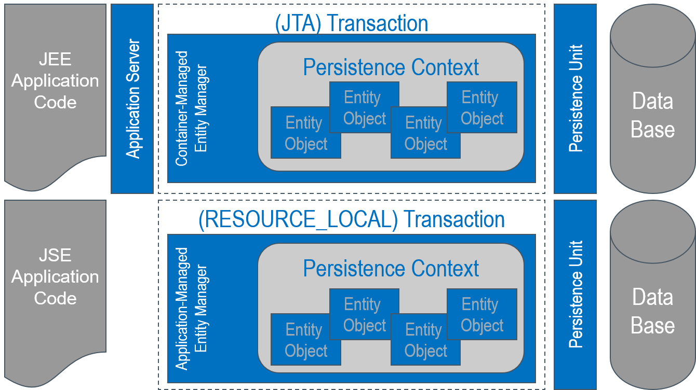
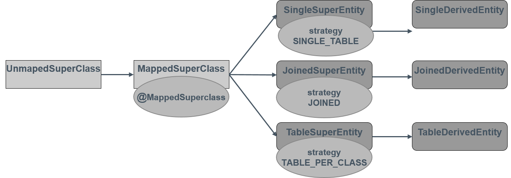
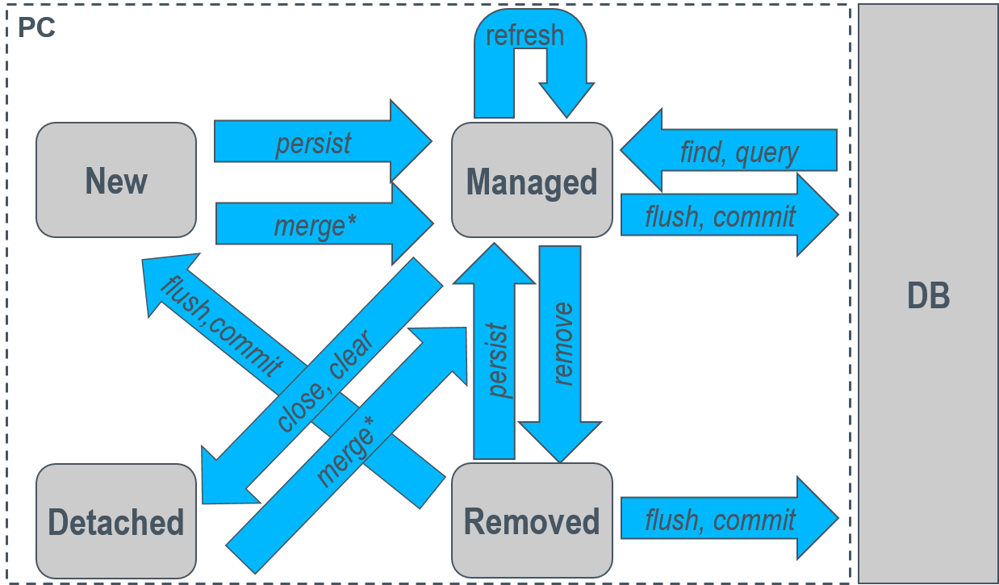
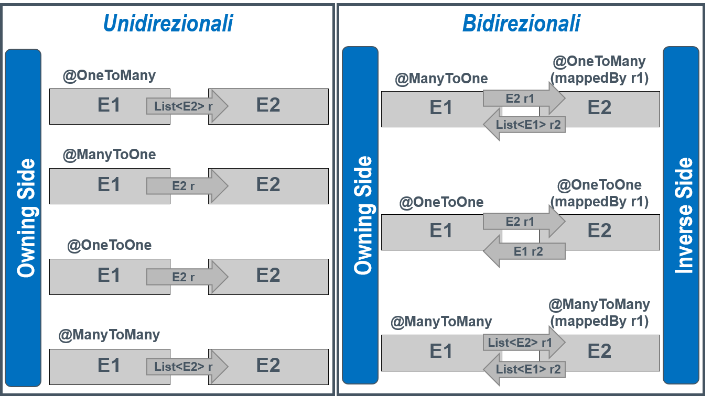

<!----------------- BEGIN SLIDE 001 -------------------------->
> 001


# Persistenza in Java: JPA  

Giuseppe Della Penna

Università degli Studi di L'Aquila    
giuseppe.dellapenna@univaq.it    
http://people.disim.univaq.it/dellapenna

**Versione documento: 051025**

> *Questo documento si basa sulle slide del corso di Web Engineering, riorganizzate per una migliore esperienza di lettura. Non è un libro di testo completo o un manuale tecnico, e deve essere utilizzato insieme a tutti gli altri materiali didattici del corso. Si prega di segnalare eventuali errori o omissioni all'autore.*

> Quest'opera è rilasciata con licenza CC BY-NC-SA 4.0. Per visualizzare una copia di questa licenza, visitate il sito https://creativecommons.org/licenses/by-nc-sa/4.0

<!----------------- BEGIN TOC -------------------------->


<!------------------- END TOC -------------------------->

<!------------------- END SLIDE 001 -------------------------->

<!----------------- BEGIN SLIDE 002 -------------------------->
> 002

## Persistenza

Un oggetto persistente ha uno stato che sopravvive al processo che lo ha creato, e quindi può essere successivamente ricaricato, riusato e aggiornato.

Per realizzare la persistenza, gli oggetti vengono scritti e letti da un database 

<!------------------- END SLIDE 002 -------------------------->

<!----------------- BEGIN SLIDE 003 -------------------------->
> 003

### Jakarta Persistence API (JPA)


JPA è un framework di persistenza generico che permette di rendere persistenti oggetti Java in maniera quasi del tutto trasparente al programmatore, fornendo: 

- API per la persistenza, definite nel package jakarta.persistence  

- Un linguaggio di query utilizzabile per interrogare oggetti persistenti, il Jakarta Persistence Query Language (JPQL)  

- Un sistema di mappatura (ORM) tra lo schema relazionale di un DB e le classi che rappresentano oggetti persistenti, dette entità.  

JPA fino a pochi anni fa era l'acronimo di **Java Persistence API**, sviluppata da Oracle come parte della *Java Enterprise Edition*, *JEE*. A partire dalla versione 9, la piattaforma enterprise di Java è sviluppata dalla  *Eclipse Foundation*, ed ha preso il nome di *JakartaEE*. Allo stesso modo, l'acronimo JPA adesso indica la  **Jakarta Persistence API**.

*La differenza più evidente tra la "vecchia" versione di JPA e quella Jakarta è che tutti i namespace sono stati aggiornati, passando dal prefisso "javax." a "jakarta."*  

JPA è solo un insieme di interfacce: come molte tecnologie Java, per essere usata ha bisogno di una libreria effettiva di persistenza, inserita nel programma, che sia compatibile con JPA stessa:  *EclipseLink*, *Hibernate*, *OpenJPA*,...

<!------------------- END SLIDE 003 -------------------------->

<!----------------- BEGIN SLIDE 004 -------------------------->
> 004

### Object-Relational Mapping (ORM)


Un elemento cardine della persistenza in un linguaggio a oggetti è la strategia con cui gli oggetti vengono mappati negli schemi relazionali di un DB.

Con JPA, l'ORM si specifica tramite annotazioni (@) poste su classi, campi e metodi.

Esistono due classi di annotazioni, che permettono di definire un mapping a livello logico o fisico:  

- Il livello logico corrisponde a quello object-oriented, e specifica entità e relazioni ad alto livello (come nel modello relazionale), lasciando a JPA l'onere di derivarne il modello fisico  

- Il livello fisico è quello del database, con tabelle e colonne: a questo livello si dice a JPA direttamente come mappare gli elementi del database (anche preesistente) sugli oggetti

<!------------------- END SLIDE 004 -------------------------->

<!----------------- BEGIN SLIDE 005 -------------------------->
> 005

### Aggiungere JPA a un progetto Maven


```xml
<dependency>  
 <groupId>org.hibernate</groupId> 
 <artifactId>hibernate-core</artifactId> 
 <version>6.3.1.Final</version> 
</dependency>  

<dependency>  
 <groupId>com.mysql</groupId> 
 <artifactId>mysql-connector-j</artifactId> 
 <version>8.0.33</version> 
</dependency>  
```

<!----------------- COLUMN 001  -------------------------->

Per usare JPA **in un’applicazione JSE** è necessario **inserirne un provider** nella propria applicazione.

In questo esempio usiamo il notissimo **Hibernate**. La versione importata in questo esempio supporta **JPA 3.1**

È inoltre necessario importare il **driver JDBC** relativo al DBMS sul quale si realizzerà la persistenza. In questo caso importiamo il driver di **MySQL 8** 

Attenzione: se si usa JPA **in un’applicazione JEE**, il relativo server **fornisce la sua implementazione di JPA, e quindi non è necessario importarne una nell’applicazione**, a meno che non si voglia disabilitare quella built-in del server.


<!------------------- END SLIDE 005 -------------------------->

<!----------------- BEGIN SLIDE 006 -------------------------->
> 006

## Architettura di JPA


<!------------------- END SLIDE 006 -------------------------->

<!----------------- BEGIN SLIDE 007 -------------------------->





<!------------------- END SLIDE 007 -------------------------->

<!----------------- BEGIN SLIDE 008 -------------------------->
> 008

### Persistence Unit


Una *persistence unit* definisce l'insieme delle classi-entità gestite da un *entity manager*.

Le classi specificate in una PU di solito sono mappate sullo schema di uno specifico database.

Le PU sono definite all'interno del file di configurazione **persistence.xml**, che di solito è posto nella directory META-INF dell'applicazione.

Ogni PU contiene 

- Un nome univoco

- Informazioni sul **provider di persistenza**, cioè la libreria che effettivamente gestirà la persistenza delle entità

- Informazioni sul tipo di transazioni da usare: **RESOURCE\_LOCAL** o **JTA** (si veda dopo per il significato di queste opzioni).

- Le in formazioni di accesso ai dati, cioè
  
  - Una lista di proprietà da inviare al provider, ad es. la *connection string* per un database e le credenziali associate

  - L'indicazione del data source (nel caso di applicazioni che usino connessioni ai dati gestite, ad esempio, tramite il *connection pooling*)

- Una lista di (nome completi di) classi-entità da far gestire alla PU    
  Specificare le classi da includere nella persistenza è solitamente necessario solo in ambienti JavaSE. Alcuni provider, come hibernate, eseguono l'autodetection di tutte le classi marcate con `@Entity`, ma questo non è sempre garantito.  

<!------------------- END SLIDE 008 -------------------------->

<!----------------- BEGIN SLIDE 009a -------------------------->
> 009a

#### Esempio – Applicazione JSE


```xml
<?xml version="1.0" encoding="UTF-8"?>
<persistence version="2.1" xmlns="http://xmlns.jcp.org/xml/ns/persistence" xmlns:xsi="http://www.w3.org/2001/XMLSchema-instance" xsi:schemaLocation="http://xmlns.jcp.org/xml/ns/persistence http://xmlns.jcp.org/xml/ns/persistence/persistence_2_1.xsd">

 <persistence-unit name="JPAExpPU" transaction-type="RESOURCE_LOCAL">
  <provider>org.hibernate.jpa.HibernatePersistenceProvider</provider>
  <class>it.univaq.f3i.lbd.jpa.examples.entities.Entity1</class>
  <properties>
   <property name="jakarta.persistence.jdbc.url" value="jdbc:mysql://localhost:3306/persistdb?zeroDateTimeBehavior=convertToNull"/>
   <property name="jakarta.persistence.jdbc.user" value="website"/>
   <property name="jakarta.persistence.jdbc.password" value="webpass"/>
   <property name="jakarta.persistence.jdbc.driver" value="com.mysql.cj.jdbc.Driver"/>
   <property name="jakarta.persistence.schema-generation.database.action" value="drop-and-create"/>
   <property name="hibernate.show_sql" value="true"/>
   <property name="hibernate.format_sql" value="true"/> 
  </properties>  
 </persistence-unit>
</persistence>
```

<!------------------- END SLIDE 009a -------------------------->

<!----------------- BEGIN SLIDE 009b -------------------------->
> 009b

#### Esempio – Applicazione Web JSE (ad esempio su server Tomcat)


```xml
<?xml version="1.0" encoding="UTF-8"?>
<persistence version="3.0" xmlns="https://jakarta.ee/xml/ns/persistence" xmlns:xsi="http://www.w3.org/2001/XMLSchema-instance" xsi:schemaLocation="https://jakarta.ee/xml/ns/persistence https://jakarta.ee/xml/ns/persistence/persistence_3_0.xsd">

 <persistence-unit name="JPAExpWebPU" transaction-type="RESOURCE_LOCAL">  
  <provider>org.hibernate.jpa.HibernatePersistenceProvider</provider>
  <non-jta-data-source>java:/comp/env/jdbc/persistdb</non-jta-data-source>
  <class>it.univaq.f3i.lbd.jpa.examples.entities.Entity1</class>
  <properties>
   <property name="jakarta.persistence.schema-generation.database.action" value="drop-and-create"/>  
   <property name="hibernate.show_sql" value="false"/>
   <property name="hibernate.format_sql" value="true"/>
  </properties>
 </persistence-unit>
</persistence>
```

<!------------------- END SLIDE 009b -------------------------->

<!----------------- BEGIN SLIDE 009c -------------------------->
> 009c

#### Esempio – Applicazione JEE


```xml
<?xml version="1.0" encoding="UTF-8"?>
<persistence version="2.0" xmlns="http://java.sun.com/xml/ns/persistence" xmlns:xsi="http://www.w3.org/2001/XMLSchema-instance" xsi:schemaLocation="http://java.sun.com/xml/ns/persistence http://java.sun.com/xml/ns/persistence/persistence_2_0.xsd">

 <persistence-unit name="JPAExpWebPU" transaction-type="JTA">
  <provider>org.apache.openjpa.persistence.PersistenceProviderImpl</provider>
  <jta-data-source>persistdb</jta-data-source>
  <properties>
   <property name="openjpa.jdbc.SynchronizeMappings" value="buildSchema(SchemaAction=&apos;add,deleteTableContents&apos;,ForeignKeys=true)"/>
  </properties>
 </persistence-unit>
</persistence>
```

<!------------------- END SLIDE 009c -------------------------->

<!----------------- BEGIN SLIDE 010 -------------------------->
> 010

### PersistenceContext ed EntityManager


Il **persistence context**  è una cache di oggetti-entità associata a una PU e da questa a una sorgente dati (ad es. connessione a database) tramite la quale gli oggetti sono creati, aggiornati e rimossi.

All'interno del codice Java un PC è associato a un'istanza della classe **EntityManager**, tramite la quale è possibile interagire con le entità ad esso associate.

Se si preleva più volte (con una query, per ID, tramite un'enumerazione, ecc.) una specifica istanza di entità (cioè  **con una particolare chiave**) tramite le API **di uno stesso EntityManager** (quindi *dallo stesso PC*), **si otterrà sempre un riferimento allo stesso oggetto Java**.

I PC sono isolati tra di loro: le entità presenti in due PC aperti simultaneamente (in concorrenza) non si influenzano e non sono sincronizzate tra loro.

L'EntityManager può essere usato, con modalità differenti, sia in applicazioni JEE che in applicazioni JSE.  

<!------------------- END SLIDE 010 -------------------------->

<!----------------- BEGIN SLIDE 011 -------------------------->
> 011

### Tipi di EntityManager


**Container-Managed EntityManager** 

- Specifico delle applicazioni Enterprise (JEE/JakartaEE).  

- È unico, viene creato dall' application server e reso disponibile nel codice tramite JNDI o *resource injection* (annotazione `@PersistenceContext`) **all'interno di oggetti EJB**.

- La parte transazionale è tipicamente JTA (default) e in tal caso l'EntityManager è ***transaction scoped***, cioè automaticamente creato e distrutto assieme alla transazione generata dal server, oppure può avere un "Extended Scope", nel qual caso il suo PC sopravvive oltre la transazione (non approfondiremo questa modalità). 

**Application-Managed EntityManager** 

- Tipico della applicazioni JSE, può essere usato anche in applicazioni JEE.  

- Viene creato manualmente nel codice e deve essere chiuso esplicitamente tramite il metodo `close()`. 

- È ottenuto tramite una **EntityManagerFactory** associata con una specifica persistence unit che può essere iniettata nel codice tramite l'annotazione `@PersistenceUnit` o creata tramite i metodi statici di  **Persistence**.

- EntityManager creati successivamente sono associati a persistence context diversi. 

- La parte transazionale è tipicamente RESOURCE\_LOCAL, ma può essere anche JTA in applicazioni JEE. In questo caso, se quando l'EntityManager viene creato è già attiva una transazione JTA, quest'ultima verrà associata automaticamente all'EntityManager, altrimenti sarà l'EntityManager stesso a doversi legare a una transazione JTA aperta dal container tramite il metodo  *joinTransaction*.

<!------------------- END SLIDE 011 -------------------------->

<!----------------- BEGIN SLIDE 012 -------------------------->
> 012

## JPA: entità


<!------------------- END SLIDE 012 -------------------------->

<!----------------- BEGIN SLIDE 013 -------------------------->
> 013


Le entità del dominio si mappano sulle normali classi Java. Una classe diventa un'entità persistente quando viene annotata con `@Entity` (jakarta.persistence.Entity). 

È possibile specificare il nome dell'entità, se diverso da quello della classe, con il parametro *name* dell'annotazione.

La classe deve avere (almeno) un costruttore senza argomenti accessibile (pubblico o protetto).

Non ci sono requisiti circa particolari classi da estendere o interfacce da implementare.

Sono supportate tutte le tecniche di modellazione a oggetti standard, come ereditarietà e incapsulamento. Nel caso dell'ereditarietà, non è richiesto che tutti gli oggetti della gerarchia siano dichiarati come entità.

La classe non deve essere *final*.

Una serie di annotazioni definisce il mapping specifico dello stato della classe nel DB. Tuttavia, maggior parte di queste annotazioni ha dei default, quindi può essere omessa.  

<!------------------- END SLIDE 013 -------------------------->

<!----------------- BEGIN SLIDE 014 -------------------------->
> 014

#### Esempio


```java
@Entity 
@Access(AccessType.FIELD) /* opzionale */  
@EntityListeners(value={Entity1Listener.class})  
public class Entity1 {  
 @Id
 @GeneratedValue(strategy = GenerationType.AUTO)  
 private Long id;

 @Column(nullable = false) 
 //oppure @Basic(optional=false) 
 private String name;  

 @Lob
 private String text;  

 @Column(name = "date")  
 private LocalDateTime timestamp;  

 @Transient 
 private int localcache;  

 @Embedded
 private Embeddable1 aggregate;

 @OneToOne 
 private Entity2 relation_e2;

 @OneToMany(mappedBy = "relation_e1")  
 private List<Entity3> relation_e3_inverse = new ArrayList<>();  
  
 @PrePersist 
 @PreUpdate 
 public void setCurrentTimestamp() {  
  setTimestamp(LocalDateTime.now());  
 }
}
```

<!----------------- COLUMN 001  -------------------------->

La classe Entity1 è *un'entità persistente*, i cui campi sono derivati da quelli della classe stessa.

<!------------------- END SLIDE 014 -------------------------->

<!----------------- BEGIN SLIDE 015 -------------------------->
> 015

### Campi


Lo stato persistente di una classe-entità è costituito dai dati in essa contenuti che vengono salvati sul DB.

È possibile indicare cosa costituisce lo stato persistente di una classe tramite l'annotazione  `@Access`:

- **AccessType.FIELD** indica che verranno resi persistenti i valori dei suoi campi.    
 I campi persistenti non devono essere mai final né pubblici, ma accessibili solo tramite i rispettivi getter/setter. I campi marcati con `@Transient` non sono mai persistenti.  

- **AccessType.PROPERTY** indica che verranno resi persistenti i valori restituiti dai suoi metodi get/set, detti proprietà (che, come sappiamo, possono anche non essere mappati direttamente su dei campi, ma avere una rappresentazione interna più complessa).    
 I metodi get/set delle proprietà persistenti non devono mai essere final.  

Se non si specifica `@Access`, il tipo di accesso viene dedotto dal punto in cui è inserita l'annotazione obbligatoria `@Id` (vedi più avanti)  

<!------------------- END SLIDE 015 -------------------------->

<!----------------- BEGIN SLIDE 016 -------------------------->
> 016

#### Annotazioni di tipo


Su ogni dato (campo/metodo) persistente è possibile specificare dettagli del mapping usando alcune annotazioni:  

- `@Column`: permette di specificare il nome della colonna del DB su cui mappare il dato (*name*, default: il nome del dato stesso), se la colonna può essere null (*nullable*, default true) e se deve essere UNIQUE (*unique*, default false). *Altre caratteristiche più avanzate vengono omesse*.    
  **Attenzione**: i tipi base di Java, come int o float, non potendo valere null, **sono implicitamente considerati nullable=false**. Al loro posto è quindi preferibile usare le corrispondenti classi wrapper (Integer, Float,...)  

- `@Basic`: indica che il campo deve essere mappato sul tipo DB semplice più appropriato. È un'annotazione di default che può essere sempre omessa.    
  Si può applicare solo a dati dei seguenti tipi Java: tipi primitivi (int, double,...), wrapper di tipi primitivi (Integer, Double,...), String, BigInteger, BigDecimal, Date, Calendar, java.sql.Date, java.sql.Time, java.sql.Timestamp, byte[], Byte[], char[], Character[], enumerazioni e classi che implementano l'interfaccia Serializable.     
  Si può specificare il tipo di *fetch* del dato (*fetch*=**FetchType.EAGER** (default) o *fetch*=**FetchType.LAZY**). FetchType.LAZY indica che il caricamento dal DB del dato dovrà avvenire solo quando questo viene letto per la prima volta.     
  Si può specificare se il dato può essere omesso tramite l'attributo  *optional* (che, in generale, renderà NOT NULL la colonna del database se posto a false).

- `@Lob`: indica che il dato persistente deve essere mappato su un Large Object del DB (CLOB, BLOB) invece che su un tipo base (ad es. VARCHAR).    
 Può essere usato insieme a `@Basic`. In questo caso, il *fetchType* di default è LAZY.

- `@Temporal` deve essere specificato (in congiunzione con `@Basic`) su dati di tipo Date o Calendar per indicare il tipo di dato del DB da mappare (**TemporalType.DATE**, **TemporalType.TIME** o **TemporalType.TIMESTAMP**). *I nuovi tipi java.time (come LocalDate) non necessitano di questa annotazione*.  

*I campi che rappresentano relazioni andranno annotati in maniera diversa*.

<!------------------- END SLIDE 016 -------------------------->

<!----------------- BEGIN SLIDE 017 -------------------------->
> 017

### Chiavi primarie


Ogni classe-entità deve avere uno o più campi dichiarati come chiave primaria, che verranno mappati nella chiave della corrispondente tabella del DB.

Le chiavi costituite da un solo campo si specificano con l'annotazione `@Id` posta sulla variabile/metodo get corrispondenti.  

Le chiavi multi-campo devono essere incapsulate in un oggetto incorporato (definite con l'annotazione `@Embeddable`, vedi dopo) che contiene tutti i campi della chiave. La variabile/metodo get corrispondente deve essere annotato con `@EmbeddedId` 

È possibile usare come chiavi primarie campi di tipo primitivo (int, double,...), wrapper di tipi primitivi (Integer, Double,...), String, Date, java.sql.Date, BigDecimal e BigInteger.    
È possibile richiedere che il valore di una campo `@Id` (di tipo *semplice*) venga generato automaticamente (e in modo univoco) usando l'annotazione `@GeneratedValue`. Il parametro *strategy* indica in che modo dovranno essere generate i valori: 

- `GenerationType.AUTO` (default, DB-specifico), 

- `GenerationType.SEQUENCE` (valori sequenziali generati dal DB), `GenerationType.IDENTITY` (usa una colonna "identity" del DB), 

- `GenerationType.TABLE` (i valori sono generati usando un'altra tabella per valutarne l'unicità)

Le strategie SEQUENCE e TABLE usano un generatore di default, che può essere riprogrammato usando le annotazioni `@TableGenerator` e `@SequenceGenerator` 

**Un campo `@GeneratedValue` non deve mai essere assegnato esplicitamente nel codice!** 

<!------------------- END SLIDE 017 -------------------------->

<!----------------- BEGIN SLIDE 018 -------------------------->
> 018

#### Esempio


```java
@Entity 
public class Entity1 {  
 @Id
 @GeneratedValue(strategy = GenerationType.AUTO)  
 private Long id;

 @Column(nullable = false) 
 //oppure @Basic(optional=false)
 private String name;  

 @Lob
 private String text;  

 @Column(name = "date")  
 private LocalDateTime timestamp;  

 @Transient 
 private int localcache;  
}
```

<!----------------- COLUMN 001  -------------------------->

L'entità Entity1 ha i seguenti **campi**:

- *id*, chiave numerica generata automaticamente all'atto della persistenza

- *name*, stringa dichiarata NOT NULL

- *text*, testo che verrà mappato su un CLOB

- *timestamp*, che verrà mappato su un campo del DB chiamato *date* (e non timestamp). Da notare che usando tipi definiti in java.time non abbiamo bisogno dell'annotazione `@Temporal` 

- *localcache* sarà parte della classe Entity1 ma non della corrispondente entità persistente. 

<!------------------- END SLIDE 018 -------------------------->

<!----------------- BEGIN SLIDE 019 -------------------------->
> 019

### Classi Embeddable


Le classi *embeddable* non hanno una propria persistenza (cioè una tabella del DB corrispondente), ma vengono salvate aggregandole alle entità (proprietarie) in cui sono incorporate.

Una classe embeddable può essere incorporata (utilizzata) in più di una entità e deve essere marcata con l'annotazione `@Embeddable`. I corrispondenti campi della classe proprietaria devono essere annotati con `@Embedded`

L'entità proprietaria di una classe embeddable può anche alterarne il mapping per adattarlo alla struttura della propria tabella DB tramite le annotazioni `@AttributeOverride`, `@AttributeOverrides`, `@AssociationOverride` e `@AssociationOverrides`.

**Attenzione**: se un campo `@Embedded` punta a una classe `@Embeddable` **contenente campi esplicitamente o implicitamente marcati con** ***nullable=false***, allora l'intero campo `@Embedded` sarà **ricorsivamente marcato come** ***nullable=false!*** 

<!------------------- END SLIDE 019 -------------------------->

<!----------------- BEGIN SLIDE 020 -------------------------->
> 020

#### Esempio


```java
@Entity
public class Entity1 { 
 @Id 
 @GeneratedValue(strategy = GenerationType.AUTO)  
 private Long id; 

 @Embedded  
 private Embeddable1 aggregate; 
}

@Embeddable 
public class Embeddable1 {  
 private String description;  
 private Integer code; 
}
```

<!----------------- COLUMN 001  -------------------------->

L'entità Entity1 ha i seguenti **campi**:

- *id*, chiave numerica generata automaticamente all'atto della persistenza

- *aggregate*, in quanto `@Embedded`, verrà esploso nei campi della classe *Embeddable1*, cioè *description*  e *code*.

- Da notare che *code* è *Integer* e non *int*, altrimenti diventerebbe implicitamente *optional=false* (o *nullable=false*) e, transitivamente, lo sarebbe anche *aggregate*.

<!------------------- END SLIDE 020 -------------------------->


<!----------------- BEGIN SLIDE 019b -------------------------->
> 019b

### Collezioni Persistenti

E' possibile rendere automaticamente persistenti anche *campi definiti come liste o mappe contenenti tipi base o classi embeddable*. 
A questo scopo, i corrispondenti campi dovranno essere annotati con l'annotazione `@ElementCollection`

Per eseguire la serializzazione, JPA creerà una relazione uno a molti implicita tra l'entità contenente il campo `@ElementCollection` e 
una tabella creata ad-hoc per contenere i valori della lista o mappa. Nel caso di una mappa, tale tabella conterrà anche una o più colonne
usate per contenere i dati della chiave.

In questi casi è sempre buona norma *capire se è il caso di gestire queste liste tramite relazioni esplicite*, rendendo la classe nella lista 
un'entità invece che una classe embedded.

<!------------------- END SLIDE 019b -------------------------->

<!----------------- BEGIN SLIDE 020b -------------------------->
> 020b

#### Esempio


```java
@Entity
public class Entity1 { 
 @Id 
 @GeneratedValue(strategy = GenerationType.AUTO)  
 private Long id; 

 @ElementCollection
 private List<Embeddable1> aggregatedList;
 @ElementCollection
 private List<String> aggregatedStrings;

 @ElementCollection
 private Map<String, Embeddable1> aggregatedMap;
}

@Embeddable 
public class Embeddable1 {  
 private String description;  
 private Integer code; 
}
```

<!----------------- COLUMN 001  -------------------------->

Per mappare Entity1 JPA creerà quattro tabelle: una per l'entità vera e propria, una per la collezione *aggregatedList*, 
una per la collezione *aggregatedStrings* e una per la collezione *aggregatedMap*. A titolo di esempio, mostriamo il DDL
creato da Hibernate:

```sql
CREATE TABLE entity1 (
  id bigint(20) NOT NULL,
  PRIMARY KEY (id)
);
CREATE TABLE entity1_aggregatedlist (
 code int(11) DEFAULT NULL,
 Entity1_id bigint(20) NOT NULL,
 description varchar(255) DEFAULT NULL,
 FOREIGN KEY (Entity1_id) REFERENCES entity1 (id)
);
CREATE TABLE entity1_aggregatedstrings (
 Entity1_id bigint(20) NOT NULL,
 aggregatedStrings varchar(255) DEFAULT NULL,
 FOREIGN KEY (Entity1_id) REFERENCES entity1 (id)
);
CREATE TABLE entity1_aggregatedmap (
 code int(11) DEFAULT NULL,
 Entity1_id bigint(20) NOT NULL,
 aggregatedMap_KEY varchar(255) NOT NULL,
 description varchar(255) DEFAULT NULL,
 PRIMARY KEY (Entity1_id,aggregatedMap_KEY),
 FOREIGN KEY (Entity1_id) REFERENCES entity1 (id)
);
```

<!------------------- END SLIDE 020b -------------------------->


<!----------------- BEGIN SLIDE 019c -------------------------->
> 019c

### Tabelle, Indici e Vincoli

Come abbiamo visto, JPA crea in generale una tabella relazionale avente lo stesso nome di
ogni entità dichiarata nel codice. E' tuttavia possibile personalizzare vari aspetti di questa
tabella usando, insieme all'annotazione `@Entity` anche l'annotazione `@Table` con i seguenti parametri

- *name*: permette di specificare un numer alternativo per la tabella relazionale collegata all'entità.
 All'interno del codice, comunque, il nome da citare rimarrà sempre quello dell'entità (classe).
  
- *indexes*: permette di specificare degli indici da creare nella tabella, elencandone le colonne. 
La sintassi completa di questo parametro è    
```java
 indexes = {@Index(name = "<nome>", columnList = "<col1>,<col2>,..."),...}
```

- *uniqueContraints*: permette di specificare dei vincoli UNIQUE su più colonne (quelli su singola colonna possono 
  essere impostati usando il parametro *unique* dell'annotazione `@Column`. 
La sintassi completa di questo parametro è     
```java
uniqueConstraints = {@UniqueConstraint(name="<nome>", columnNames = {"<col1>", "<col2>"}),...}
``` 

<!------------------- END SLIDE 019c -------------------------->

<!----------------- BEGIN SLIDE 020c -------------------------->
> 020c

#### Esempio

```java
@Entity
@Table(
 uniqueConstraints = {
  @UniqueConstraint(name="unique1", columnNames = {"name", "number"})},
 indexes = {
  @Index(name = "indice1", columnList = "date,name")}
)
@Access(AccessType.FIELD)
public class Entity1 implements Serializable {
 @Id
 @GeneratedValue(strategy = GenerationType.AUTO)
 private Long id;
 @Column(nullable = false, unique = true)
 private String name;
 private Float number;
 @Lob
 private String text;
 @Column(name = "date")
 private LocalDateTime timestamp;
 @Transient
 private int localcache;
 @Embedded
 private Embeddable1 aggregate;
 @AttributeOverrides({
  @AttributeOverride(name = "description", column = @Column(name = "description2")),
  @AttributeOverride(name = "code", column = @Column(name = "code2"))
 })
 private Embeddable1 aggregate2;    
```

<!----------------- COLUMN 001  -------------------------->

Hibernate genera il seguente DDL per l'entità mostrata:

```sql
CREATE TABLE entity1 (
 id bigint(20) NOT NULL,
 number float DEFAULT NULL,
 name varchar(255) NOT NULL,
 text tinytext,  
 date datetime(6) DEFAULT NULL,
 code int(11) DEFAULT NULL,
 code2 int(11) DEFAULT NULL,
 description varchar(255) DEFAULT NULL,
 description2 varchar(255) DEFAULT NULL,
 PRIMARY KEY (id),
 UNIQUE KEY UK_q7hc6n1kqsv (name),
 UNIQUE KEY unique1 (name,number),
 KEY indice1 (date,name)
);
```

<!------------------- END SLIDE 020c -------------------------->


<!----------------- BEGIN SLIDE 021 -------------------------->
> 021

### Ereditarietà


Le classi-entità possono estendere altre entità ma anche classi non-entità (non annotate con `@Entity`) e astratte.  

**Lo stato delle classi standard (non-entità) inserite all'interno di una gerarchia non è mai persistente** (quindi queste classi non possono contenere annotazioni relative alla persistenza, e i loro campi non vengono immagazzinati nel DB anche se ereditati da classi-entità), **a meno che queste non siano marcate con l'annotazione `@MappedSuperclass`**.    
 Una classe non-entità della gerarchia marcata con l'annotazione `@MappedSuperclass` può specificare un mapping per i suoi campi, che verranno resi persistenti, con le caratteristiche così descritte, come parte delle classi derivate (*una `@MappedSupeclass` non ha mai una tabella propria*).

Le gerarchie così ottenute possono essere mappate sul DB con tre strategie diverse, indicate tramite il parametro *strategy* dell'annotazione `@Inheritance`, da inserire **sulla classe radice della gerarchia**, insieme all'annotazione `@Entity`:  

- `InheritanceType.SINGLE_TABLE`: tutti i dati della gerarchia (appartenenti a tutte le classi-entità in essa contenute) sono mappati su una sola tabella (default); in altre parole, c'è *una tabella per tutta la gerarchia (o meglio per ogni foglia delle gerarchia)*.

- `InheritanceType.JOINED`: ogni classe-entità (anche astratta) della gerarchia viene mappata su una tabella diversa, **con i propri campi (non quelli ereditati)**. Il sistema di persistenza userà dei join per ricostruire i dati completi (propri ed ereditati) di una sottoclasse. I record da collegare nelle varie tabelle avranno lo stesso valore `@Id`.

- `InheritanceType.TABLE_PER_CLASS`: ogni classe-entità non astratta della gerarchia viene mappata su una tabella diversa, **contenente tutti i campi propri ed ereditati**.

È possibile anche variare la strategia di mapping per sotto-alberi di una gerarchia, inserendo altre annotazioni `@Inheritance` sulle radici delle sotto-gerarchie.  

<!------------------- END SLIDE 021 -------------------------->

<!----------------- BEGIN SLIDE 022 -------------------------->
> 022

#### Discriminatori


Per le strategie SINGLE\_TABLE è necessario che JPA possa capire a quale entità della gerarchia corrispondono i dati "aggregati" nell'unica tabella (SINGLE\_TABLE). Per questo viene aggiunta alle tabelle una colonna detta "discriminatore":  

- Si inserisce l'annotazione `@DiscriminatorColumn` con i parametri *name* (nome della colonna) e opzionalmente *discriminatorType* (con valori `discriminatorType.STRING`, il default, `discriminatorType.CHAR` o `discriminatorType.INTEGER`) sulla classe che riporta anche l'annotazione `@Inheritance`. Se questa annotazione viene omessa, la colonna verrà creata col nome di default "DTYPE".  

- Si inserisce, su ciascuna classe non astratta della gerarchia (compresa eventualmente la radice!), l'annotazione `@DiscriminatorValue` avente come parametro un valore del tipo prescelto che indichi univocamente quella classe. Se questa annotazione viene omessa, JPA sceglierà dei valori dipendenti dall'implementazione (ad esempio il nome dell'entità).

<!------------------- END SLIDE 022 -------------------------->

<!----------------- BEGIN SLIDE 023 -------------------------->
> 023

#### Esempio


```java
public abstract class UnmappedSuperClass {private String unmappedSuperClassField;}  

@MappedSuperclass public class MappedSuperClass extends SimpleSuperClass 
{private String mappedSuperClassField;} 

@Entity public class SingleSuperEntity extends MappedSuperClass 
{@Id private Long singleSuperEntityId;  
private String singleSuperEntityField;} 

@Entity public class SingleDerivedEntity extends SingleSuperEntity 
{private String singleDerivedEntityField;} 

@Entity @Inheritance(strategy = InheritanceType.JOINED) 
public class JoinedSuperEntity extends MappedSuperClass  
{@Id private Long joinedSuperEntityId;  
private String joinedSuperEntityField;} 

public class JoinedDerivedEntity extends JoinedSuperEntity 
{private String joinedDerivedEntityField;} 

@Entity @Inheritance(strategy = InheritanceType.TABLE_PER_CLASS) 
public class TableSuperEntity extends MappedSuperClass  
{@Id private Long tableSuperEntityId;  
private String tableSuperEntityField;} 

@Entity public class TableDerivedEntity extends TableSuperEntity  
{private String tableDerivedEntityField;} 
```

<!----------------- COLUMN 001  -------------------------->

**UnmappedSuperClass** è una classe semplice, quindi non è possibile renderla persistente, e non è mappata nelle derivate, che quindi non conterranno unmappedSuperClassField.  

**MappedSuperClass**  è una `@MappedSuperclass`, quindi il campo **mappedSuperClassField diverrà persistente come parte nelle entità derivate**  (ma questa classe non potrà essere resa persistente da sola).

L'entità **SingleSuperEntity** ha InheritanceType=SINGLE (default).    
  La classe derivata **SingleDerivedEntity** verrà fusa con la classe superiore, generando una tabella che conterrà i campi ***singleSuperEntityId*** e ***singleSuperEntityField*** **(classe base)**, ***mappedSuperClassField*** (ereditato) e  ***singleDerivedEntityField*** (derivata). Inoltre verrà inserita automaticamente una colonna discriminatrice per distinguere le istanze di **SingleDerivedEntity** da quelle di **SingleSuperEntity**.

L'entità **JoinedSuperEntity** ha InheritanceType=JOINED.   
  Una tabella **JoinedSuperEntity**  conterrà i campi ***joinedSuperEntityId***, ***joinedSuperEntityField*** e ***mappedSuperClassField***, ereditato da MappedSuperClass.   
  Una tabella **JoinedDerivedEntity** conterrà i campi ***joinedSuperEntityId*** (ereditato e usato per mettere in corrispondenza I record di questa tablela con quelli di JoinedSuperEntity) e  ***joinedDerivedEntityField***. 

L'entità **TableSuperEntity** ha InheritanceType=TABLE\_PER\_CLASS.   
  Una tabella **TableSuperEntity**  conterrà i campi ***tableSuperEntityId***, ***tableSuperEntityField*** e ***mappedSuperClassField***, ereditato MappedSuperClass.   
  Una tabella **TableDerivedEntity** conterrà i campi ***tableSuperEntityId***, ***tableSuperEntityField***, ***mappedSuperClassField***  (ereditati da TableSuperEntity) e ***tableDerivedEntityField***.

<!------------------- END SLIDE 023 -------------------------->

<!----------------- BEGIN SLIDE 024 -------------------------->
> 024

#### Esempio (albero e modello relazionale)




- **SingleSuperEntity** (*_singleSuperEntityId_*, *singleSuperEntityField*, *mappedSuperClassField*, *singleDerivedEntityField*, DTYPE). 

- **JoinedSuperEntity**(*_joinedSuperEntityId_*, *joinedSuperEntityField*, *mappedSuperClassField*)

- **JoinedDerivedEntity**(*_joinedSuperEntityId_*, *joinedDerivedEntityField*)

- **TableSuperEntity**(*_tableSuperEntityId_*, *tableSuperEntityField*, *mappedSuperClassField*)

- **TableDerivedEntity**(*_tableSuperEntityId_*, *tableSuperEntityField*, *mappedSuperClassField, tableDerivedEntityField*)


<!------------------- END SLIDE 024 -------------------------->

<!----------------- BEGIN SLIDE 025 -------------------------->
> 025

#### Esempio (Dati)


Supponiamo di inserire un'istanza in ogni classe-entità della gerarchia, impostando tutti i campi con la stessa (ovvia) stringa...

**SingleSuperEntity**

|**DTYPE** |**singleSuperEntityId** |**mappedSuperClassField** |**singleSuperEntityField** |**singleDerivedEntityField**|
|---|---|---|---|---|
|SingleSuperEntity|1|single\_super|single\_super| |
|SingleDerivedEntity|4|single\_derived|single\_derived|single\_derived|

**JoinedSuperEntity**

|**joinedSuperEntityId**|**mappedSuperClassField**|**joinedSuperEntityField**|
|---|---|---|
|2|joined\_super|joined\_super|
|5|joined\_derived|joined\_derived|

**JoinedDerivedEntity**

|**joinedSuperEntityId**|**joinedDerivedEntityField**|
|---|---|
|5|joined\_derived|

**TableSuperEntity**

|**tableSuperEntityId**|**mappedSuperClassField**|**tableSuperEntityField**|
|---|---|---|
|3|table\_super|table\_super|

**TableDerivedEntity**

|**tableDerivedEntityId**|**mappedSuperClassField**|**tableSuperEntityField**|**tableDerivedEntityField**|
|---|---|---|---|
|6|table\_derived|table\_derived|table\_derived|


<!------------------- END SLIDE 025 -------------------------->

<!----------------- BEGIN SLIDE 026 -------------------------->
> 026

### Ciclo di Vita delle Entità


In JPA, ogni oggetto-entità può trovarsi in quattro differenti stati:

**Nuovo (*****New*****)**

- Non è persistente

**Managed** 

- È presente nel DB (persistente)

- È presente del PC

- Il suo stato viene sincronizzato automaticamente col DB

- Le relazioni sono popolate automaticamente

**Detached** (scollegata)

- È presente nel DB 

- Non è presente nel PC

- Il suo stato non viene sincronizzato col DB, a meno che non si usino operazioni di *merge* manuali

- Le relazioni devono essere popolate manualmente 

**Removed** (eliminata)  

- È presente nel DB 

- È presente del PC 

- Il suo stato non viene sincronizzato col DB, e verrà rimossa dal DB e dal PC alla successiva commit, (ri)diventando nuova 

<!------------------- END SLIDE 026 -------------------------->

<!----------------- BEGIN SLIDE 027 -------------------------->
> 027





<!------------------- END SLIDE 027 -------------------------->

<!----------------- BEGIN SLIDE 028 -------------------------->
> 028

### API dell'EntityManager

#### Entità


L'EntityManager dispone di API specifiche per la gestione del ciclo di vita delle entità  

- `persist()`: aggiunge un'entità al PC, rendendola persistente (inserendola nel DB) appena possibile

- `remove()`: rimuove un'entità dal PC, eliminandola dal DB appena possibile

- `refresh()`: ricarica l'entità nel PC, sovrascrivendola col suo attuale stato nel DB

- `merge()`: aggiorna un'entità nel PC con lo stato di una sua copia non persistente (*detached*)

- `contains()`: determina se un'entità è *managed*, cioè è contenuta nel PC

- `flush()`: forza la sincronizzazione tra PC e DB

- `close()`: distrugge il PC (tutte le entità diventano *detached*)

- `clear()`: elimina tutte le entità dal PC (diventano tutte *detached*)

<!------------------- END SLIDE 028 -------------------------->

<!----------------- BEGIN SLIDE 029 -------------------------->
> 029

#### Persist


Persist accetta come parametro oggetti-entità e li rende persistenti, inserendoli nel PC e programmandone la INSERT nel DB associato. 

Il metodo si utilizza primariamente con oggetti-entità *nuovi*, cioè mai inseriti nel DB, tuttavia

- Se si chiama persist su un oggetto già *managed* il metodo non esegue alcuna operazione

- Se si chiama persist su un oggetto *detached*, cioè già presente nel DB ma non attualmente nel PC, il metodo solleva un'eccezione (si tratterebbe in questo caso di un duplicato)  

- Se si chiama persist su un oggetto *removed*, cioè rimosso tramite una chiamata a `remove()`, questo lo rende di nuovo persistente.

L'inserimento nel DB avverrà di solito alla fine della transazione associata, ma più essere anticipato chiamando esplicitamente `flush()`  o per scelta interna dell'EntityManager.  

La persistenza si propaga agli oggetti in relazione con quello corrente se la relazione ha un *cascade* di tipo PERSIST o ALL.

Eventuali compi `@Generated` dell'oggetto e lasciati a null vengono valorizzati in automatico al momento della chiamata a persist.  

<!------------------- END SLIDE 029 -------------------------->

<!----------------- BEGIN SLIDE 030 -------------------------->
> 030

#### Remove


Remove accetta come parametro oggetti-entità  *managed* e li elimina, mettendoli in stato *removed* e programmandone la DELETE nel DB associato.

Non è possibile rimuovere un'entità *detached* (cioè rimossa dal PC): se necessario, la si deve ri-prelevare dal DB o farne una merge prima di poterla rimuovere.  

<!------------------- END SLIDE 030 -------------------------->

<!----------------- BEGIN SLIDE 031 -------------------------->
> 031

#### Merge


Merge fonde l'oggetto-entità passatogli come parametro con quello eventualmente già presente nel DB (cioè *con la stessa chiave*), programmando una REPLACE.

Si usa spesso quando un oggetto persistente viene trasferito (con serializzazione) tra componenti software/sessioni fisicamente separati, rendendolo *detached*, e poi deve essere reso di nuovo persistente sincronizzandone lo stato.

Il metodo **restituisce l'oggetto persistente** risultante dalla fusione (**l'oggetto passato come parametro non viene alterato e resta** ***detached***!).

- Se l'oggetto passato a merge è *detached*, viene fuso con quello avente la stessa chiave presente nel DB e il metodo ritorna un riferimento all'oggetto persistente corrispondente.

- Se l'oggetto passato a merge è *nuovo* (la sua chiave non è presente nel DB), la chiamata equivale a una *persist* e il metodo ritorna un riferimento all'oggetto persistente corrispondente.

- Se l'oggetto passato a merge è già *managed*, il metodo non esegue alcuna operazione.

- Se l'oggetto passato a merge è *removed*, il metodo solleva un'eccezione.

<!------------------- END SLIDE 031 -------------------------->

<!----------------- BEGIN SLIDE 032 -------------------------->
> 032

#### Flush / Refresh


Flush forza l'EntityManager a eseguire immediatamente le operazioni SQL programmate sul DB, anche prima della fine della transazione.  In questo modo il PC viene immediatamente sincronizzato col DB.

Refresh ricarica lo stato di un'entità  *managed* sovrascrivendolo con quello presente nel DB. È utile nel caso in cui dei processi esterni possano alterare direttamente nel DB lo stato di oggetti attualmente presenti nel PC.

<!------------------- END SLIDE 032 -------------------------->

<!----------------- BEGIN SLIDE 033 -------------------------->
> 033

### Eventi di Persistenza


È possibile tracciare i più importanti eventi del ciclo di vita di un'entità usando dei metodi *listener*. 

I listener possono essere metodi della classe-entità (o di una sua superclasse) con nome arbitrario, ma devono essere di tipo void e annotati con una o più delle seguenti annotazioni:  

- `@PrePersist`: il metodo si attiva quando viene chiamata `persist()`  su un'istanza

- `@PostPersist`: il metodo si attiva dopo l'esecuzione della INSERT connessa a una chiamata a `persist()` 

- `@PreRemove`: il metodo si attiva all'esecuzione della  `remove()`  su un'istanza

- `@PostRemove`: il metodo si attiva dopo l'esecuzione della DELETE connessa a una chiamata a `remove()` 

- `@PreUpdate`: il metodo si attiva quando l'EntityManager marca un'istanza come modificata  

- `@PostUpdate`: il metodo si attiva dopo l'esecuzione della UPDATE per un'istanza modificata  

- `@PostLoad`: il metodo si attiva quando un'istanza viene caricata o ricaricata (refresh) nel PC  

I metodi listener verranno chiamati, in base all'annotazione (o alle annotazioni) che li marcano, in risposta agli eventi delle istanze della classe-entità corrispondente. 

Se il listener è un metodo dell'entità stessa o di una sua superclasse, allora non accetterà alcun parametro  

*Un possibile uso può essere quello di compilare dei campi (calcolati/generati) prima della sincronizzazione col DB, o eseguire aggiornamenti speciali nell'applicazione quando un oggetto viene rimosso*. 

<!------------------- END SLIDE 033 -------------------------->

<!----------------- BEGIN SLIDE 034 -------------------------->
> 034

### Classi EntityListener


È possibile inserire uno o più listener anche in classi arbitrarie (non-entità, dette in questo caso *EntityListener*) alle seguenti condizioni:

- La classe EntityListener deve avere un costruttore vuoto  

- La classe EntityListener deve essere agganciata all'entità corrispondente tramite l'annotazione `@EntityListeners` (values={lista-classi})  

- I metodi annotati come listener nella classe *EntityListener* devono accettare come parametro un oggetto della classe-entità corrispondente (o di una sua superclasse)

<!------------------- END SLIDE 034 -------------------------->

<!----------------- BEGIN SLIDE 035 -------------------------->
> 035

#### Esempio


```java
@Entity 
@Access(AccessType.FIELD)  
@EntityListeners(value={Entity1Listener.class})  
public class Entity1 {  
 ... 
 @PrePersist  
 @PreUpdate 
 public void setCurrentTimestamp() {  
 setTimestamp(LocalDateTime.now());  
 }
}

public class Entity1Listener {  
 @PreUpdate 
 public void preUpdateListener(Entity1 e) {...}  
 @PrePersist 
 public void prePersistListener(Entity1 e) {...}   
}
```

<!----------------- COLUMN 001  -------------------------->

Un'entità può diventare EntityListener di se stessa semplicemente annotandone dei metodi con gli eventi che vuole seguire. In tal caso i metodi devono essere void e non avere parametri  

Si possono connettere anche più eventi (annotazioni) allo stesso metodo

È possibile registrare anche EntityListener esterni alla classe specificandoli con l'annotazione `@EntityListeners`  

Un EntityListener esterno non deve implementare alcuna interfaccia: basta che abbia dei metodi con le opportune annotazioni e un costruttore vuoto.  

I metodi di un EntityListener esterno devono accettare come parametro un oggetto della classe entità corrispondente (o una superclasse della stessa).  

<!------------------- END SLIDE 035 -------------------------->

<!----------------- BEGIN SLIDE 036 -------------------------->
> 036

## JPA: Relazioni


<!------------------- END SLIDE 036 -------------------------->

<!----------------- BEGIN SLIDE 037 -------------------------->
> 037

JPA supporta tutti i tipi più comuni di relazione, o meglio di cardinalità delle relazioni, cioè 1:1, 1:N, M:N

JPA riprende il concetto di chiave esterna (FOREIGN KEY) dai database relazionali e lo trasforma nella cosiddetta **owning side**  della relazione.

Una relazione tra due entità A (referente, *owning side*, contenente cioè la FOREIGN KEY nel database) e B (riferita) si instaura incorporando istanze di B all'interno di A tramite un attributo di A **annotato con un'annotazione JPA che definisce le caratteristiche dalla relazione**.

Nella owning side si può anche configurare il comportamento della relazione: 

- specificando la mappatura fisica delle relazioni che necessitano di una *join table* (`@ManyToMany`  e `@ManyToOne`, vedi dopo) tramite le annotazioni  `@JoinTable` (nome della *join table*) e `@JoinColumn` (nome della colonna contenente la *foreign key*) 

- specificando se  **la relazione debba essere caricata in maniera**  ***eager*** **o** ***lazy***, tramite l'attributo  *fetch* dell'annotazione principale (come per `@Basic`, vedi dopo), che ha come default  *lazy*.

- specificando **come le operazioni (aggiornamento, cancellazione, ecc.) sull'entità dell'owning side debbano propagarsi sulle entità in relazione**, tramite l'attributo  *cascade* dell'annotazione principale (vedi dopo)  

<!------------------- END SLIDE 037 -------------------------->

<!----------------- BEGIN SLIDE 038 -------------------------->
> 038

### Relazioni @ManyToOne (N:1)


```java
@Entity 
public class Entity_Nto1_Owner {  
 @Id
 @GeneratedValue 
 private Long id; 
 private String name; 
 @ManyToOne 
 private RelatedEntity relation; 
```

```sql
CREATE TABLE `entity_nto1_owner` (
 `id` bigint(20) NOT NULL, 
 `name` varchar(255) DEFAULT NULL, 
 `relation_id` bigint(20) DEFAULT NULL, 
 PRIMARY KEY (`id`), 
 FOREIGN KEY (`relation_id`) REFERENCES `relatedentity` (`id`)  
)
```

```java
@Entity
public class RelatedEntity {  
 @Id
 private Long id;
 private String name;
}
```

```sql
CREATE TABLE `relatedentity` (
 `id` bigint(20) NOT NULL, 
 `name` varchar(255) DEFAULT NULL,
 PRIMARY KEY (`id`)
)
```

<!----------------- COLUMN 001  -------------------------->

L'entità che dichiara questo tipo di relazione (*entity\_nto1\_owner*) è collegata con (attributo *relation*) una *singola* istanza di un'altra entità (*relatedentity*). 

Qui di fianco vediamo la struttura relazionale creata da *hibernate* per ciascuna delle due entità. Si noti la FOREIGN KEY.

<!------------------- END SLIDE 038 -------------------------->

<!----------------- BEGIN SLIDE 039 -------------------------->
> 039

### Relazioni @OneToOne (1:1)


```java
@Entity
public class Entity_1to1_Owner {  
 @Id
 @GeneratedValue 
 private Long id; 
 private String name; 
 @OneToOne 
 private RelatedEntity relation;  
}
```

```sql
CREATE TABLE `entity_1to1_owner` (
 `id` bigint(20) NOT NULL, 
 `name` varchar(255) DEFAULT NULL, 
 `relation_id` bigint(20) DEFAULT NULL, 
 PRIMARY KEY (`id`), 
 UNIQUE KEY (`relation_id`), 
 FOREIGN KEY (`relation_id`) REFERENCES `relatedentity`(`id`)  
)
```

<!----------------- COLUMN 001  -------------------------->

L'entità che dichiara questo tipo di relazione (*entity\_1to1\_owner*) è collegata con (attributo *relation*) una *singola* istanza di un'altra entità (*relatedentity*, la cui definizione è omessa). 

In teoria, la cardinalità (in particolare l'"1" iniziale) imporrebbe che non esistano più istanze di *entity\_1to1\_owner* collegate con la stessa istanza di *relatedentity*. Ciò è verificabile inserendo nel database un vincolo UNIQUE sulla colonna della FOREIGN KEY (*relation\_id*). In questo caso, vediamo che *hibernate* ha effettivamente aggiunto questo controllo.

<!------------------- END SLIDE 039 -------------------------->

<!----------------- BEGIN SLIDE 040 -------------------------->
> 040

### Relazioni @ManyToMany (M:N)


```java
@Entity 
public class Entity_MtoN_Owner { 
 @Id
 @GeneratedValue 
 private Long id; 
 private String name; 
 @ManyToMany 
 private List<RelatedEntity> relations; 
```

```sql
CREATE TABLE `entity_mton_owner` (
 `id` bigint(20) NOT NULL, 
 `name` varchar(255) DEFAULT NULL, 
 PRIMARY KEY (`id`)  
)
 
CREATE TABLE `entity_mton_owner_relatedentity` (
 `Entity_MtoN_Owner_id` bigint(20) NOT NULL, 
 `relations_id` bigint(20) NOT NULL, 
 FOREIGN KEY (`Entity_MtoN_Owner_id`) REFERENCES `entity_mton_owner` (`id`), 
 FOREIGN KEY (`relations_id`) REFERENCES `relatedentity` (`id`) 
)
```

<!----------------- COLUMN 001  -------------------------->

L'entità che dichiara questo tipo di relazione (*entity\_mton\_owner*) è collegata (attributo *relations*) con *molteplici* istanze di un'altra entità (*relatedentity*, la cui definizione è omessa). 

L'attributo di collegamento può essere una *List*, un *Set* o una generica *Collection*.

Nei DBMS relazionali, per realizzare questo tipo di relazione, è necessario introdurre una **tabella intermedia** che contiene due FOREIGN KEY verso istanze delle due entità coinvolte.

Questo avviene anche con JPA, che crea automaticamente la cosiddetta **join table** (*entity\_mton\_owner\_relatedentity*) ed imposta su di essa le necessarie FOREIGN KEY.

La presenza della join table è del tutto trasparente per il programmatore, che continuerà a lavorare sull'attributo *relations*, il quale sarà però popolato da JPA tramite la join table.  

<!------------------- END SLIDE 040 -------------------------->

<!----------------- BEGIN SLIDE 041 -------------------------->
> 041

### Relazioni @OneToMany (1:N)


```java
@Entity 
public class Entity_1toN_Owner {  
 @Id 
 @GeneratedValue  
 private Long id; 
 private String name; 
 @OneToMany  
 private List<RelatedEntity> relations;  
```

```sql
CREATE TABLE `entity_1ton_owner` (
 `id` bigint(20) NOT NULL, 
 `name` varchar(255) DEFAULT NULL, 
 PRIMARY KEY (`id`)  
)

CREATE TABLE `entity_1ton_owner_relatedentity` (
 `Entity_1toN_Owner_id` bigint(20) NOT NULL, 
 `relations_id` bigint(20) NOT NULL, 
 UNIQUE KEY (`relations_id`), 
 FOREIGN KEY (`Entity_1toN_Owner_id`) REFERENCES `entity_1ton_owner` (`id`), 
 FOREIGN KEY (`relations_id`) REFERENCES `relatedentity` (`id`)  
)
```

<!----------------- COLUMN 001  -------------------------->

L'entità che dichiara questo tipo di relazione (*entity\_1ton\_owner*) è collegata con (attributo  *relations*) molteplici istanze di un'altra entità (*relatedentity*, la cui definizione è omessa).  

L'attributo di collegamento può essere una *List*, un *Set* o una generica *Collection*.

Per realizzare questa relazione, come indicata nel codice, nel modello relazionale è necessaria una join table come per la `@ManyToMany` 

Come nel caso della relazione `@OneToOne`, in teoria, la cardinalità imporrebbe che non esistano più istanze di  *entity\_1ton\_owner* collegate con la stessa istanza di  *relatedentity*. Ciò è verificabile inserendo nel database un vincolo UNIQUE sulla colonna *relations\_id*, della join table. In questo caso, vediamo che *hibernate* ha effettivamente aggiunto questo controllo.

Tuttavia, se possibile, in questo caso **sarebbe** **stato più efficiente inserire la relazione nell'entità** ***relatedentity*** sotto forma di una `@ManyToOne`, perché questo avrebbe evitato la creazione della join table.  

<!------------------- END SLIDE 041 -------------------------->

<!----------------- BEGIN SLIDE 042 -------------------------->
> 042

### Relazioni unidirezionali e bidirezionali


Negli schemi relazionali le relazioni hanno sempre un verso, dato dal "lato" che dichiara la FOREIGN KEY (referente).  

Nella terminologia JPA, come abbiamo detto, questa entità costituisce la **owning side**  della relazione.

In JPA, il lato owning dichiara la relazione e aggrega le istanze relazionate.  

Tuttavia, in JPA **le relazioni possono essere dichiarate e implementate in maniera unidirezionale (*****default*****) ma anche bidirezionale**. Questa scelta impatta sia sulla struttura delle classi-entità che sulla fruibilità della relazione stessa. 

Ogni relazione in JPA ha un ***owning side***, mentre le sole relazioni bidirezionali hanno una ***inverse side***.

**In una relazione JPA bidirezionale, entrambi i lati dichiarano una relazione "speculare" e aggregano opportunamente le istanze relazionate dell'altro lato**.

Tuttavia, l'*owning side* di una relazione **è sempre quello che** ***guida la mappatura relazionale***. *Per questo motivo*, per le relazioni 1:N, l'  *owning side*  dovrebbe essere sempre quello "toOne", in modo da non avere la necessità di una *join table*.

*La bidirezionalità delle relazioni è utile solo per percorrerle più agevolmente, in quanto entrambe le classi coinvolte conterranno un riferimento all'altra sotto forma di campo. Si possono sempre usare query e join per percorrere in entrambe le direzioni una relazione, anche se questa è unidirezionale*.  

<!------------------- END SLIDE 042 -------------------------->

<!----------------- BEGIN SLIDE 043 -------------------------->
> 043

### Relazioni: inverse side


L'*inverse side*  (per le sole relazioni bidirezionali) di una relazione:

- Specifica l'annotazione (`@OneToOne`, `@OneToMany`, `@ManyToOne`, `@ManyToMany`) corrispondente alla  **relazione inversa** a quella specificata nell'*owning side* 

- **Usa l'attributo** ***mappedBy*** dell'annotazione per fare riferimento al campo della classe *owning* the rappresenta l'altro estremo della relazione

**JPA non sincronizza le relazioni bidirezionali: se si mette un oggetto A in relazione bidirezionale con B, bisogna manualmente mettere B in relazione con A, aggiornando gli opportuni campi su entrambi gli oggetti. In altre parole, non c'è alcun automatismo che fornisca agli oggetti riferiti il corrispondente riferimento "inverso"**. 

*Generalmente, infatti, i metodi add o set che impostano una relazione nell'owning side aggiornano anche quella inversa impostando gli opportuni campi negli oggetti riferiti*.  

<!------------------- END SLIDE 043 -------------------------->

<!----------------- BEGIN SLIDE 044 -------------------------->
> 044

### Relazioni bidirezionali @OneToOne

#### owning


```java
@Entity
public class Entity_1to1b_Owner { 
 @Id
 @GeneratedValue 
 private Long id; 
 private String name; 
 @OneToOne  
 private Entity_1to1b_Inverse relation;  

 public void setRelation (Entity_1to1b_Inverse e) {  
  if (this.relation != null) 
   {  this.relation.internalSetInverseRelation(null);  }
  this.relation = e;  
  if (e != null) 
   {  e.internalSetInverseRelation(this); } 
 } 
}
```

```sql
CREATE TABLE `entity_1to1b_owner` (
 `id` bigint(20) NOT NULL, 
 `name` varchar(255) DEFAULT NULL, 
 `relation_id` bigint(20) DEFAULT NULL, 
 PRIMARY KEY (`id`), 
 FOREIGN KEY (`relation_id`) REFERENCES `entity_1to1b_inverse` (`id`) 
)
```

<!----------------- COLUMN 001  -------------------------->

L'owner side della relazione bidirezionale è identico a quello della corrispondente relazione unidirezionale.  

Tuttavia, per realizzare delle relazioni bidirezionali funzionanti bisogna seguire un  *pattern* ben preciso, che assicura l'aggiornamento della relazione in entrambe le direzioni (cioè su entrambi gli oggetti coinvolti) senza produrre loop (che risulterebbero dalle soluzioni più semplicistiche) 

L'owning side  **aggiorna la relazione dal suo lato**, e **fa aggiornare la relazione inversa** al corrispondente oggetto usando una chiamata interna, che vedremo nella slide successiva. 

Se un oggetto è già in relazione, prima di rimuoverlo o sovrascriverlo bisogna **cancellare anche la sua relazione inversa**.

<!------------------- END SLIDE 044 -------------------------->

<!----------------- BEGIN SLIDE 045 -------------------------->
> 045

#### inverse


```java
@Entity
public class Entity_1to1b_Inverse { 
 @Id 
 @GeneratedValue  
 private Long id; 
 private String name; 
 @OneToOne(mappedBy = "relation")  
 private Entity_1to1b_Owner inverseRelation; 

 public void setInverseRelation (Entity_1to1b_Owner e) {  
  if (this.inverseRelation != null) 
   { this.inverseRelation.setRelation(null); } 
  if (e != null) { e.setRelation(this);  } 
 }
 void internalSetInverseRelation (Entity_1to1b_Owner e) { 
  this.inverseRelation = e;  
 } 
}
```

```sql
CREATE TABLE `entity_1to1b_inverse` (
 `id` bigint(20) NOT NULL, 
 `name` varchar(255) DEFAULT NULL, 
 PRIMARY KEY (`id`) 
)
```

<!----------------- COLUMN 001  -------------------------->

Sul lato inverso di una relazione bidirezionale inseriamo l'annotazione opposta (qui ovviamente rimane una `@OneToOne`) usando poi il parametro *mappedBy* per puntare al campo dell'owner side che dichiara la corrispondente relazione.  

Il pattern di impostazione sul lato inverso richiede di **delegare gli aggiornamenti effettivi al lato owning**: quindi la *setInverseRelation* chiama la corrispondente *setRelation* dell'oggetto da relazionare passandogli come argomento l'oggetto corrente.

Dotiamo gli oggetti sul lato inverso di **metodi interni** (dichiarati qui *package private*), i quali aggiornano semplicemente la relazione (assumendo che il lato opposto sia già aggiornato). Questi metodi saranno chiamati, come abbiamo visto, solo dall'owning side.  

<!------------------- END SLIDE 045 -------------------------->

<!----------------- BEGIN SLIDE 046 -------------------------->
> 046

### Relazioni bidirezionali @ManyToOne

#### owner


```java
@Entity 
public class Entity_Nto1b_Owner { 
 @Id 
 @GeneratedValue  
 private Long id; 
 private String name; 
 @ManyToOne  
 private Entity_Nto1b_Inverse relation; 

 public void setRelation (Entity_Nto1b_Inverse e) {  
  if (this.relation != null) 
   {  this.relation.internalRemoveInverseRelation(this); } 
  this.relation = e; 
  if (e != null)
   { e.internalAddInverseRelation(this); } 
 } 
}
```

```sql
CREATE TABLE `entity_nto1b_owner` (
 `id` bigint(20) NOT NULL, 
 `name` varchar(255) DEFAULT NULL, 
 `relation_id` bigint(20) DEFAULT NULL, 
 PRIMARY KEY (`id`), 
 FOREIGN KEY (`relation_id`) REFERENCES `entity_nto1b_inverse` (`id`) 
)
```

<!----------------- COLUMN 001  -------------------------->

L'owner side della relazione bidirezionale è identico a quello della corrispondente relazione unidirezionale.  

Per quel che riguarda l'aggiornamento, usiamo lo stesso pattern già visto:

L'owner side **aggiorna la relazione dal suo lato**, e **fa aggiornare la relazione inversa** al corrispondente oggetto usando una chiamata interna. 

Se un oggetto è già in relazione, prima di rimuoverlo o sovrascriverlo bisogna **cancellare anche la sua relazione inversa**. 

Tuttavia, in questo caso, l'inverse side conterrà una lista di oggetti in relazione, quindi utilizziamo i metodi *internalAddInverseRelation*  e i  *nternalRemoveInverseRelation* invece che il semplice *internalSetInverseRelation*  per aggiornare la relazione inversa.

<!------------------- END SLIDE 046 -------------------------->

<!----------------- BEGIN SLIDE 047 -------------------------->
> 047

#### inverse


```java
@Entity 
public class Entity_Nto1b_Inverse { 
 @Id 
 @GeneratedValue  
 private Long id;
 private String name; 
 @OneToMany(mappedBy = "relation")  
 private List<Entity_Nto1b_Owner> inverseRelations;  

 public void setInverseRelations(List<Entity_Nto1b_Owner> ee) {  
  for (Entity_Nto1b_Owner r: this.inverseRelations)
   { removeInverseRelation(r);  } 
  for (Entity_Nto1b_Owner r: ee)
   { addInverseRelation(r); }
 } 

 public void addInverseRelation(Entity_Nto1b_Owner e) {  
  if (e != null && !this.inverseRelations.contains(e)) 
   { e.setRelation(this); }  
 } 
 public void removeInverseRelation(Entity_Nto1b_Owner e) { 
  if (e != null && this.inverseRelations.contains(e)) 
   { e.setRelation(null); } 
 } 
 void internalAddInverseRelation(Entity_Nto1b_Owner e) {  
  this.inverseRelations.add(e);  
 } 
 void internalRemoveInverseRelation(Entity_Nto1b_Owner e) { 
  this.inverseRelations.remove(e);  
 }
}
```

```sql
CREATE TABLE `entity_nto1b_inverse` (
 `id` bigint(20) NOT NULL, 
 `name` varchar(255) DEFAULT NULL, 
 PRIMARY KEY (`id`) 
)
```

<!----------------- COLUMN 001  -------------------------->

Il lato inverso di una relazione `@ManyToOne` sarà, ovviamente, un `@OneToMany` con il corretto parametro *mappedBy*. 

Poiché la relazione è "a molti", qui avremo una lista di oggetti in relazione, e di conseguenza dei metodi  *addInverseRelation* e *removeInverseRelation* per aggiornare la lista. 

Abbiamo incluso anche un metodo *setInverseRelations* per sostituire tutta la lista con un'altra, anche se spesso non necessario, solo per mostrare il suo corretto codice: per far funzionare il sistema di aggiornamenti bidirezionali, non bisogna sostituire semplicemente la vecchia lista con quella nuova, ma è necessario rimuovere e poi aggiungere gli elementi uno a uno usando i metodi *addInverseRelation* e *removeInverseRelation*.

Anche qui, i metodi *addInverseRelation* e *removeInverseRelation* delegano l'aggiornamento all'owner side, mentre i corrispondenti metodi  *internalAddInverseRelation* e *internalRemoveInverseRelation* aggiornano semplicemente la lista.

<!------------------- END SLIDE 047 -------------------------->

<!----------------- BEGIN SLIDE 048 -------------------------->
> 048

### Relazioni bidirezionali @ManyToMany

#### owner


```java
@Entity 
public class Entity_MtoNb_Owner { 
 @Id 
 @GeneratedValue  
 private Long id; 
 private String name; 
 @ManyToMany  
 private List<Entity_MtoNb_Inverse> relations; 

 public void setRelations(List<Entity_MtoNb_Inverse> ee) { 
  for (Entity_MtoNb_Inverse r: this.relations)
   { removeRelation(r); } 
  for (Entity_MtoNb_Inverse r: ee)
   { addRelation(r); } 
 } 
 public void addRelation(Entity_MtoNb_Inverse e) {  
  if (e != null && !this.relations.contains(e))
   { this.relations.add(e); e.internalAddInverseRelation(this); } 
 } 
 public void removeRelation(Entity_MtoNb_Inverse e) {  
  if (e != null && this.relations.contains(e))
   { this.relations.remove(e); e.internalRemoveInverseRelation(this); } 
 } 
```

```sql
CREATE TABLE `entity_mtonb_owner` (
 `id` bigint(20) NOT NULL, 
 `name` varchar(255) DEFAULT NULL, 
  PRIMARY KEY (`id`)
)

CREATE TABLE `entity_mtonb_owner_entity_mtonb_inverse` (
 `inverseRelations_id` bigint(20) NOT NULL, 
 `relations_id` bigint(20) NOT NULL, 
  FOREIGN KEY (`relations_id`) REFERENCES `entity_mtonb_inverse` (`id`), 
 FOREIGN KEY (`inverseRelations_id`) REFERENCES `entity_mtonb_owner` (`id`)  
)
```

<!----------------- COLUMN 001  -------------------------->

Nelle relazioni `@ManyToMany` si applica la stessa strategia vista per le `@ManyToOne`, considerando però che anche nell'owner side adesso avremo una lista di oggetti in relazione, quindi dei metodi *addRelation* e *removeRelation*.

Abbiamo incluso anche qui il metodo *setRelations* opzionale, che delega sempre il lavoro ad *addRelation* e *removeRelation*.

I metodi *addRelation* e *removeRelation* eseguono l'aggiornamento sulla lista e poi chiamano i metodi  *internalAddInverseRelation* e *internalRemoveInverseRelation* dell'inverse side per aggiornare la direzione opposta della relazione.

<!------------------- END SLIDE 048 -------------------------->

<!----------------- BEGIN SLIDE 049 -------------------------->
> 049

#### inverse


```java
@Entity 
public class Entity_MtoNb_Inverse { 
 @Id 
 @GeneratedValue  
 private Long id; 
 private String name;  
 @ManyToMany(mappedBy = "relations")  
 private List<Entity_MtoNb_Owner> inverseRelations;  

 public void setInverseRelations(List<Entity_MtoNb_Owner> ee) {  
  for (Entity_MtoNb_Owner r: this.inverseRelations)
   { removeInverseRelation(r); } 
  for (Entity_MtoNb_Owner r: ee)
   { addInverseRelation(r); } 
 } 
 public void addInverseRelation(Entity_MtoNb_Owner e) {  
  if (e != null && !this.inverseRelations.contains(e))
   { e.addRelation(this); } 
 } 
 public void removeInverseRelation(Entity_MtoNb_Owner e) {  
  if (e != null && this.inverseRelations.contains(e))
   { e.removeRelation(this); } 
 } 
 void internalAddInverseRelation(Entity_MtoNb_Owner e) {  
  this.inverseRelations.add(e);  
 } 
 void internalRemoveInverseRelation(Entity_MtoNb_Owner e) {  
  this.inverseRelations.remove(e);  
 }
}
```

```sql
CREATE TABLE `entity_mtonb_inverse` (
 `id` bigint(20) NOT NULL, 
 `name` varchar(255) DEFAULT NULL, 
  PRIMARY KEY (`id`)
)
```

<!----------------- COLUMN 001  -------------------------->

Il lato inverso della relazione `@ManyToMany` è anch'esso dello stesso tipo, ma usa la proprietà *mappedBy* per far riferimento al campo della relazione corrispondente nella classe owner.  

Come richiesto dal pattern, deleghiamo gli aggiornamenti veri e proprio all'owner side nei metodi pubblici  *addInverseRelation* e *removeInverseRelation*, mentre eseguiamo gli aggiornamenti locali nei corrispondenti metodi *internalAddInverseRelation* e *internalRemoveInverseRelation*, che verranno chiamati dall'owner side. 

<!------------------- END SLIDE 049 -------------------------->

<!----------------- BEGIN SLIDE 050 -------------------------->
> 050

### Relazioni: riassunto delle modalità di definizione




<!------------------- END SLIDE 050 -------------------------->

<!----------------- BEGIN SLIDE 051 -------------------------->
> 051

### Caricamento (fetch) delle Relazioni


È possibile specificare quando un'entità in relazione con un'altra entità verrà caricata in memoria.

Questo permette di bilanciare al meglio il rapporto tra i ritardi dovuti alle query sul database necessarie a recuperare tutta l'informazione e l'occupazione di memoria provocata dal caricamento anticipato di dati inutili.  

A questo scopo si usa il parametro *fetch* dell'annotazione usata per dichiarare la relazione (ad es. `@OneToMany`, `@ManyToMany`, ecc.), avente come valore una delle seguenti modalità:  

- `EAGER` (default per le relazioni "ToOne"): il dato in relazione viene caricato insieme all'entità che vi fa riferimento  

- `LAZY` (default per le relazioni "ToMany"): il dato in relazione viene caricato solo quando si cerca di accedervi  

<!------------------- END SLIDE 051 -------------------------->

<!----------------- BEGIN SLIDE 052 -------------------------->
> 052

### Estensione (cascade) delle Operazioni sulle Relazioni


È possibile estendere (a cascata) alcune operazioni su un'entità a tutte quelle che sono in una certa relazione con essa.

A questo scopo si usa il parametro *cascade* dell'annotazione usata per dichiarare la relazione (ad es. `@OneToMany`, `@ManyToMany`, ecc.), avente come valore un array delle seguenti modalità:  

- `PERSIST`: quando l'entità viene resa persistente, anche quelle in relazione vengono rese tali, se non lo sono già

- `REMOVE`: quando l'entità viene rimossa, vengono rimosse anche quelle in relazione con essa

- `REFRESH`: quando l'entità viene ricaricata dal database, vengono ricaricate anche quelle in relazione con essa.

- `ALL`: scorciatoia per specificare tutte le modalità appena elencate.

**Il default è non eseguire alcuna operazione in cascata** quindi, ad esempio, quando si rende persistente una entità bisogna sempre sincerarsi di aver reso persistenti anche quelle in relazione con essa!

<!------------------- END SLIDE 052 -------------------------->

<!----------------- BEGIN SLIDE 053 -------------------------->
> 053

## JPA: Transazioni


<!------------------- END SLIDE 053 -------------------------->

<!----------------- BEGIN SLIDE 054 -------------------------->
> 054


Ogni operazione (anche se di sola lettura) svolta sugli oggetti-entità tramite l'EntityManager dovrebbe essere racchiusa in una transazione. Il livello di isolamento del codice e le caratteristiche del database potrebbero rendere inutile una transazione in certi casi, ma non ci sono particolari overhead nel crearne sempre di esplicite, per maggior sicurezza.  

Un metodo di business che manipola dati solitamente ha questa struttura:

- Inizia con la creazione di un EntityManager e di una transazione. 

- Finisce con un *commit* sulla transazione (che esegue un *flush* automatico sul persistence context dell'EntityManager associato) e la chiusura dell'EntityManager (tipicamente in un blocco *finally*). 

- Eventualmente, se qualche eccezione viene generata tra l'inizio e la fine del metodo, è necessario eseguire (tipicamente in un blocco  *catch*) il  *rollback* della transazione. È opportuno anche chiudere l'EntityManager (se era stato creato esplicitamente), perché alcune operazioni potrebbero aver lasciato il suo persistence context in uno stato inconsistente.  

È possibile gestire le transazioni in due modi diversi:

  - **Nelle applicazioni JSE le transazioni devono essere gestite localmente in maniera totalmente manuale**, quindi i passi appena elencati vanno implementati nel codice. In particolare, si userà il *transaction-type* **RESOURCE\_LOCAL**, che si poggia sulle transazioni native offerte dal driver JDBC del DBMS in uso.

  - **Nelle applicazioni JEE, invece, le transazioni sono solitamente globali e gestite dal container**. In particolare, si userà il *transaction-type* **JTA**. Si potrà quindi decidere se lasciare al container la gestione completa delle transazioni, oppure controllarle manualmente.

<!------------------- END SLIDE 054 -------------------------->

<!----------------- BEGIN SLIDE 055 -------------------------->
> 055

### RESOURCE\_LOCAL


Le transazioni **RESOURCE\_LOCAL** sono usate nelle applicazioni JSE. 

Come già visto, per utilizzare questa modalità è necessario specificare il *transaction-type* RESOURCE\_LOCAL nel file persistence.xml e, se per la connessione al DBMS si utilizza un *DataSource* (ad es. con il *connection pooling*), questo deve essere specificato tramite l'elemento `<non-jta-data-source>`.

Le API per la gestione di queste transazioni (*begin*, *commit*, *rollback*) sono esposte dall'oggetto **EntityTransaction** restituito dalla chiamata al metodo `getTransaction()`  dell'EntityManager.  

In generale è meglio chiamare il metodo *begin* della transazione **prima di effettuare qualsiasi operazione sui dati**, anche se read only (*altrimenti gli oggetti restituiti potrebbero non essere managed!*).

Dopo un *commit* l'EntityManager rimane valido, tutti gli oggetti-entità da esso gestiti restano managed ed è possibile attivare una nuova transazione con un nuovo *begin*. Tuttavia, è spesso consigliato chiudere l'EntityManager alla fine della transazione e crearne uno nuovo se è necessaria una nuova transazione.  

<!------------------- END SLIDE 055 -------------------------->

<!----------------- BEGIN SLIDE 056 -------------------------->
> 056

#### Esempio


```java
EntityManagerFactory emf = Persistence.createEntityManagerFactory("JPAExpPU"); 
EntityManager em = emf.createEntityManager(); 
try {
 em.getTransaction().begin();  
 //...
 em.getTransaction().commit();  
} catch (Exception e) {
 //...
} finally {
 if (em.getTransaction().isActive())  
  em.getTransaction().rollback();  
 em.close();  
}
```

<!----------------- COLUMN 001  -------------------------->

La chiamata a *commit* sulla transazione genera una *flush* automatico sull'EntityManager.  

La chiamata a *close* distrugge l'EntityManager e rilascia le risorse ad esso associate, cioè il PC e gli oggetti-entità in esso contenuti. Attenzione quindi a chiamare *close* sempre e solo alla fine del ciclo di vita dell'EntityManager, tramite un blocco *finally*.

Nota: con transazioni non RESOURCE\_LOCAL, il metodo `joinTransaction()` dell'*EntityManager* non può essere chiamato.

<!------------------- END SLIDE 056 -------------------------->

<!----------------- BEGIN SLIDE 057 -------------------------->
> 057

### JTA


Le transazioni JTA sono tipiche delle applicazioni JEE. 

Come già visto, per utilizzare questa modalità è necessario specificare il transaction-type JTA nel file persistence.xml e, se per la connessione al DBMS si utilizza un *DataSource* (ad es. con il *connection pooling*), questo deve essere specificato tramite l'elemento the `<jta-data-source>`.

**Se si lavora all'interno di un EJB, di default il container racchiude automaticamente ogni chiamata ai suoi metodi in una transazione** (se non è già attiva) la cui apertura (all'avvio del metodo), *commit* (alla chiusura del metodo), e *rollback* (se un'eccezione viene propagata fino al container) vengono svolte in automatico.

Se si lavora al di fuori di un EJB (ad es. direttamente in una Servlet) oppure se si marca esplicitamente l'EJB con l'annotazione `@TransactionManagement(TransactionManagementType.BEAN)`, sarà possibile iniettare la transazione JTA (**UserTransaction**) generata dal server nel codice tramite l'annotazione `@Resource`, e quindi effettuare tutte le relative operazioni (apertura compresa) manualmente.

Attenzione, però: verificate sempre il vostro server disponga delle librerie JTA, altrimenti non sarà possibile usare questa funzionalità. **Il server Tomcat, ad esempio, non ha supporto JTA** (mentre lo possiede il suo derivato *TomEE*). In questo caso, dovrete quindi usare le transazioni RESOURCE_LOCAL.

<!------------------- END SLIDE 057 -------------------------->

<!----------------- BEGIN SLIDE 058 -------------------------->
> 058

#### Esempio di Container-managed EntityManager in Container-managed JTA transaction con EJB


```java
@Stateless 
public class Entity1Service_CE_CT {  
 @PersistenceContext 
 private EntityManager em;  

 public void testEntity1() {  
 Entity1 e1 = new Entity1();
 em.persist(e1);  
 }
}

public class TestEntitiesEJB extends HttpServlet {  
 @EJB
 private Entity1Service_CE_CT entity1service_CE_CT;  
 public void doGET(HttpServletRequest request, HttpServletResponse response) 
  throws ServletException, IOException {  
 entity1service_CE_CT.testEntity1(out);
}
```

<!----------------- COLUMN 001  -------------------------->

Nella servlet, l'annotazione `@EJB` inietta un riferimento all'EJB specificato nella variabile.  

Quando il metodo dell'EJB viene invocato:

- Viene creata automaticamente una transazione JTA se non è già attiva

- Viene iniettato nel codice un EntityManager legato alla transazione  

Quando il metodo EJB termina:

- Il commit della transazione JTA è implicito, come pure il rollback nel caso il codice sollevi una RuntimeException di qualche tipo  

<!------------------- END SLIDE 058 -------------------------->

<!----------------- BEGIN SLIDE 059 -------------------------->
> 059

#### Esempio di Container-managed EntityManager in Application-managed JTA transaction con EJB


```java
@Stateless 
@TransactionManagement(TransactionManagementType.BEAN)  
public class Entity1Service_CE_AT {  
 @PersistenceContext  
 private EntityManager em; 
 @Resource 
 private UserTransaction transaction; 

 public void testEntity1() { 
  try { 
   transaction.begin();  
   Entity1 e1 = new Entity1();
   em.persist(e1);  
   transaction.commit();  
  } catch (Exception e) { 
   try { 
    transaction.rollback();  
    throw new RuntimeException(e);  
   } catch (IllegalStateException | SecurityException  | SystemException ex) {...}  
  }
 } 
}
```

<!----------------- COLUMN 001  -------------------------->

Quando il metodo dell'EJB viene invocato:

- Viene iniettato nel codice un EntityManager 

- Viene iniettata nel codice una transazione JTA (UserTransaction)  

A questo punto la transazione viene aperta manualmente prima di utilizzare l'EntityManager 

Quando il metodo EJB termina:

- Il commit della transazione JTA va effettuato esplicitamente  

- Il rollback nel caso di errore viene svolto esplicitamente nel blocco catch  

<!------------------- END SLIDE 059 -------------------------->

<!----------------- BEGIN SLIDE 060 -------------------------->
> 060

#### Esempio di Application-managed EntityManager in Container-managed JTA transaction con EJB


```java
@Stateless 
public class Entity1Service_AE_CT {  
 @PersistenceUnit  
 private EntityManagerFactory emf; 

 public void testEntity1() { 
  EntityManager em = emf.createEntityManager();  
  try {  
   Entity1 e1 = new Entity1();
   em.persist(e1);  
  } finally {  
   em.close();  
  }
 }
}
```

<!----------------- COLUMN 001  -------------------------->

Quando il metodo dell'EJB viene invocato:

- **Viene creata automaticamente una transazione JTA** se non è già attiva

- Viene iniettata nel codice una EntityManagerFactory (annotazione `@PersistenceUnit`) 

Il codice crea manualmente un EntityManager a partire dalla factory. Tale EntityManager **sarà automaticamente inserito nella transazione JTA attiva**

Quando il metodo EJB termina:

- Il commit della transazione JTA è implicito, come pure il rollback nel caso il codice sollevi una RuntimeException di qualche tipo  

- L‘EntityManager va chiuso esplicitamente, preferibilmente in un blocco finally.  

<!------------------- END SLIDE 060 -------------------------->

<!----------------- BEGIN SLIDE 061 -------------------------->
> 061

#### Esempio di Application-managed EntityManager in Application-managed JTA transaction con EJB


```java
@Stateless 
@TransactionManagement(TransactionManagementType.BEAN)  
public class Entity1Service_AE_AT {  
 @PersistenceUnit  
 private EntityManagerFactory emf; 
 @Resource
 private UserTransaction transaction; 

 public void testEntity1() { 
  EntityManager em = null; 
  try {  
   transaction.begin();  
   em = emf.createEntityManager();  
   Entity1 e1 = new Entity1();
   em.persist(e1);  
   transaction.commit();  
  } catch (Exception e) {  
   try {  
    transaction.rollback();  
    throw new RuntimeException(e);  
   } catch (IllegalStateException | SecurityException  | SystemException ex) {  
    //...
   } finally {  
    em.close();  
   }
  }
 }
}
```

<!----------------- COLUMN 001  -------------------------->

Quando il metodo dell'EJB viene invocato:

- Viene iniettata nel codice una EntityManagerFactory (annotazione `@PersistenceUnit`) 

- Viene iniettata nel codice una transazione JTA (UserTransaction)  

A questo punto:

- La transazione viene aperta manualmente

- Il codice crea manualmente un EntityManager a partire dalla factory. Tale EntityManager sarà automaticamente inserito nella transazione JTA aperta  

Quando il metodo EJB termina:

- Il commit della transazione JTA va effettuato esplicitamente  

- Il rollback nel caso di errore viene svolto esplicitamente nel blocco catch  

- L'entityManager va chiuso esplicitamente, preferibilmente in un blocco finally.  

<!------------------- END SLIDE 061 -------------------------->

<!----------------- BEGIN SLIDE 062 -------------------------->
> 062

#### Esempio di Application-managed EntityManager in Application-managed JTA transaction senza EJB


```java
public class TestEntitiesAPP extends HttpServlet {  
 @PersistenceUnit 
 private EntityManagerFactory emf;  
 @Resource
 UserTransaction ut;  
 
 private EntityManager em;  

 private void testEntity1() {  
  try { 
   transaction.begin();  
   em = emf.createEntityManager(); 
   Entity1 e1 = new Entity1();  
   em.persist(e1);  
   transaction.commit(); 
  } catch (Exception e) {  
   try {  
    transaction.rollback();  
    throw new RuntimeException(e);  
   } catch (IllegalStateException | SecurityException  | SystemException ex) {  
    //...
   } 
  } finally {  
   em.close();  
  } 
 }
 public void doGET(HttpServletRequest request, HttpServletResponse response) throws ServletException, IOException {  
  testEntity1();
 }
}
```

<!----------------- COLUMN 001  -------------------------->

Il codice è identico allo stesso caso effettuato all'interno di un EJB. In questo caso, però, questa è l'unica combinazione valida.

<!------------------- END SLIDE 062 -------------------------->

<!----------------- BEGIN SLIDE 063 -------------------------->
> 063

#### Sintesi delle modalità d'uso

|**Piattaforma**|**Tipo EntityManager** |**Tipo Transazioni**|
|---|---|---|
|**JSE**|*Application-Managed* |RESOURCE_LOCAL *Application-Managed*|
|**JEE con EJB**|*Container-Managed* |JTA *Container-Managed* o *Application-Managed* |
|**JEE con EJB**|*Application-Managed* |JTA *Container-Managed* o *Application-Managed* |
|**JEE senza EJB**|*Application\_Managed*|JTA *Application-Managed*|

<!------------------- END SLIDE 063 -------------------------->

<!----------------- BEGIN SLIDE 064 -------------------------->
> 064

### Locking


JPA gestisce **l'accesso concorrente alle entità**, sia effettuato attraverso lo stesso EntityManager che tramite *EntityManager aperti in parallelo sulla stessa sorgente dati*, tramite due **modalità di locking**:

- **Optimistic locking** (default). JPA permette a tutti di accedere in lettura e scrittura alle entità, ed effettua un controllo solo in fase di *commit* delle rispettive transazioni: se si cerca di fare *commit* di una modifica a una entità che nel frattempo è stata già cambiata da un'altra transazione chiusa (quindi l'entità su cui è basata la propria modifica non è più quella nel DB), viene generata un'eccezione.

- **Pessimistic locking**. In questo caso si può richiedere esplicitamente un lock in lettura o scrittura che viene applicato immediatamente. I conflitti con altre transazioni che cercano di accedere alle stesse entità sono segnalati e bloccati immediatamente (quindi senza attendere il *commit*).

È possibile richiedere il lock su una o più entità in una delle seguenti modalità:  

- Con il metodo `lock` dell'EntityManager: `lock(Object, LockModeType)` 

- Specificando un `LockModeType` come ultimo parametro dei metodi `find` o `refresh` dell'EntityManager (il lock sarà relativo all'oggetto trovato o ricaricato)  

- Con il metodo `setLockMode` dell'oggetto *Query* (per tutti i risultati restituiti): `setLockMode(LockModeType lockMode)`  

I valori più comuni per *LockModeType* sono

- `OPTIMISTIC`

- `PESSIMISTIC_READ`

- `PESSIMISTIC_WRITE`

- `NONE` (elimina il lock)  

I lock **possono essere attivati solo all'interno di una transazione** e sono comunque **rilasciati al termine della transazione** che li ha creati.  

<!------------------- END SLIDE 064 -------------------------->

<!----------------- BEGIN SLIDE 065 -------------------------->
> 065

## JPA: Query


<!------------------- END SLIDE 065 -------------------------->

<!----------------- BEGIN SLIDE 066 -------------------------->
> 066

### API dell'EntityManager

#### Query


L'EntityManager dispone di API specifiche per la gestione delle query  

- `find()`: ricerca una entità in base alla sua chiave

- `createQuery()`, `createNamedQuery()`, `createNativeQuery()`: crea una query complessa  

<!------------------- END SLIDE 066 -------------------------->

<!----------------- BEGIN SLIDE 067 -------------------------->
> 067

### Query JPA


JPA comprende un linguaggio di query SQL-like, denominato **JPQL**. 

Le query JPA possono essere **statiche**, cioè salvate e associate a un nome per essere riutilizzate, o **dinamiche**, cioè create ed eseguite all'occorrenza.

All'interno della query JPQL è possibile inserire **parametri**, che verranno poi valorizzati prima di eseguirla. I parametri possono essere specificati con un nome, usando la sintassi `:nome`, oppure con un numero di ordine, con la sintassi `?n`

Per creare ed eseguire una **query dinamica**:  

1. Si crea un oggetto **Query** dall'EntityManager chiamando il metodo `createQuery` e passando l'espressione JPQL corrispondente. È possibile specificare, come secondo parametro, la classe delle entità che verranno restituite, ottenendo in questo caso una **TypedQuery**

```java
Query q = em.createQuery("SELECT...")  

TypedQuery<Entity1> q = em.createQuery("SELECT...",Entity1.class) 
```

2. Si impostano eventuali parametri della query 

3. Si esegue la query, ad esempio col metodo  `getResultList()` che ritorna le entità estratte sotto forma di una List generica o tipata, a seconda del modo con cui si è costruita la query. 

Per creare ed eseguire una **query statica**: 

1. Si crea la query usando l'annotazione `@NamedQuery`, solitamente *posta sulla classe alla quale la query fa primariamente riferimento. Se si assegnano più query alla stessa classe, le si deve racchiudere in un'annotazione `@NamedQueries`* 

```java
@NamedQuery(name="N", query="SELECT...")  
```

2. Si crea un oggetto Query dall'EntityManager chiamando il metodo `createNamedQuery()` con il nome della query già dichiarata e opzionalmente la classe delle entità risultanti  

```java
Query q = em.createNamedQuery("N")  

TypedQuery q = em.createNamedQuery("N",Entity1.class)  
```

3. Si esegue la query, ad esempio col metodo  `getResultList()`, che ritorna le entità estratte cotto forma di una List generica o tipata, a seconda del modo con cui si è costruita la query.  

<!------------------- END SLIDE 067 -------------------------->

<!----------------- BEGIN SLIDE 068 -------------------------->
> 068

### Interfaccia Query


I metodi principali dell'interfaccia *Query* (e della derivata *TypedQuery*) sono i seguenti:

- `setMaxResults(int max)`   
specifica il numero massimo di elementi da restituire. Insieme a setFirstResult permette di paginare i risultati.  

- `setFirstResult(int pos)`   
specifica la posizione (a base zero) del primo risultato da restituire

- `setParameter(String name, Object value)`, `setParameter(int pos, Object value)`   
consentono di impostare il valore di un parametro della query, indicato tramite il suo nome o la sua posizione.  

- `setParameter(String name, Date value, TemporalType temporalType)`, `setParameter(String name, Calendar value, TemporalType temporalType)`, `setParameter(int pos, Date value, TemporalType temporalType)`, `setParameter(int pos, Calendar value, TemporalType temporalType)`   
consentono di specificare una data per un parametro della query, indicato tramite il suo nome o la sua posizione. L'ultimo argomento del metodo specifica come mappare il dato Java nel tipo del DB: i valori sono *DATE*, *TIME* o *TIMESTAMP*, e devono corrispondere in generale al tipo impostato con l'annotazione `@Temporal` sul campo dell'entità con cui il parametro verrà confrontato.  

- `setFlushMode(FlushModeType flushmode)`   
specifica come le modifiche correnti al PC debbano essere trattate *prima* di eseguire la query: *AUTO* rende la modifiche permanenti prima della chiamata alla query, *COMMIT* invece le rende permanenti solo se si effettua un *commit/flush* esplicito.

- `setLockMode(LockModeType lockMode)`    
specifica il *lock* che verrà richiesto per tutte le entità restituite dalla query.  

- `getResultList()`   
restituisce i risultati della query come oggetto List (generico o tipato). 

- `getSingleResult()`   
esegue la query e, se questa ritorna un solo risultato, lo restituisce. Solleva un'eccezione se i risultati sono multipli.  

- `executeUpdate()`   
esegue una query di tipo UPDATE o DELETE e ritorna il numero di entità coinvolte  

Da notare che tutti i metodi appena elencati, a parte `getResultList`, `getSingleResult` e `executeUpdate` restituiscono la query su cui sono chiamati, **in modo da poter essere concatenati**.

<!------------------- END SLIDE 068 -------------------------->

<!----------------- BEGIN SLIDE 069 -------------------------->
> 069

### JPQL: SELECT


La clausola `SELECT`, come nell'SQL, apre una **query di estrazione**. È possibile estrarre:

- Intere **entità**, specificandone *l'alias* dichiarato nella clausola FROM, 

- Il **valore di espressioni** che possono eventualmente far riferimento a campi di entità e navigare relazioni *ManyToOne* o *OneToOne* usando la consueta notazione a oggetti (*path expression*).

**Non è possibile estrarre campi o espressioni aventi valori multipli (Collection)**.

**Se si specifica più di un dato da estrarre**, i valori ritornati dai metodi `getResultList` / `getSingleResult` saranno (liste di) array di oggetti (**Object[]**).

È possibile usare la parola chiave `DISTINCT` per eliminare i duplicati.

<!------------------- END SLIDE 069 -------------------------->

<!----------------- BEGIN SLIDE 070 -------------------------->
> 070

### JPQL: FROM


La clausola `FROM` specifica le **entità da coinvolgere nella query**  (*dominio*).

Si possono specificare più entità, separandole con una virgola.

È possibile (e consigliato) definire **alias** per i nomi di entità con la sintassi `FROM entità [AS] alias`.

In assenza di alias, i riferimenti a una entità (nelle altre clausole) andranno fatti usando il nome dell'entità stessa.

Come in SQL, è possibile usare espressioni più complesse nella clausola FROM, ma per ora ci limiteremo a quelle di base.

<!------------------- END SLIDE 070 -------------------------->

<!----------------- BEGIN SLIDE 071 -------------------------->
> 071

### JPQL: JOIN nelle Clausole FROM


L'operatore `JOIN` nella clausola FROM permette di percorrere relazioni associando entità.  

Al contrario dell'SQL, nel JPQL la condizione di JOIN non si può specificare, e **il JOIN si esegue specificando un attributo-relazione dell'entità di sinistra**.

È possibile specificare alias per entrambi i lati del JOIN.

Ad esempio `Entity1 e1 JOIN e1.relE2 e2`  restituisce tutte le entità Entity1 collegate a quelle indicate nei loro campi relE2.

Come in SQL, il JOIN di default è `INNER`, quindi le entità che non hanno relazioni non verranno restituite. È possibile usare un `LEFT JOIN` per comprendere tutte le entità del lato sinistro, anche se non hanno relazioni col lato destro.

*Ricordiamo comunque che i `JOIN` possono sempre essere realizzati citando nella clausola `FROM` tutte le entità coinvolte e poi usando la clausola `WHERE` per filtrare solo quelle in relazione, tipicamente usando operatori come `IN`, `MEMBER` e `=`*.

<!------------------- END SLIDE 071 -------------------------->

<!----------------- BEGIN SLIDE 072 -------------------------->
> 072

### JPQL: WHERE


L'espressione condizionale inserita in una clausola `WHERE` filtra le entità su cui opererà la query.  

JPQL permette di usare tutti i più comuni operatori logici e matematici per costruire espressioni basate sui valori dei campi delle entità (referenziabili, come nelle clausole `SELECT`, con delle *path expression*).

Alcuni operatori particolari che si possono usare nella clausola WHERE in JPQL sono i seguenti

- `[NOT] BETWEEN` permette di verificare se un valore numerico (non) cade in un certo intervallo: `exp1 BETWEEN exp2 AND exp3`

- `[NOT] IN` permette di verificare se un valore (stringa o numero) (non) appartiene a una lista: `exp1 IN (1,2,3)`, `exp2 NOT IN ('a','b')`  

- `[NOT] LIKE` consente di determinare se un valore stringa (non) fa match con un pattern semplice (come in SQL): `exp1 LIKE "_a%"`

- `IS [NOT] NULL` consente di determinare si un valore (non) è null: `exp1 IS NULL`

- `IS [NOT] EMPTY` permette di controllare se un valore di tipo collection (compresi quelli usati per le relazioni "ToMany") (non) rappresenta un insieme vuoto: `exp1 IS EMPTY`

- `[NOT] MEMBER [OF]` verifica se un valore si trova in una collezione:  `exp1 MEMBER OF exp2`

<!------------------- END SLIDE 072 -------------------------->

<!----------------- BEGIN SLIDE 073 -------------------------->
> 073

### JPQL: Funzioni


Il JPQL comprende un certo numero di funzioni standard che possono essere usate nelle clausole `SELECT`, `WHERE` e `HAVING`. La loro semantica è identica a quella dell'SQL.

**Funzioni Stringa**  

-`CONCAT(String, String)`

-`LENGTH(String)`

-`LOCATE(String, String [, start])`

-`SUBSTRING(String, start, length)`

-`TRIM([[LEADING|TRAILING|BOTH] char) FROM] (String)`

-`LOWER(String)`

-`UPPER(String)`

**Funzioni Numeriche**  

-`ABS(number)`

-`MOD(int, int)`

-`SQRT(double)`

**Funzioni per Collezioni** 

-`SIZE(Collection)`

**Funzioni Data/Ora**  

-`CURRENT_DATE`

-`CURRENT_TIME`

-`CURRENT_TIMESTAMP`

**Funzioni Condizionali**  

-`CASE... WHEN... THEN... ELSE... END`

<!------------------- END SLIDE 073 -------------------------->

<!----------------- BEGIN SLIDE 074 -------------------------->
> 074

### JPQL: Sottoquery


È possibile usare sottoquery nelle clausole `WHERE` o `HAVING`, racchiudendole tra parentesi.  

Come in SQL, se la sottoquery restituisce un **singolo valore**, viene trattata **come una normale espressione** che può essere utilizzata all'interno di operazioni matematiche, logiche, ecc.

Se la sottoquery restituisce **più valori**, è possibile usarla con i seguenti operatori:  

- `[NOT] EXISTS` permette di verificare se la sottoquery restituisce almeno un risultato: `EXISTS (SELECT e FROM Entity1 e)`

- `[NOT] IN` permette di verificare se un valore è contenuto tra quelli restituiti dalla query (la cui SELECT deve contenere una singola espressione!): `exp1 IN (SELECT e FROM Entity1 e)`

- `ALL`, `ANY` come in SQL, permettono di effettuare un confronto logico tra un valore e ciascuno dei di valori restituiti da una sottoquery, mettendoli rispettivamente in AND o in OR: `exp1 > ALL (SELECT e.numero FROM Entity1 e)`

<!------------------- END SLIDE 074 -------------------------->

<!----------------- BEGIN SLIDE 075 -------------------------->
> 075

### JPQL: GROUP BY e HAVING


Come in SQL, le clausole `GROUP BY` e `HAVING` permettono di **raggruppare i valori** e **filtrare i gruppi** in base alle loro proprietà aggregate.

È possibile raggruppare in base ai valori di una o più proprietà (estratte da entità), che devono rappresentare singoli valori (non collezioni).  

Se si usa il raggruppamento, **le espressioni contenute nella SELECT potranno solo riferirsi ai campi di raggruppamento e a funzioni di aggregazione**, che sono quelle tipiche dell'SQL: `AVG`, `COUNT`, `MAX` e `MIN`.

La clausola `HAVING` lavora come la `WHERE`, ma filtra i gruppi generati dalla GROUP BY. Anche qui, le espressioni condizionali potranno fare riferimento solo ai campi di raggruppamento e a funzioni di aggregazione.  

<!------------------- END SLIDE 075 -------------------------->

<!----------------- BEGIN SLIDE 076 -------------------------->
> 076

### JPQL: ORDER BY


La clausola `ORDER BY` permette di **ordinare i risultati** di una query sulla base di una o più proprietà di entità 

Le proprietà usate nella clausola **devono però essere derivabili da quanto estratto dalla `SELECT`**: ad esempio, se si estrae un'entità, si possono usare tutti i suoi attributi come chiavi di ordinamento, ma se estrae solo un particolare attributo si potrà usare solo quest'ultimo come chiave.

Più chiavi possono essere separate da virgole, e ciascuna chiave può avere un ordinamento `ASC` (ascendente) o `DESC` (discendente).

<!------------------- END SLIDE 076 -------------------------->

<!----------------- BEGIN SLIDE 077 -------------------------->
> 077

### JPQL: UPDATE e DELETE


Le clausole `UPDATE` e `DELETE` vengono utilizzate, come in SQL, per eseguire operazioni di modifica o cancellazione multipla su tutte le entità **eventualmente filtrate da una clausola WHERE**.

`UPDATE` ha come parametro il nome di un'entità con eventuale alias ed è seguita da una clausola `SET` che assegna un valore alle proprietà di questa entità: `UPDATE Entity1 e SET campo = "valore",... WHERE e.numero >= 10`

`DELETE` deve essere seguita da una clausola `FROM` che indichi il nome di un'entità con eventuale alias: `DELETE FROM Entity1 e WHERE e.numero >= 10`

<!------------------- END SLIDE 077 -------------------------->

<!----------------- BEGIN SLIDE 078 -------------------------->
> 078

## Argomenti Avanzati


<!------------------- END SLIDE 078 -------------------------->

<!----------------- BEGIN SLIDE 079 -------------------------->
> 079

### Persistenza in PHP


Oltre a JPA in Java, tutti i framework di programmazione più diffusi forniscono sistemi di Object Relational Mapping e database abstraction.  

In PHP, ad esempio, va citato **Doctrine** (http://www.doctrine-project.org/) che fornisce  *funzionalità, annotazioni e query language praticamente identici a JPA*, grazie ai quali dopo aver studiato JPA si potrà immediatamente usare Doctrine per la persistenza in PHP!  

<!------------------- END SLIDE 079 -------------------------->

<!----------------- BEGIN SLIDE 080 -------------------------->
> 080

### Riferimenti


**Jakarta Persistence Specification Project**  
https://jakartaee.github.io/persistence/  

**Jakarta Persistence 3.1 Specification Document** 
https://jakarta.ee/specifications/persistence/3.1/jakarta-persistence-spec-3.1

**Jakarta Persistence project su GitHub** 
https://github.com/jakartaee/persistence  

**Hybernate ORM**  
https://hibernate.org/ 

<!------------------- END SLIDE 080 -------------------------->

