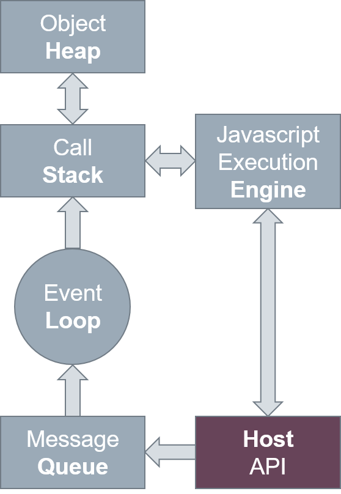

<!----------------- BEGIN SLIDE 001 it -------------------------->

#  Javascript


<!----------------- COLUMN 1 -------------------------->

> 001


Giuseppe Della Penna

Università degli Studi di L'Aquila    
giuseppe.dellapenna@univaq.it    
http://people.disim.univaq.it/dellapenna


> *Questo documento si basa sulle slide del corso di Web Engineering, riorganizzate per migliorare l'esperienza di lettura. Non è un libro di testo completo o un manuale tecnico, e deve essere utilizzato insieme a tutti gli altri materiali didattici del corso. Si prega di segnalare eventuali errori o omissioni all'autore.*

> Quest'opera è rilasciata con licenza CC BY-NC-SA 4.0. Per visualizzare una copia di questa licenza, visitate il sito https://creativecommons.org/licenses/by-nc-sa/4.0

<!----------------- BEGIN TOC -------------------------->

 - [1. Introduzione a Javascript](#1-introduzione-a-javascript)

    - [1.1. Ambiente di Esecuzione](#11-ambiente-di-esecuzione)

    - [1.2. Modello di Esecuzione](#12-modello-di-esecuzione)

    - [1.3. Evoluzione di Javascript](#13-evoluzione-di-javascript)

 - [2. Tipi, Variabili e Operatori](#2-tipi-variabili-e-operatori)

    - [2.1. Tipi di Dato](#21-tipi-di-dato)

    - [2.2. Variabili](#22-variabili)

    - [2.3. Costanti](#23-costanti)

    - [2.4. Operatori](#24-operatori)

 - [3. Costrutti di Flusso](#3-costrutti-di-flusso)

    - [3.1. Esecuzione condizionale - if](#31-esecuzione-condizionale---if)

    - [3.2. Esecuzione condizionale - switch](#32-esecuzione-condizionale---switch)

    - [3.3. Loops](#33-loops)

 - [4. Funzioni](#4-funzioni)

    - [4.1. Riferimento](#41-riferimento)

    - [4.2. Chiamata](#42-chiamata)

    - [4.3. Passaggio di Parametri](#43-passaggio-di-parametri)

    - [4.4. Ritorno](#44-ritorno)

    - [4.5. Closures](#45-closures)

 - [5. Oggetti](#5-oggetti)

    - [5.1. Proprietà](#51-proprietà)

    - [5.2. Metodi](#52-metodi)

    - [5.3. Funzioni Costruttore](#53-funzioni-costruttore)

    - [5.4. Prototipi](#54-prototipi)

    - [5.5. Getter e Setter](#55-getter-e-setter)

    - [5.6. Membri pubblici, privati e "privilegiati"](#56-membri-pubblici-privati-e-privilegiati)

    - [5.7. Classi](#57-classi)

 - [6. Spread e Destructuring Assignment](#6-spread-e-destructuring-assignment)

    - [6.1. Espansione di espressioni (spread)](#61-espansione-di-espressioni-spread)

    - [6.2. Destructuring Assignment](#62-destructuring-assignment)

 - [7. Iteratori e Funzioni Generatrici](#7-iteratori-e-funzioni-generatrici)

    - [7.1. Iteratori](#71-iteratori)

    - [7.2. Generatori](#72-generatori)

 - [8. Eccezioni](#8-eccezioni)

 - [9. Oggetti Predefiniti](#9-oggetti-predefiniti)

    - [9.1. String](#91-string)

    - [9.2. RegExp](#92-regexp)

    - [9.3. Array](#93-array)

    - [9.4. Date](#94-date)

    - [9.5. Set](#95-set)

    - [9.6. Map](#96-map)

    - [9.7. Promise](#97-promise)

    - [9.8. Async Functions](#98-async-functions)

 - [10. Javascript nei Browser](#10-javascript-nei-browser)

    - [10.1. Script nella pagine HTML](#101-script-nella-pagine-html)

    - [10.2. Oggetto window](#102-oggetto-window)

    - [10.3. Oggetto XMLHttpRequest](#103-oggetto-xmlhttprequest)

    - [10.4. Fetch API](#104-fetch-api)

 - [11. Moduli](#11-moduli)

    - [11.1. Moduli: esportazione](#111-moduli-esportazione)

    - [11.2. Moduli: importazione](#112-moduli-importazione)

    - [11.3. Moduli nelle pagine HTML ](#113-moduli-nelle-pagine-html-)

 - [12. Riferimenti](#12-riferimenti)

 - [13. Esempi](#13-esempi)


<!------------------- END TOC --------------------------> 

<!------------------- END SLIDE 001 it -------------------------->

<!----------------- BEGIN SLIDE 002 it -------------------------->

## 1. Introduzione a Javascript


<!----------------- COLUMN 1 -------------------------->

> 002


Javascript è un    **linguaggio di programmazione** usato comunemente per fornire dinamica alle pagine web.

Tecnicamente, si tratta di un linguaggio *interpretato* basato su *prototipi* che supporta vari stili di programmazione: *object oriented*, *imperativo* e *dichiarativo*.

Javascript è definito sulla base della specifica del linguaggio  **ECMAScript** (ultima edizione: ECMA-262)

**Javascript non è Java** : i due linguaggi hanno sintassi, semantica e uso molto diversi. 

Javascript dispone di tutte le funzionalità e i costrutti comuni ai più diffusi  **linguaggi di programmazione imperativi** (variabili, cicli, istruzioni condizionali, istruzioni di assegnamento, operazioni matematiche di base, funzioni e procedure, ecc.). 

<!------------------- END SLIDE 002 it -------------------------->

<!----------------- BEGIN SLIDE 003 it -------------------------->

####  Dove si usa?


<!----------------- COLUMN 1 -------------------------->

> 003


Javascript è un linguaggio molto popolare tra i programmatori, per la sua versatilità e semplicità, e per questo si è esteso ben oltre la programmazione web lato client. In effetti, oggi Javascript viene usato per programmare una moltitudine di applicazioni ampiamente diffuse.

- **Sviluppo web lato client**: come sappiamo, JavaScript viene usato insieme a HTML e CSS per creare le parti di una pagina Web che gli utenti vedono e con cui interagiscono nei loro browser.

- **Sviluppo web lato server**: grazie all'avvento di **Node.js**, un framework Javascript comunemente usato per lo sviluppo back-end, Javascript può essere usato anche per la programmazione lato server.

- **Sviluppo di giochi**: questa categoria, sebbene ricada propriamente in quella dello sviluppo lato client, è molto importante e va evidenziata. In precedenza, moltissimi giochi online erano sviluppati con tecnologie diverse e/o proprietarie come Flash. Oggi, Javascript è usato per programmare tutti giochi 2D e 3D che si trovano online.

- **Sviluppo di applicazioni mobili**: le applicazioni per dispositivi mobili inizialmente erano sviluppate in maniera nativa, cioè interfacciandosi direttamente con il sistema operativo (Android, iOS) del dispositivo ed usando il linguaggio di programmazione da esso preferito. Attualmente, framework come **React Native** e **Ionic**, permettono di realizzare applicazioni mobili multipiattaforma usando gli stessi linguaggi del web: HTML, CSS e naturalmente Javascript.

- **Sviluppo di applicazioni desktop**: seguendo l'esempio delle applicazioni mobili, si stanno affermando numerosi framework, come **Electron**, che permettono di sviluppare applicazioni per computer desktop usando Javascript (e spesso HTML e CSS per definirne l'interfaccia) invece dei più comuni linguaggi come Java o C++.

- Javascript può essere usato per aggiungere dinamica anche ai documenti **PDF**! 

<!------------------- END SLIDE 003 it -------------------------->

<!----------------- BEGIN SLIDE 004 it -------------------------->

### 1.1. Ambiente di Esecuzione


<!----------------- COLUMN 1 -------------------------->

> 004


Javascript è progettato per essere eseguito all'interno di un   **oggetto host** , o *ambiente*, che può estenderlo fornendo funzionalità aggiuntive specifiche per quell'ambiente. 

Ad esempio, in una pagina web l'ambiente, che è il browser, fornisce a Javascript i mezzi per   **leggere e modificare la struttura HTML della pagina** e i suoi fogli di stile (**DOM**), nonché per **interagire con alcune parti del browser** stesso, **intercettare tutte le azioni compiute dall'utente** sulla pagina ed eseguire chiamate verso altri server (**AJAX**)

Tuttavia, il browser costruisce una "**sandbox**" intorno alla pagina web, in modo che gli script in essa contenuti non possano interferire con le altre pagine aperte né con il resto della macchina.

I browser forniscono a Javascript anche l'accesso a una serie di funzionalità estese, le cosiddette   **Web API**. Con queste ultime il "potere" di Javascript si estende notevolmente.    

Alcuni esempi di Web API, il cui nome è piuttosto auto esplicativo: Battery API, Bluetooth API, Canvas API, Clipboard API, Console API, Credential Management API, Fetch API, File System Access API, Fullscreen API, Geolocation API, History API, Payment Request API, Picture-in-Picture API, Screen Capture API, Sensor API, Storage Access API, Web Audio API, Web Authentication API, Web Crypto API, Web Speech API, Web Storage API, WebGL, WebRTC. 

<!------------------- END SLIDE 004 it -------------------------->

<!----------------- BEGIN SLIDE 005 it -------------------------->

### 1.2. Modello di Esecuzione


<!----------------- COLUMN 1 -------------------------->

> 005


Javascript è un linguaggio  **single-threaded** , cioè non contempla alcun tipo di parallelismo nell'esecuzione.

Il motore di esecuzione Javascript estrae uno alla volta i frame dello    **stack**, che corrispondono alle **chiamate a funzione**, e li esegue. L'esecuzione di una funzione può **aggiungere nuovi frame** in testa allo stack tramite   **chiamate nidificate** ad altre funzioni.
Gli oggetti creati durante l'esecuzione vengono posti nell'**heap**. 

Il codice Javascript, nella sua esecuzione, interagisce tipicamente con le **API** dell'host (ad esempio le *Web API* del browser). Tali API possono contenere elementi **asincroni** (ad esempio la funzione *setTimeout*  o gli *eventi del DOM*) che possono accodare **messaggi** nella message   **queue**. Un messaggio è, essenzialmente, una funzione da chiamare (**callback**) accompagnata da una serie di informazioni relative all'evento che ne richiede l'esecuzione.  

**Quando lo stack è vuoto**, l'**event loop**   estrae dalla message   **queue** la successiva funzione callback da richiamare e la inserisce nello stack.    

 


<!----------------- COLUMN 2 -------------------------->


 

<!------------------- END SLIDE 005 it -------------------------->

<!----------------- BEGIN SLIDE 006 it -------------------------->

### 1.3. Evoluzione di Javascript

####  ECMAScript 5 (2009): novità


<!----------------- COLUMN 1 -------------------------->

> 006


- Modalità strict 

- Getters e setters per le proprietà (dichiarati nei costruttori)      

- Nuovi metodi per leggere/scrivere le proprietà degli oggetti

- Nuovi metodi String: `trim()`   

- Nuovi metodi Array: `isArray()`, `forEach()`, `map()`, `filter()`, `reduce()`, `reduceRight()`, `every()`, `some()`, `indexOf()`, `lastIndexOf()`,…                    
- Metodi `JSON.parse()` e `JSON.stringify()`    

- Nuovo metodo Date: `now()` 

<!------------------- END SLIDE 006 it -------------------------->

<!----------------- BEGIN SLIDE 007 it -------------------------->

####  ECMAScript 6 (2015): novità


<!----------------- COLUMN 1 -------------------------->

> 007


- Variabili e funzioni con scope di blocco 

- Funzioni freccia (lambda)

- Sintassi estesa per i parametri di funzione

- Operatore spread 

- Interpolazione di stringhe

- Proprietà shorthand, nomi di proprietà calcolati   

- Destructuring assignment  

- Moduli

- Classi

- Iteratori

- Generatori

- Strutture Set e Map 

- Promises 

<!------------------- END SLIDE 007 it -------------------------->

<!----------------- BEGIN SLIDE 008 it -------------------------->

####  Evoluzione recente


<!----------------- COLUMN 1 -------------------------->

> 008


Riassumiamo qui alcune delle più importanti modifiche allo standard cumulatesi negli anni più recenti.

**ECMAScript 2016 (7)**:  

- Operatore esponente (\*\*)

**ECMAScript 2017 (8)**:

- Async functions  

**ECMAScript 2018 (9)**:

- Metodo finally nelle Promise  

- Iteratori asincroni

- Spread nel destructuring assignment degli oggetti    

**ECMAScript 2019 (10)** 

**ECMAScript 2020 (11)**

**ECMAScript 2021 (12)**

- Varie modifiche non utili agli argomenti trattati in queste slide. Per informazioni aggiornate si veda, ad esempio:

   - https://github.com/daumann/ECMAScript-new-features-list 

   - https://v8.dev/features 

   - https://github.com/tc39/ecma262 

<!------------------- END SLIDE 008 it -------------------------->

<!----------------- BEGIN SLIDE 009 it -------------------------->

####  Compatibilità


<!----------------- COLUMN 1 -------------------------->

> 009


Tutte le funzionalità introdotte con ECMAScript 5, 6 e oltre, nonché tutte le novità relative al DOM di HTML che vengono via via adottate dai browser più moderni   **non sono ovviamente compatibili con quelli più datati**.

Nel realizzare uno script, è sempre necessario quindi **domandarsi quali siano i browser target** (e quindi anche la platea di utenti) e verificare se le funzionalità (avanzate) che intendiamo utilizzare siano compatibili con essi.
Per verificare la compatibilità di una certa funzione/API, è possibile cercare su  **MDN** (*https://developer.mozilla.org/en-US/docs/Web* ) o su siti come  *https://caniuse.com/*.

In caso di funzionalità con scarso supporto nei browser datati è utile, per ampliare la platea dei browser supportati, **inserire tra i propri script i relativi polyfill** , cioè librerie che integrano nei browser le funzionalità non supportate tramite opportuni workaround.   
Provate ad utilizzare le librerie generate da  *https://polyfill.io*, che permette tra l'altro di scaricare i polyfill per le sole funzionalità di vostro interesse e solo se necessari al browser che le richiede, tutto in maniera automatica.  
In alternativa, potete usare un transpiler come Babel (*https://babeljs.io*) per trasformare i vostri script rendendoli retrocompatibili con specifici browser datati. Babel manipola la sintassi e integra i polyfill necessari. 

<!------------------- END SLIDE 009 it -------------------------->

<!----------------- BEGIN SLIDE 010 it -------------------------->

## 2. Tipi, Variabili e Operatori


<!----------------- COLUMN 1 -------------------------->

> 010 

<!------------------- END SLIDE 010 it -------------------------->

<!----------------- BEGIN SLIDE 011 it -------------------------->

### 2.1. Tipi di Dato


<!----------------- COLUMN 1 -------------------------->

> 011


Javascript gestisce quattro diversi tipi di dato: 

**Numeri**

- Non c'è distinzione tra interi e reali. 

- Sono costanti numeriche tutte le espressioni che rappresentano un numero valido, con e senza virgola.

- Le funzioni `parseInt` e `parseFloat` possono essere usate per convertire stringhe in numeri.

**Booleani**

- Le costanti boooeane sono   *true* e *false*.

**Stringhe**

- Le stringhe sono particolari oggetti Javascript. Possono essere create implicitamente, attraverso una costante di tipo stringa, o esplicitamente tramite il costruttore dell'oggetto String.    

- Sono costanti di tipo stringa i valori racchiusi tra virgolette (singole o doppie).

**Oggetti**

- Gli oggetti sono un tipo di dato molto comune in javascript.  

- Le variabili di tipo oggetto contengono in effetti dei *riferimenti* ad oggetti. Più variabili possono quindi fare riferimento allo *stesso* oggetto.

**Null**

- Il tipo nullo ha un unico valore, *null*. 

<!------------------- END SLIDE 011 it -------------------------->

<!----------------- BEGIN SLIDE 012 it -------------------------->

### 2.2. Variabili


<!----------------- COLUMN 1 -------------------------->

> 012


Le variabili javascript sono identificate da sequenze alfanumeriche il cui primo carattere deve essere alfabetico.

Le variabili non hanno un tipo: questo viene dedotto automaticamente dal valore assegnato alla variabile, e può cambiare di volta in volta.

Le variabili possono essere dichiarate scrivendo `var nome`. 

Il valore iniziale di una variabile è sempre lo speciale valore `undefined`. È anche possibile inizializzare la variabile durante la sua dichiarazione scrivendo `var nome = valore`.

Se si assegna un valore a una variabile non dichiarata, javascript la crea automaticamente. Questa pratica è **sconsigliata** perché le variabili create automaticamente **sono sempre globali**.

Se si cerca di leggere il valore di una variabile mai dichiarata né assegnata, questo risulterà `undefined`. 

<!------------------- END SLIDE 012 it -------------------------->

<!----------------- BEGIN SLIDE 013 it -------------------------->

####  Esempi


<!----------------- COLUMN 1 -------------------------->

> 013


```javascript
var o = new Object(); //o è una variabile di tipo Object (vuota) 

var s = "pluto"; //s è una variabile String con valore "pluto"       

var n = 3; //n è una variabile Number con valore 3 

m = n; //m è una variabile globale di tipo Number con valore 3

t = "paperino" //t è una variabile globale di tipo String con valore "paperino"  

u = v //u ha valore undefined (in quanto v non è a sua volta definita)  

var b = (3>2) //b è una variabile Boolean con valore true    
``` 

<!------------------- END SLIDE 013 it -------------------------->

<!----------------- BEGIN SLIDE 014 it -------------------------->

####  Modalità strict


<!----------------- COLUMN 1 -------------------------->

> 014


La modaltà strict si attiva usando la sintassi `"use strict";`   

Da notare la sintassi retrocompatibile: i browser più vecchi la vedranno come una stringa senza significato  

Non è consentito:

- Usare variabili o oggetti non dichiarati

- Duplicare nomi di parametro nelle funzioni

- Assegnare valori a proprietà *read-only* o *get-only*

Inoltre:

- La stringa "eval", non può essere utilizzata come variabile  

- `eval()` non può creare variabili nel suo scope di chiamata 

<!------------------- END SLIDE 014 it -------------------------->

<!----------------- BEGIN SLIDE 015 it -------------------------->

####  scope di blocco


<!----------------- COLUMN 1 -------------------------->

> 015


Prima di ES6, le variabili dichiarate con la parola chiave  `var` non erano globali, ma erano in ogni caso *function-scoped*, cioè accessibili in tutta la funzione di appartenenza.  

In ES6, come in gran parte degli linguaggi, una variabile dichiarata con la nuova parola chiave `let` è *block-scoped*, **cioè visibile solo nel blocco** (\{...\}) in cui si trova la sua dichiarazione, e **non può essere ridichiarata** all'interno dello stesso blocco.

```javascript
for (let i  = 0; i < a.length; i++) {   let x  = a[i]; … }    
//i e x sono disponibili solo all'interno del blocco for
```

Esempio più complesso:

```javascript  
let callbacks = []; for (let i = 0; i <= 2; i++) {         
 callbacks[i]=function(){return i * 2;};
}        
//callbacks[0]()=0, callbacks[1]()=2, callbacks[2]()= 4      
```    

Per ottenere lo stesso effetto in ES\<6, ci sarebbe stato bisogno di creare una closure per fissare il valore di i relativo a ogni iterazione e associarlo alla callback generata:      

```javascript
var callbacks = []; 
for (var i = 0; i <= 2; i++) {         
 (function(i) {callbacks[i]=function() {return i * 2;};})(i);
}         
``` 

<!------------------- END SLIDE 015 it -------------------------->

<!----------------- BEGIN SLIDE 016 it -------------------------->

### 2.3. Costanti


<!----------------- COLUMN 1 -------------------------->

> 016


Le costanti possono essere dichiarate tramite la parola chiave `const`.

```javascript
const PI = 3.141593;  
```

Le costanti hanno scope di blocco come le variabili dichiarate con il `let`.

Nota: un *oggetto costante* non può essere riassegnato, ma il suo contenuto può variare poiché la costante, in questo caso, è solo il *riferimento* all'oggetto assegnato all'identificatore. 

<!------------------- END SLIDE 016 it -------------------------->

<!----------------- BEGIN SLIDE 017 it -------------------------->

### 2.4. Operatori


<!----------------- COLUMN 1 -------------------------->

> 017


`+` **(somma)**    
Oltre che a numeri, può essere applicata a stringhe, nel qual caso diventa l'operatore di concatenazione. Se in una somma almeno un operando è una stringa, gli altri vengono convertiti anch'essi in stringhe.

`-` **(differenza)**, `/` **(quoziente)**, `*` **(prodotto)**, `%` **(modulo)**

`=` **(assegnamento)**, `+=`, `-=` **(assegnamento con somma/differenza)**    
Gli assegnamenti con somma/differenza hanno la stessa semantica dei loro corrispondenti in C o Java. L'assegnamento con somma può essere applicato anche a stringhe, esattamente come l'operatore di somma.

`++` **(incremento)**, `--` **(decremento)**

`>>` **(shift right)**, `<<` **(shift left)**, `&` **(and)**, `|` **(or)**, `^` **(xor)**, `~` **(not)**   `             
Effettuano bit-a-bit tra operandi numerici. 

<!------------------- END SLIDE 017 it -------------------------->

<!----------------- BEGIN SLIDE 018 it -------------------------->


<!----------------- COLUMN 1 -------------------------->

> 018


`&&` **(and)**, `||` **(or)**, `!` **(not)**      
Utilizzati per combinare espressioni booleane.

`in` **(appartenenza)**     
Può essere applicato a oggetti o array (operando destro), per controllare se contengono se la proprietà o l'indice dati (operando sinistro).

`>` **(maggiore)**, `<` **(minore)**, `>=` **(maggiore o uguale)**, `<=` **(minore o uguale)**, `==` **(uguale)**, `!=` **(diverso)**  
Funzionano anche con le stringhe, per le quali si considera l'ordinamento lessicografico.

`typeof(…)` **(controllo tipo)**   
Restituisce una stringa contenente il nome del tipo del suo argomento

`void(...)` **(statement nullo)**   
Esegue il codice passato come argomento, ma non restituisce l'eventuale valore di ritorno

`eval(...)` **(valutazione script)**      
Esegue lo script passato nell'argomento stringa e restituisce il suo valore 

<!------------------- END SLIDE 018 it -------------------------->

<!----------------- BEGIN SLIDE 019 it -------------------------->

####  Esempi


<!----------------- COLUMN 1 -------------------------->

> 019


```javascript
var s = "tre " + 2; //s è la stringa "tre 2" 

s += " uno"; //s è la stringa "tre 2 uno"

s > "ciao"; //l'espressione vale true, in quanto il valore di s è lessicograficamente successivo a "ciao"  

typeof(s); //restituisce "string"   

var o = {pippo: 1};   
"pippo" in o; //l'espressione vale true, in quanto pippo è una proprietà di o      

void(0); //statement nullo (utile in HTML per prevenire azioni di default) 
void(f(x)); //esegue f(x) ed ignora il suo valore di ritorno 

eval("f(x)");  
//esegue lo script, chiamando f(x) e restituendo il valore di ritorno della chiamata

eval("3+1"); //restituisce 4 
eval("var s = 1"); //dichiara globalmente la variabile s e le assegna il valore 1.   
``` 

<!------------------- END SLIDE 019 it -------------------------->

<!----------------- BEGIN SLIDE 020 it -------------------------->

## 3. Costrutti di Flusso


<!----------------- COLUMN 1 -------------------------->

> 020 

<!------------------- END SLIDE 020 it -------------------------->

<!----------------- BEGIN SLIDE 021 it -------------------------->

### 3.1. Esecuzione condizionale - if


<!----------------- COLUMN 1 -------------------------->

> 021


Javascript dispone del costrutto `if` con la stessa sintassi di Java:

```javascript
if (espressione) {
 corpo
} else {
 corpo-else
}
```

Un'espressione guardia non booleana viene convertita in valore booleano come segue:

- Se l'espressione ha un valore numerico diverso da zero è true.  

- Se l'espressione ha un valore stringa non vuoto è true.  

- Se l'espressione ha un valore oggetto è true.  

- In tutti gli altri casi (numerico zero, stringa vuota, valore undefined o null) l'espressione è false.    

Per eseguire delle istruzioni solo se una determinata variabile o proprietà è definita e non vuota, è sufficiente scrivere `if (variabile) {...}` 

<!------------------- END SLIDE 021 it -------------------------->

<!----------------- BEGIN SLIDE 022 it -------------------------->

### 3.2. Esecuzione condizionale - switch


<!----------------- COLUMN 1 -------------------------->

> 022


Javascript dispone del costrutto  `switch` con la stessa sintassi di Java:

```javascript
switch (espressione) {     
 case v1: statements     
 case v2: statements     
 default: statements     
} 
```

L'espressione viene valutata e confrontata con i valori dei diversi `case`. Vengono quindi eseguite le istruzioni *a partire dal primo `case`* con lo stesso valore dell'espressione. Se nessun case è selezionato, vengono eseguite le istruzioni del `default`, se presenti.

Se si desidera limitare l'esecuzione a un gruppo di istruzioni, è necessario introdurre la parola chiave `break`. 

<!------------------- END SLIDE 022 it -------------------------->

<!----------------- BEGIN SLIDE 023 it -------------------------->

####  Esempi


<!----------------- COLUMN 1 -------------------------->

> 023


```javascript
var s = "valore"; 
var b = 0; 

//costrutto if con condizione di tipo "misto"
if (s && b > 0) { s = "ok" } else { b = 1; }

//costrutto switch su stringa  
switch (s) { 
 case "ok": …
 break; //questo case finisce qui
 case "error": … //questo case continua sul default  
 default: …
}
``` 

<!------------------- END SLIDE 023 it -------------------------->

<!----------------- BEGIN SLIDE 024 it -------------------------->

### 3.3. Loops


<!----------------- COLUMN 1 -------------------------->

> 024


Javascript dispone dei costrutti  `for`, `while` e `do ... while`, con la stessa sintassi di Java:

```javascript
for (inizializzazione; condizione; aggiornamento) {corpo} 
```

```javascript
while (condizione) {corpo} 
```

```javascript
do {corpo} while (condizione) 
```

Nel ciclo `for` vengono eseguite le istruzioni di *inizializzazione*, quindi se la *condizione* è vera viene eseguito il *corpo* dell'istruzione e di seguito le istruzioni di *aggiornamento*. Se la *condizione* è ancora vera il ciclo continua.

Nel ciclo `while` il *corpo* viene eseguito se e finché la *condizione* è vera.

Nel ciclo `do...while`  il *corpo* viene eseguito almeno una volta, in quanto la *condizione* è testata al termine della sua esecuzione.

Nel corpo dei loop è possibile usare le parole chiave `break` e `continue` rispettivamente per interromperne l'esecuzione o per saltare direttamente al ciclo successivo. 

<!------------------- END SLIDE 024 it -------------------------->

<!----------------- BEGIN SLIDE 025 it -------------------------->

####  I loop for…in e for…of


<!----------------- COLUMN 1 -------------------------->

> 025


Una speciale forma del costrutto `for` permette di iterare tra tutte le proprietà di un oggetto:

```javascript
for (proprietà in oggetto) {body} 
```

Ad ogni iterazione, la stringa *proprietà* conterrà il nome della successiva proprietà dell'*oggetto*.
Sarà quindi possibile accedere alla proprietà scrivendo `oggetto[proprietà]` (sintassi array).
Poiché i metodi sono proprietà con un particolare tipo, anche questi verranno elencati dal loop.  

In ES6 è presente anche un'altra forma del costrutto `for` che permette di iterare tra i valori di oggetti  *iterabile*, tra cui gli array:

```javascript
for (valore of array) {corpo} 
```

Ad ogni iterazione, il  *valore* conterrà il valore del successivo elemento dell'*array*
*Vedremo più avanti cosa sono e come si creano altri oggetti iterabili* 

<!------------------- END SLIDE 025 it -------------------------->

<!----------------- BEGIN SLIDE 026 it -------------------------->

####  Esempi


<!----------------- COLUMN 1 -------------------------->

> 026


```javascript
var o = new Object(); 

//itera tra le proprietà dell'oggetto
for (p in o) {
 o[p]; //preleva il valore della proprietà indicizzata dal loop (e dovrebbe usarla…)  
}

var i = 0; 

//ciclo for standard
for (i=0; i<10; ++i) { j=j+1; }

//ciclo while 
while(i>0) { i=i+1; } 

//ciclo do
do { i=i+1; } while(i>0);  
``` 

<!------------------- END SLIDE 026 it -------------------------->

<!----------------- BEGIN SLIDE 027 it -------------------------->

## 4. Funzioni


<!----------------- COLUMN 1 -------------------------->

> 027 

<!------------------- END SLIDE 027 it -------------------------->

<!----------------- BEGIN SLIDE 028 it -------------------------->

####  Dichiarazione


<!----------------- COLUMN 1 -------------------------->

> 028


In Javascript è possibile creare nuove funzioni con le seguenti sintassi:  

- Dichiarazione di funzione: `function nome(parametri) {corpo}`

- Funzioni anonime: `function (parametri) {corpo}`

- Oggetti funzione: `new Function ("parametri", "corpo")`

Le diverse sintassi presentano specifiche caratteristiche e limitazioni:

- Una funzione dichiarata *con un nome* può essere richiamata in ogni punto del codice tramite il suo nome. 

- Una funzione anonima o creata col costruttore **Function** deve essere assegnata a una variabile (o proprietà di un oggetto) per essere utilizzata.

Il **nome** di una funzione può essere qualsiasi nome valido per una variabile. 

I **parametri** della funzione, se presenti, sono dichiarati tramite una lista di nomi (di variabile) separati da virgole.    
Le parentesi dopo il nome della funzione vanno sempre inserite, anche se la lista dei parametri è vuota.

Il **corpo** della funzione è costituito da una sequenza di istruzioni Javascript valide.   
Ogni istruzione è separata dalla successiva da un punto e virgola. 
Nel corpo è possibile utilizzare i parametri tramite il nome delle variabili ad essi associate. 

<!------------------- END SLIDE 028 it -------------------------->

<!----------------- BEGIN SLIDE 029 it -------------------------->

####  Funzioni freccia (lambda) 


<!----------------- COLUMN 1 -------------------------->

> 029


ES6, come Java 8, permette di definire funzioni anonime (lambda) con una sintassi semplificata  `(parametri) => espressione`:

```javascript
(a, b) => a + b //è un'espressione valida di tipo Function     
((a, b) => a + b)(1,2)===3 //può essere invocata   
let f = ((a, b) => a + b) //e assegnata 
```

Nel caso di un solo parametro si possono anche omettere le parentesi:

```javascript
a => a + 1 //la funzione incremento
```

Per corpi di funzione più complessi, si può usare la sintassi `(parametri) => { corpo }`:

```javascript
a => {return a+1;}
(x,y) => {a[x]=y;}  
```

Nel corpo delle funzioni freccia il valore di `this` viene propagato dall'esterno:      

```javascript
this.nums.forEach(
 (v) => {if (v % 5 === 0) this.fives.push(v); }
);  
```  

Mentre in ES\<6 avremmo dovuto scrivere        

```javascript
var self = this; 
this.nums.forEach(      
 function (v) { if (v % 5 === 0) self.fives.push(v); }
);   
``` 

<!------------------- END SLIDE 029 it -------------------------->

<!----------------- BEGIN SLIDE 030 it -------------------------->

####  Esempi


<!----------------- COLUMN 1 -------------------------->

> 030


```javascript
//funzione senza parametri, dichiarazione diretta
function f() { 
 var i;  
}

//funzione con due parametri, dichiarazione diretta
function g(a,b) {   
 var c = a + b;  
}

//funzione anonima assegnata a una variabile
var h1 = function(a) {return a+1;}     

//oggetto funzione assegnato a una variabile
var h2 = new Function("a","return a+1;");     
``` 

<!------------------- END SLIDE 030 it -------------------------->

<!----------------- BEGIN SLIDE 031 it -------------------------->

####  scope di blocco


<!----------------- COLUMN 1 -------------------------->

> 031


Le funzioni sono visibili solo all'interno del blocco che le definisce (qui non è necessaria alcuna sintassi specifica):

```javascript
{//blocco   
 function foo () { return 1; }           
 foo() === 1;      
 { //blocco nidificato
  function foo () { return 2; }           
  //funzione ridefinita nel blocco nidificato
  foo() === 2;       
 }     
 //nel blocco esterno continua ad esistere la precedente versione
 foo() === 1;       
}
``` 

<!------------------- END SLIDE 031 it -------------------------->

<!----------------- BEGIN SLIDE 032 it -------------------------->

### 4.1. Riferimento


<!----------------- COLUMN 1 -------------------------->

> 032


Le funzioni Javascript sono in realtà variabili con valore di tipo **Function**.

Per fare riferimento a una funzione è sufficiente usare il suo nome, o un'espressione equivalente che abbia valore di tipo **Function**.

Una volta ottenuto il riferimento a una funzione è possibile:

- Chiamare la funzione passandole dei parametri.

- Passare come argomento una funzione ad un'altra funzione.

- Assegnare una funzione a una o più variabili.

- Accedere a tutti gli elementi della funzione, per modificarla o ridefinirla, tramite le proprietà di **Function**.

- Verificare se una funzione è definita come si farebbe con qualsiasi variabile, ad esempio testandola con un `if(nome_funzione)`. 

<!------------------- END SLIDE 032 it -------------------------->

<!----------------- BEGIN SLIDE 033 it -------------------------->

### 4.2. Chiamata


<!----------------- COLUMN 1 -------------------------->

> 033


Per richiamare una funzione, si accoda la lista dei parametri, tra parentesi, all'espressione che fa riferimento alla funzione stessa:

```javascript
nome_funzione(argomenti)
```

```javascript
espressione_con_valore_Function(argomenti)
```

Gli argomenti sono una lista di espressioni valide separate da virgole.

E' possibile omettere uno o più parametri al termine della lista. In questo caso, tali parametri varranno *undefined* nel corpo della funzione.

Se la funzione non ha parametri, è comunque necessario specificare le due parentesi dopo il nome. 

<!------------------- END SLIDE 033 it -------------------------->

<!----------------- BEGIN SLIDE 034 it -------------------------->

####  Esempi


<!----------------- COLUMN 1 -------------------------->

> 034


```javascript
function f() { var i; }   
var h1 = function(a) {return a+1;}     
var h2 = new Function("a","return a+1;");     

f(); //ritorna undefined 

var r = h1(3); //r=4 

var r2 = h2(4); //r=5 
``` 

<!------------------- END SLIDE 034 it -------------------------->

<!----------------- BEGIN SLIDE 035 it -------------------------->

### 4.3. Passaggio di Parametri


<!----------------- COLUMN 1 -------------------------->

> 035


Il passaggio dei parametri alle funzioni Javascript avviene in maniera diversa a seconda del tipo del parametro stesso:

- I tipi booleano, stringa, numero e null sono passati *per valore*. Nella funzione, cioè, è presente una copia del valore usato come argomento. Cambiamenti locali alla funzione non influenzano il valore dell'argomento usato nella chiamata alla funzione stessa.

- Il tipo oggetto è passato *per riferimento*. La manipolazione del contenuto dell'oggetto si riflette sull'oggetto usato come argomento. 

<!------------------- END SLIDE 035 it -------------------------->

<!----------------- BEGIN SLIDE 036 it -------------------------->

####  Passaggio di Parametri - sintassi estesa


<!----------------- COLUMN 1 -------------------------->

> 036


In ES6 è possibile specificare **valori di default per i parametri** (come ad esempio in PHP o C):  

```javascript
function f(x, y=7, z=42) {...}
```

È inoltre posibile definire **funzioni variadiche**, cioè ad arietà variabile, come in altri linguaggi (C, Java, ecc.), specificando un ultimo parametro (indicato con la sintassi `...variable`) nel quale verranno inseriti, sotto forma di array, tutti gli  *altri* argomenti passati alla funzione ( *rest parameters*): 

```javascript
function f( ...args ) {return args.length;}
```

```javascript
function f (x,...a) {return x*a.reduce((t,v,i,r) => a+v, 0);}
``` 

<!------------------- END SLIDE 036 it -------------------------->

<!----------------- BEGIN SLIDE 037 it -------------------------->

### 4.4. Ritorno


<!----------------- COLUMN 1 -------------------------->

> 037


Le funzioni restituiscono il controllo al chiamante al termine del loro blocco di istruzioni.

È possibile *restituire un valore* al chiamante, in modo da poter usare la funzione in espressioni più complesse, utilizzando la sintassi

```javascript
return expression
```

L'*espressione* può essere di qualsiasi tipo. Essa viene valutata e il valore risultante è restituito.

Se la funzione non esegue una return, Javascript sottintende un `return undefined` implicito. 

<!------------------- END SLIDE 037 it -------------------------->

<!----------------- BEGIN SLIDE 038 it -------------------------->

### 4.5. Closures


<!----------------- COLUMN 1 -------------------------->

> 038


Una **closure** (chiusura) è, tecnicamente, un'espressione (tipicamente una funzione) *associata a un contesto che valorizza le sue variabili libere*. 
Tutto il codice Javascript viene eseguito in un contesto, compreso quello globale. 

In particolare, ogni esecuzione di una funzione ha un contesto associato.

Una *closure* si crea proprio a partire da una funzione, quando quest'ultima restituisce come valore di ritorno una nuova funzione creata dinamicamente (cioè con uno dei tre costrutti visti in precedenza). 

<!------------------- END SLIDE 038 it -------------------------->

<!----------------- BEGIN SLIDE 039 it -------------------------->

####  Comportamento delle closures


<!----------------- COLUMN 1 -------------------------->

> 039


Una *closure*, cioè una funzione creata all'interno di un'altra funzione e poi restituita, *mantiene il contesto di esecuzione della funzione che l'ha creata*.

Questo significa che il contesto di ciascuna chiamata della funzione "generatrice" non viene distrutto all'uscita della funzione, come avviene in generale, ma conservato in memoria.

La *closure* potrà fare riferimento (in lettura e scrittura) ai parametri e alle variabili dichiarate nel contesto della funzione che l'ha creata. 

Poiché ogni chiamata a funzione ha un suo contesto distinto, i valori "visti" dalla *closure* non saranno influenzati da successive chiamate alla funzione generatrice. 

<!------------------- END SLIDE 039 it -------------------------->

<!----------------- BEGIN SLIDE 040 it -------------------------->

####  Closures - Esempi


<!----------------- COLUMN 1 -------------------------->

> 040


Un uso comune per le closure è fornire parametri a una funzione che verrà eseguita in seguito: è il caso ad esempio delle funzioni passate come argomento a `setTimeout` (che verrà illustrata più avanti).

Se dobbiamo passare una funzione come argomento, o assegnarla a una variabile, non possiamo fornirgli parametri, ma al posto della funzione possiamo usare una *wrapper closure* che la chiama con i parametri desiderati.

Si vedano gli esempi seguenti... 

<!------------------- END SLIDE 040 it -------------------------->

<!----------------- BEGIN SLIDE 041 it -------------------------->


<!----------------- COLUMN 1 -------------------------->

> 041


```javascript
function f(x) { 
 return x+variabile_globale; //NOTA: il valore di ritorno NON dipende solo dai parametri    
}
//vorremmo assegnare a una proprietà p di o la FUNZIONE che restituisce f(3)

o.p = f(3); 
o.p(); //ERRATO: o.p non punta a una funzione, ma al valore calcolato
//come f(3) al momento dell'esecuzione dell'istruzione precedente   

o.p = f; 
o.p(); //ERRATO: o.p è un riferimento a f, per cui necessita
//di un parametro (avremmo dovuto scrivere o.p(3))     

function closureGenF(y) {   
 return function() {return f(y);}       
}
o.p = closureGenF(3);   
o.p() //CORRETTO: verrà chiamata f(3)! 
``` 

<!------------------- END SLIDE 041 it -------------------------->

<!----------------- BEGIN SLIDE 042 it -------------------------->


<!----------------- COLUMN 1 -------------------------->

> 042


```javascript
//dobbiamo assegnare un handler per l'evento onclick a un elemento del DOM HTML    
htmlelement.onclick = f; 
//NOTA: anche qui non si possono passare parametri! 

//Accade spesso che si usino piccole varianti dello stesso handler per elementi diversi  
//Tali varianti sono semplici da costruire a tempo di esecuzione (e spesso è necessario). 
//Ad esempio, vogliamo associare a certi elementi un handler che 
//colori in rosso l'elemento ad esso associato quando viene cliccato.          

function clickHandler(oToHighlight) {     
 return function(e) {    
  oToHighlight.style.backgroundColor="red";    
 }
}

element1.onclick = clickHandler(linkedelement1);  
element2.onclick = clickHandler(linkedelement2);  
``` 

<!------------------- END SLIDE 042 it -------------------------->

<!----------------- BEGIN SLIDE 043 it -------------------------->

## 5. Oggetti


<!----------------- COLUMN 1 -------------------------->

> 043 

<!------------------- END SLIDE 043 it -------------------------->

<!----------------- BEGIN SLIDE 044 it -------------------------->


<!----------------- COLUMN 1 -------------------------->

> 044

Javascript **non è un linguaggio object oriented simile a quelli più noti (come Java)**, e il suo concetto di oggetto è molto più simile a quello di un array associativo.

Gli oggetti Javascript contengono metodi, che possono tuttavia essere considerati anch'essi valori, in quanto non sono altro che oggetti di classe **Function**.

In Javascript non si possono definire **classi**, ma solo speciali funzioni dette **costruttori** che creano oggetti aventi determinati membri. Il nome della funzione costruttore è considerato il nome della classe dell'oggetto.

Non esiste vera ereditarietà negli oggetti Javascript, e non è possibile dichiarare delle gerarchie. Tuttavia, Javascript contiene una classe base predefinita, chiamato **Object**.

Gli oggetti si creano utilizzando l'operatore **new** applicato alla loro **funzione costruttore**:  `o =  new Object();`

Un metodo di creazione alternativo consiste nell'utilizzo del costrutto `{"proprietà": valore, ...}` , che crea un oggetto con le proprietà date assegnate ai corrispondenti valori. 

<!------------------- END SLIDE 044 it -------------------------->

<!----------------- BEGIN SLIDE 045 it -------------------------->

### 5.1. Proprietà


<!----------------- COLUMN 1 -------------------------->

> 045


Le proprietà di un oggetto Javascript possono contenere valori di qualsiasi tipo.  

Per accedere a una proprietà, si possono usare due sintassi:

- Sintassi "a oggetti": `oggetto.proprietà`

- Sintassi "array": `oggetto["proprietà"]`

È disponibile lo speciale costrutto `for...in` per iterare tra le proprietà di un oggetto.

È possibile verificare se un oggetto ha una determinata proprietà con l'espressione booleana `proprietà in oggetto`.

Se si tenta di leggere il valore di una proprietà non definita in un oggetto, si ottiene il valore *undefined* (come per ogni variabile non assegnata).
È possibile **aggiungere dinamicamente proprietà** agli oggetti semplicemente assegnando loro un valore. 
Non è possibile aggiungere proprietà a variabili che non siano di tipo oggetto (oggetti predefiniti o creati con `new`) 

<!------------------- END SLIDE 045 it -------------------------->

<!----------------- BEGIN SLIDE 046 it -------------------------->

####  Proprietà - Esempi


<!----------------- COLUMN 1 -------------------------->

> 046


```javascript
var o = new Object(); 

var v = o.pippo; 
//v è undefined    

o.pluto = 3; 
//adesso o ha una proprietà "pluto", di tipo Number,con valore 3      

v = o.pluto; 
//adesso v è una variabile di tipo Number e vale 3  

v.paperino = "ciao"; 
//ERRORE: una variabile può accettare l'aggiunta di proprietà solo se è di tipo oggetto   

var o2 = {"pippo": "ciao", "pluto": 3}; 
//creazione implicita di un oggetto     

v = o2["pluto"]; 
//equivalente a v =o2.pluto  

var nome = "pippo"; 
//adesso nome è una variabile di tipo String e vale "pippo"       

v=o2[nome]; 
//accesso a una proprietà con nome dinamico
//assegnato alla variabile nome
``` 

<!------------------- END SLIDE 046 it -------------------------->

<!----------------- BEGIN SLIDE 047 it -------------------------->

### 5.2. Metodi


<!----------------- COLUMN 1 -------------------------->

> 047


I metodi di un oggetto Javascript sono semplicemente proprietà di tipo   **Function**.
*Function* è un oggetto predefinito Javascript, e può essere utilizzato direttamente, ad esempio per creare funzioni anonime.  

Per **accedere** a un metodo si possono usare le stesse sintassi viste per le proprietà.

Per **chiamare** un metodo basta accodare la lista dei parametri, tra parentesi, all'espressione di accesso al metodo.

Per aggiungere un metodo a un oggetto, è sufficiente creare una proprietà col nome del metodo ed assegnarvi:

- Una funzione già definita

- Una funzione anonima:  `function(parametri) {corpo}`

I metodi possono essere aggiunti in qualsiasi momento a un oggetto, esattamente come le proprietà.

I metodi di un oggetto, *per far riferimento alle proprietà dell'oggetto in cui sono definiti*, devono utilizzare la parola chiave `this`: `this. proprietà`.  
Omettendo `this`, Javascript cercherà le variabili col nome dato all'interno del metodo o tra le variabili globali! 

<!------------------- END SLIDE 047 it -------------------------->

<!----------------- BEGIN SLIDE 048 it -------------------------->

####  Metodi - Esempi


<!----------------- COLUMN 1 -------------------------->

> 048


```javascript
var o = new Object(); 

o.metodo1 = function(x) {return x;} 
//aggiunge la funzione specificata come metodo1 all'oggetto    

o["metodo2"] = f; 
//aggiunge la funzione f (se esistente) come metodo2 all'oggetto

o.metodo1 
//questa espressione restituisce l'oggetto Function che rappresenta il meotodo1  

o.metodo1(3); 
o["metodo1"](3); 
//due chiamate equivalenti al meotodo1

var o2 = {"pippo": "ciao", "pluto": 3, "metodo3": function(x) {return x;}} 
//definizione di un metodo all'interno della sintassi abbreviata di creazione         

var o3 = new Object(); 
o3.metodo3 = o.metodo1 
//il metodo3 dell'oggetto o3 è una copia del metodo1 dell'oggetto o
``` 

<!------------------- END SLIDE 048 it -------------------------->

<!----------------- BEGIN SLIDE 049 it -------------------------->

####  Definizione semplificata delle proprietà


<!----------------- COLUMN 1 -------------------------->

> 049


È possibile usare una sintassi compatta per la  **definizione di proprietà a partire da variabili**: la proprietà dell'oggetto può assumere automaticamente lo stesso nome della variabile usata per assegnargli un valore:

```javascript
let x=0, y=0;     
let o={x,y}; //identico a {"x":x, "y":y}          
```

Allo stesso modo, nel definire una proprietà associata a un metodo, è possibile **scrivere direttamente il metodo** stesso, senza la parola chiave *function*, che verrà assegnato a una proprietà omonima:

```javascript
let o={s(x,y){return x+y}};  
//identico a {s: function(x,y){return x+y}} o {s: (x,y)=>{return x+y}}       
```       

È possibile anche definire proprietà con un  **nome calcolato** usando la sintassi  `[espressione-nome]`:

```javascript
let o={p:"ciao", ["p_"+f()]: 42 }; 
``` 

<!------------------- END SLIDE 049 it -------------------------->

<!----------------- BEGIN SLIDE 050 it -------------------------->

### 5.3. Funzioni Costruttore


<!----------------- COLUMN 1 -------------------------->

> 050


Una funzione costruttore è un tipo speciale di funzione all'interno della quale

- Si utilizza la parola chiave `this`  per *definire* le proprietà di un nuovo oggetto.

- Non si ritorna alcun valore

Le funzioni costruttore possono essere usate come argomento per l'operatore `new`, esattamente come i nomi degli oggetti standard di Javascript: `new funzione(parametri)`

Le funzioni costruttore non dovrebbero mai essere richiamate direttamente. 

<!------------------- END SLIDE 050 it -------------------------->

<!----------------- BEGIN SLIDE 051 it -------------------------->


<!----------------- COLUMN 1 -------------------------->

> 051


Quando si usa un costruttore con `new`, Javascript crea un oggetto vuoto derivato da **Object** ed applica ad esso la funzione.

All'interno del costruttore, `this` punta al nuovo oggetto.
In questo modo, il costruttore può popolare il nuovo oggetto, aggiungendo proprietà e metodi attraverso `this`.
Va ricordato che i metodi inseriti in un oggetto, per fare riferimento alle proprietà dell'oggetto stesso, devono riferirvisi attraverso `this`. 

<!------------------- END SLIDE 051 it -------------------------->

<!----------------- BEGIN SLIDE 052 it -------------------------->

####  Esempi


<!----------------- COLUMN 1 -------------------------->

> 052


```javascript
function myObject(a) {   
 this.v = a+1;  
 this.w = 0;  
 this.m = function(x) {return this.v+x;}        
}

/*
 L'oggetto o avrà due proprietà, v e w, la prima inizializzata 
 tramite il parametro a della funzione costruttore, e un metodo m 
 che restituisce il valore della proprietà v sommata al suo argomento x         
*/

var o = new myObject(2);   
o.m(3); //ritorna 6;   

o.getW = function() {return this.w;} 
//aggiunta dinamica di membri all'oggetto istanza (NON al costruttore) 
        
o.getV = function() {return v;} 
//SBAGLIATO! V fa riferimento alla variabile GLOBALE v!       
``` 

<!------------------- END SLIDE 052 it -------------------------->

<!----------------- BEGIN SLIDE 053 it -------------------------->

### 5.4. Prototipi


<!----------------- COLUMN 1 -------------------------->

> 053


Quando si crea un oggetto in Javascript usando la `new`, gli si assegna implicitamente un *prototipo*.

I prototipi contengono **i metodi e le proprietà comuni a tutti gli oggetti creati con lo stesso costruttore**, e quindi sono un analogo del concetto di *classe* in altri linguaggi.

Quando si estende un oggetto specifico con nuove proprietà o metodi, questi vengono **assegnati solo a quell'oggetto**.

Tuttavia, se **si estende il prototipo di un oggetto**, l'estensione sarà **disponibile in tutti gli oggetti creati dal suo stesso costruttore, anche in precedenza**. 
Si può dire, in un certo senso, che Javascript permette di estendere dinamicamente le classi.  

Quando si cerca di accedere a una proprietà di un oggetto, questa viene prima cercata nell'oggetto stesso, poi nel suo prototipo. Essendo il prototipo stesso un oggetto, questa procedura viene iterata fino a risalire al prototipo di *Object*, l'oggetto base.
Grazie a questo effetto, e potendo anche riassegnare dinamicamente il prototipo di un oggetto, è possibile ottenete in Javascript qualcosa di simile alle gerarchie di ereditarietà.  

Il prototipo degli oggetti creati da una funzione costruttore si può esaminare e modificare accedendo alla sua proprietà `prototype`.
Se invece disponiamo di un oggetto istanza, possiamo accedere al suo prototipo risalendo prima alla sua funzione costruttore tramite la proprietà `constructor`, oppure usando la proprietà `__proto__` (meno supportata).

L'operatore `instanceof` permette di verificare se una funzione costruttore è presente in un qualsiasi punto della catena di prototipi di un oggetto. 

<!------------------- END SLIDE 053 it -------------------------->

<!----------------- BEGIN SLIDE 054 it -------------------------->

####  Esempi


<!----------------- COLUMN 1 -------------------------->

> 054


```javascript
function myObject(a) {   
 this.v = a+1;  
 this.w = 0;  
 this.m = function(x) {return this.v+x;}        
}
var o1 = new myObject(1);   
var o2 = new myObject(2);   

o1.m(1); //ritorna 3
o2.m(1); //ritorna 4

o1.z = function() {return this.v;} 
//aggiunta dinamica di membri all'oggetto o1      

o1.z(); //ritorna 2
o2.z(); //ERRORE, z è solo in o1!
``` 

<!------------------- END SLIDE 054 it -------------------------->

<!----------------- BEGIN SLIDE 055 it -------------------------->


<!----------------- COLUMN 1 -------------------------->

> 055


```javascript
//tutti queste espressioni puntano al prototipo 
//degli oggetti creati col costruttore myObject 
o1.constructor.prototype == o1.__proto__; //true 
o1.__proto__ == myObject.prototype; //true:    

//aggiunta dinamica di membri a tutti gli oggetti 
//creati dal costruttore myObject 
myObject.prototype.x = function() {return this.v+2;}     

o1.x(); //ritorna 4
o2.x(); //ritorna 5 

o1 instanceof myObject //ritorna true     
o1 instanceof Array //ritorna false     
[1,2,3] instanceof Array //ritorna true     
``` 

<!------------------- END SLIDE 055 it -------------------------->

<!----------------- BEGIN SLIDE 056 it -------------------------->

### 5.5. Getter e Setter


<!----------------- COLUMN 1 -------------------------->

> 056


In Javascript, **getter** e **setter** permettono di creare pseudo variabili in un oggetto. Una pseudo variabile non è associata direttamente a una vera variabile dell'oggetto, ma funziona come se lo fosse.

In realtà, getter e setter sono metodi che vengono chiamati automaticamente quando si tenta di leggere o scrivere la variabile rappresentata dal loro nome.  

In questo modo la lettura e la scrittura vengono mediate dal codice:

- È possibile calcolare "al volo" un valore nel getter 

- È possibile controllare o correggere il valore da assegnare nel setter (magari generando un'eccezione se il valore è inaccettabile)

- È possibile rendere un valore get-only o set-only   

Getter e setter possono essere definiti nelle singole istanze: 

```javascript
var o = {
 val:1,      
 set pippo(v) {if (v<10) this.val=v; else throw "wrong value"},              
 get pippo() {return this.val}            
 //proprietà r/w chiamata pippo, accetta solo valori minori di dieci
}
```

Per inserirli nei costruttori, è invece necessario usare il nuovo metodo `defineProperty` sui loro prototipi, come vedremo più avanti 

<!------------------- END SLIDE 056 it -------------------------->

<!----------------- BEGIN SLIDE 057 it -------------------------->

####  Metodo Object.defineProperty


<!----------------- COLUMN 1 -------------------------->

> 057


`Object.defineProperty(object, propertyName, descriptor)` inserisce o sovrascrive una proprietà in un oggetto.

- *descriptor* è un oggetto che può contenere le seguenti proprietà

   - *configurabile*: *true* se il descrittore può essere cambiato

   - *enumerabile*: *true* se questa proprietà viene inclusa nell'enumerazione delle proprietà dell'oggetto

   - *value*: il valore della proprietà

   - *writable*: *true* se il valore della proprietà può essere alterato (false, il default, la rende di sola lettura)  


```javascript
var o={a:2}    
Object.defineProperty(o, "val1", { value: 3, writable:true});         
//proprietà "val" R/W... come scrivere o.val=3     
Object.defineProperty(o, "val2", { value: 4, writable:false});            
//proprietà "val" R/O  
```

In **alternativa** a *value* e *writable*, è possibile usare le proprietà *get* e *set* per creare una pseudo variabile:


```javascript
Object.defineProperty(o, "pippo", { get : function() { return this.val1 }});             
//pseudo proprietà "pippo", vista read only sulla proprietà val1 definita sopra     
```

Per definire getter e setter   **in un costruttore**, si può estendere il suo prototipo:

```javascript
function obj() {this.val=4};        
Object.defineProperty(obj.prototype, "pippo", {         
 get : function() { return this.val },            
 set : function(v) { this.val=v } 
});        
//getter e setter definiti nel prototipo di una funzione costruttore
``` 

<!------------------- END SLIDE 057 it -------------------------->

<!----------------- BEGIN SLIDE 058 it -------------------------->

### 5.6. Membri pubblici, privati e "privilegiati"


<!----------------- COLUMN 1 -------------------------->

> 058


In Javascript non esiste la nozione esplicita di pubblico e privato, come in molti linguaggi a oggetti.    

Tuttavia, è possibile **simulare questo tipo di comportamento** usando opportunamente le tecniche appena esposte.

Vedremo quindi come definire proprietà (e metodi) in modo che siano visibili all'esterno dell'oggetto oppure utilizzabili solo dai suoi metodi interni. 

<!------------------- END SLIDE 058 it -------------------------->

<!----------------- BEGIN SLIDE 059 it -------------------------->

####  Membri pubblici


<!----------------- COLUMN 1 -------------------------->

> 059


Le proprietà e i metodi pubblici si possono creare come abbiamo visto finora, cioè assegnandole all'oggetto `this` all'interno del costruttore.

Tuttavia, i *coding standard*  di Javascript preferiscono procedere in modo diverso:  

- Le proprietà sono **create all'interno della funzione costruttore**

- I metodi sono **aggiunti al prototype del costruttore**  

L'effetto finale è lo stesso, ma come vedremo ha un certo impatto sulle proprietà private. 

<!------------------- END SLIDE 059 it -------------------------->

<!----------------- BEGIN SLIDE 060 it -------------------------->

####  Membri pubblici - Esempi


<!----------------- COLUMN 1 -------------------------->

> 060


```javascript
function myObject(a) {   
 this.v = a+1; //proprietà pubblica  
}
myObject.prototype.m = function(x) {return this.v+x;} //metodo pubblico       

var o = new myObject(1);   
``` 

<!------------------- END SLIDE 060 it -------------------------->

<!----------------- BEGIN SLIDE 061 it -------------------------->

####  Membri privati


<!----------------- COLUMN 1 -------------------------->

> 061


Le proprietà e i metodi privati si possono creare sfruttando l'effetto *closure* del costruttore

In pratica, ogni proprietà o metodo dichiarato nella funzione costruttore **come variabile locale** (cioè con la parola chiave `var`  o `let`, e non con `this`) sarà paragonabile a un membro privato degli oggetti da esso generati.

I metodi privati **possono accedere ai membri pubblici dell'oggetto**, ma per ovviare a un'ambiguità di ECMAScript non è possibile farlo usando la sintassi comune `this.p`: è necessario un *workaround*.
Dichiareremo una proprietà privata (che chiameremo `THIS`) e la assegneremo al valore di `this` nel costruttore. I metodi privati potranno quindi accedere ai membri pubblici con la sintassi `THIS.p`.

Le proprietà e i metodi privati **non sono accessibili dall'esterno dell'oggetto** ma, al contrario dei comuni linguaggi object-oriented,   **non sono accessibili neppure dai metodi pubblici** creati come visto in precedenza.
Quindi le proprietà e i metodi privati possono essere manipolati solo da altri metodi privati o dal costruttore in cui sono dichiarati! 

<!------------------- END SLIDE 061 it -------------------------->

<!----------------- BEGIN SLIDE 062 it -------------------------->

####  Esempi


<!----------------- COLUMN 1 -------------------------->

> 062


```javascript
function myObject(a) {   
 this.v = a+1; //proprietà pubblica  
 var p = 7; //proprietà privata  
 var THIS = this; //workaround per rendere this disponibile nei metodi privati        
 var pm = function() {p=p-1;} //metodo privato      
 var pm2 = function() {return THIS.m()+1;} //metodo privato che chiama un metodo pubblico        
}
myObject.prototype.m = function(x) {return this.v+x;} //metodo pubblico       

var o = new myObject(1);   
o.p; //undefined (p è privato)   
o.pm() //ERRORE (pm è privato)  

myObject.prototype.m2 = function() {pm(); return p;}       
//metodo pubblico che usa membri privati

o.m2(); //ERRORE, in quanto p e pm non sono accessibili da metodi pubblici  
``` 

<!------------------- END SLIDE 062 it -------------------------->

<!----------------- BEGIN SLIDE 063 it -------------------------->

####  Membri privilegiati


<!----------------- COLUMN 1 -------------------------->

> 063


Non poter accedere ai membri privati dai metodi pubblici rende i membri privati utili solo per funzioni interne, ad esempio di inizializzazione.

Tuttavia, **è possibile creare speciali metodi pubblici che hanno accesso anche ai membri privati dell'oggetto**, e che sono spesso definiti per questo *privilegiati*.

In pratica, molti preferiscono dichiarare sempre metodi privilegiati invece che pubblici, per avere una maggior simmetria col comportamento standard dei linguaggi a oggetti.

Creare metodi privilegiati è molto semplice: basta usare la tecnica "base" di creazione dei metodi vista all'inizio, cioè **definirli direttamente nella funzione costruttore** (e non aggiungerli al prototipo) e la closure farà il resto. 

<!------------------- END SLIDE 063 it -------------------------->

<!----------------- BEGIN SLIDE 064 it -------------------------->

####  Esempi


<!----------------- COLUMN 1 -------------------------->

> 064


```javascript
function myObject(a) {   
 this.v = a+1; //proprietà pubblica  
 var p = 7; //proprietà privata  
 var THIS = this; //workaround per rendere this disponibile nei metodi privati         
 var pm = function() {p=p-1;} //metodo privato      
 var pm2 = function() {return THIS.m()+1;} //metodo privato che chiama un metodo pubblico        
  this.m3 = function() {pm(); return p;} //metodo privilegiato: è pubblico e usa membri privati          
}
myObject.prototype.m = function(x) {return this.v+x;} //metodo pubblico       

var o = new myObject(1);   
o.p; //undefined (p è privato)   
o.pm() //ERRORE (pm è privato)  

myObject.prototype.m2 = function() {pm(); return p;}       
//metodo pubblico che usa una proprietà private  

o.m2(); //ERRORE, in quanto p e pm non sono accessibili da metodi pubblici  

o.m3(); //ritorna 6
``` 

<!------------------- END SLIDE 064 it -------------------------->

<!----------------- BEGIN SLIDE 065 it -------------------------->

### 5.7. Classi


<!----------------- COLUMN 1 -------------------------->

> 065


ES6 introduce un nuovo concetto di classe, simile a quello dei linguaggi object-oriented come Java o C++.      

La sintassi per la definizione di una classe è quella comune, che prevede l'uso della parola chiave `class`.

**Una classe ES6 può contenere solo metodi** , che si dichiarano senza la parola chiave `function`. Le altre proprietà della classe sono inizializzate nel costruttore assegnandole, come nel sistema prototipale.      
Il costruttore si dichiara come un metodo con il nome riservato       `constructor`. 

```javascript
class Shape {      
 constructor(id, x, y) { 
  this._id = id; 
  this.move(x, y); 
 }
 move(x, y) {
  this._x = x; 
  this._y = y; 
 }
} 

s = new Shape("test",1,2)    
```

Una classe può essere dichiarata con il suo nome oppure assegnata come *espressione di classe* a un identificatore.

```javascript
let Shape =  class { constructor(id) { this._id = id;} }   
``` 

<!------------------- END SLIDE 065 it -------------------------->

<!----------------- BEGIN SLIDE 066 it -------------------------->

####  Metodi speciali


<!----------------- COLUMN 1 -------------------------->

> 066


È possibile usare la parola chiave `static` per dichiarare metodi richiamabili direttamente sulla classe, e non sulle sue istanze:   

```javascript
class Shape {      
 constructor(id, x, y) { 
  this._id = id; 
  this.move(x, y); 
 }
 move(x, y) {
  this._x = x; 
  this._y = y; 
 }
 static defaultShape() { 
  return new Shape("default", 100, 100); 
 } 
}

s = Shape.defaultShape();   
```

È possibile dichiarare  *getter* e *setter* con la sintassi di ES5 

```javascript
class Shape {       
 constructor(id, x, y) { 
  this._id = id; 
  this.move(x, y); 
 }
 move(x, y) {
  this._x = x; 
  this._y = y; 
 }
 static defaultShape() { 
  return new Shape("default", 100, 100); 
 }    
 set x(x) { this._x = x; }       
 get x()   { return this._x; }        
}
``` 

<!------------------- END SLIDE 066 it -------------------------->

<!----------------- BEGIN SLIDE 067 it -------------------------->

####  Ereditarietà


<!----------------- COLUMN 1 -------------------------->

> 067


È possibile generare **gerarchie di classi** usando la parola chiave `extends`. Nelle classi derivate, la parola chiave `super` permette di accedere ai metodi e al costruttore della classe base.

```javascript
class Rectangle extends Shape {    
 constructor (id, x, y, width, height) { 
  super(id, x, y); 
  this._width=width; 
  this._height=height; 
 }              
 toString() { 
  return "Rectangle > " + super.toString(); 
 } 
}  
```

Non esistono modificatori di visibilità (*private*, *protected*,…): se necessario, si possono usare gli accorgimenti già validi per i prototipi per ottenere effetti simili. 

<!------------------- END SLIDE 067 it -------------------------->

<!----------------- BEGIN SLIDE 068 it -------------------------->

####  Esempi


<!----------------- COLUMN 1 -------------------------->

> 068


```javascript
// Le classi non sostituiscono il sistema basato sui prototipi delle  
// precedenti versioni, ma lo affiancano. In realtà, le classi sono solo  
// zucchero sintattico, e vengono rimappate internamente sul vecchio    
// sistema di gestione degli oggetti.  

class Shape {    
 constructor(id, x, y) {this._id = id; this.move(x,y);}         
 move(x, y) { this._x = x; this._y = y; }       
 static defaultShape () { return new Shape("default", 100, 100); }            
 get x() { return this._x; }      
}}
//IDENTICO A
let Shape = function(id,x,y) {         
 this._id = id;    
 this.move = function(x, y){ this._x = x; this._y = y; }          
 this.move(x, y);   
}
Shape.defaultShape = function(){return new Shape("default", 100, 100);}       
Object.defineProperty(Shape.prototype,"x",{get: function(){return this._x}}           
``` 

<!------------------- END SLIDE 068 it -------------------------->

<!----------------- BEGIN SLIDE 069 it -------------------------->

## 6. Spread e Destructuring Assignment


<!----------------- COLUMN 1 -------------------------->

> 069 

<!------------------- END SLIDE 069 it -------------------------->

<!----------------- BEGIN SLIDE 070 it -------------------------->

### 6.1. Espansione di espressioni (spread)


<!----------------- COLUMN 1 -------------------------->

> 070


È possibile usare l'operatore di *spread* (indicato con `...`, da non confondersi con la sintassi dei *rest parameters*) per **esplodere un array (o**  ***ogni oggetto iterabile***     **) nella sequenza dei suoi valori**           

- durante una **chiamata a funzione**  

```javascript
var p = [1,2];       
function f(x,y) {return x+y}            
r=f( ...p); //r=f(1,2). 
//r=f(p) non avrebbe funzionato!    
```
- e negli   **assegnamenti di array** :

```javascript
var a = [ "a", "b",  ...p ]; //a=[ "a", "b", 1, 2 ]       
var str="ciao"; var chars = [...str]; 
//chars=["c","i","a","o"]
//l'ultimo esempio funziona perché la stringa è iterabile
``` 

<!------------------- END SLIDE 070 it -------------------------->

<!----------------- BEGIN SLIDE 071 it -------------------------->

### 6.2. Destructuring Assignment


<!----------------- COLUMN 1 -------------------------->

> 071


Il destructuring assignament ("assegnazione destrutturante") permette di  **estrarre i valori di array o le proprietà di oggetti e assegnarli a variabili distinte**. 

**Con gli array** la sintassi prevede l'uso di un'espressione tra parentesi quadre al lato  *sinistro* di un assegnamento:  

```javascript
var list = [ 1, 2, 3 ];      
var  [ a, b, c ] = list; //a=1, b=2,c=3
```

È possibile **non assegnare parte degli elementi** dell'array:

```javascript
var  [ a, b ] = list; //a=1, b=2    
var  [ a, , b ] = list; //a=1, b=3, notare le virgole
var [ , , a ] = list; //a=3  
```

Oppure assegnare la parte restante dell'array usando un   **rest parameter**:

```javascript
var  [ a, ...b ]  = list; //a=1, b=[2,3]
``` 

<!------------------- END SLIDE 071 it -------------------------->

<!----------------- BEGIN SLIDE 072 it -------------------------->


<!----------------- COLUMN 1 -------------------------->

> 072


**Con gli oggetti** la sintassi prevede l'uso di un'espressione tra parentesi graffe al lato sinistro di un assegnamento:                     

```javascript
var o={p1:1, p2:"a", p3(x){return x+1}};         
var  {p1, p2, p3}=o; //p1=1,p2="a",p3=x=>x+1
```

È possibile **estrarre solo parte dell'oggetto** specificando le sole proprietà necessarie:

```javascript
var  {p3}=o; //p3=x=>x+1
```

È possibile **dare alle variabili estratte un nome diverso** dalla proprietà dell'oggetto usando la sintassi `proprietà: variabile`

```javascript
var  {p1:a,p3:b}=o; //a=1, b=x=>x+1
```

È possibile anche  **estrarre la stessa proprietà più volte** con nomi diversi:

```javascript
var {p1:a,p1:b}=o; //a=1, b=1  
```

La destrutturazione può essere invocata in modo **ricorsivo**:

```javascript
var o2={p1:1, p2:"a", p3:{s1:2, s2:3}};     
var {p3:a, p3:{s2:b}}=o2; //a={s1:2, s2:3}, b=3
``` 

<!------------------- END SLIDE 072 it -------------------------->

<!----------------- BEGIN SLIDE 073 it -------------------------->


<!----------------- COLUMN 1 -------------------------->

> 073


È possibile fornire dei **default nella destrutturazione**, in modo che elementi mancanti siano assegnati col default e non restino *undefined*:

```javascript
var [a, b, c, d]=list //d=undefined       
var [a, b, c, d=10] = list //d=10    
var {p4}=o; //p4=undefined       
var {p4=1} =o; //p4=1   
```

Il destructing può essere usato in maniera intelligente anche   **durante il passaggio di parametri alle funzioni** (che viene visto come un assegnamento degli argomenti alle variabili parametro):

```javascript
function f ([a,b]) {return a+b;}          
f(["Ciao",10]); //restituisce "Ciao10"       
//in questo caso f("Ciao",10) non funziona

function g ({p1:a,p2:b}) {return a+b;}        
g({p1:"Ciao",p2:10}); //restituisce "Ciao10"     
``` 

<!------------------- END SLIDE 073 it -------------------------->

<!----------------- BEGIN SLIDE 074 it -------------------------->

## 7. Iteratori e Funzioni Generatrici


<!----------------- COLUMN 1 -------------------------->

> 074 

<!------------------- END SLIDE 074 it -------------------------->

<!----------------- BEGIN SLIDE 075 it -------------------------->

### 7.1. Iteratori

####  Definizione


<!----------------- COLUMN 1 -------------------------->

> 075


Gli oggetti ES6 possono personalizzare la maniera in cui vengono "enumerati" tramite il costrutto for, che dispone di una nuova sintassi specifica per questo scopo.

- Un oggetto iterabile implementa un metodo il cui nome è il valore dell'espressione `Symbol.iterator`. Questo metodo deve ritornare un oggetto che implementa l'interfaccia di un iteratore, che deve contenere un metodo `next` il quale, a sua volta, ritorna un oggetto con le due proprietà `value` (il successivo valore dell'iteratore) e `done` (*true* se i valori sono finiti)

```javascript
let numbers1_10 = {      
 [Symbol.iterator]: function() {   
  let n = 1;      
  return {
   next: function() {
    if (n<=10) return { done: false, value: n++ }; 
	 else return { done: true, value: undefined };  
   }
  };    
 }
} 
```

Ovviamente è possibile costruire dinamicamente un oggetto e il suo iteratore tramite una funzione:

```javascript
function numbers(a,b) {       
 return {      
  [Symbol.iterator]() { 
   let n = a; 
   return {
    next() {
	 if (n<=b) return { done: false, value: n++ };  
	 else return { done: true, value: undefined }; 
	}
   }; 
  }     
 }   
}
``` 

<!------------------- END SLIDE 075 it -------------------------->

<!----------------- BEGIN SLIDE 076 it -------------------------->

####  Uso


<!----------------- COLUMN 1 -------------------------->

> 076


Un oggetto iterabile può essere enumerato usando il suo iteratore, ad esempio con un ciclo for:

```javascript
it =  numbers1_10[Symbol.iterator]();   
for(let n=it.next(); !n.done; n = it.next()) {
 console.log(n.value)
}
```        

Come abbiamo visto, è disponibile il costrutto `for...of` specifico per gli oggetti iterabili:  

```javascript
for(n of numbers1_10) console.log(n)
```

Anche l'operatore  **spread** e il  **destructing assignment** funzionano con qualsiasi oggetto iterabile:        

```javascript
let [a,b,,d] = numbers1_10 //a=1, b=2, d=4   
[0,...numbers1_10] //un array da 0 a 10
```

Molti oggetti Javascript sono iterabili, come gli array e le stringhe, ma anche le Map e i Set che vedremo successivamente. 

<!------------------- END SLIDE 076 it -------------------------->

<!----------------- BEGIN SLIDE 077 it -------------------------->

### 7.2. Generatori


<!----------------- COLUMN 1 -------------------------->

> 077


Poiché definire un iteratore è abbastanza complesso, ES6 mette a disposizione un altro utile costrutto per creare oggetti iterabili con valori calcolati e, teoricamente, illimitati: le funzioni generatrici.

Le funzioni generatrici sono speciali funzioni che interrompono la propria esecuzione ritornando un valore e, quando vengono richiamate, riprendono l'esecuzione da dove avevano interrotto.

Un generatore si definisce come una normale funzione inserendo un asterisco dopo la parola chiave function (`function *`). 

All'interno del generatore, i valori generati vanno ritornati con la parola chiave `yield`. Per concludere l'iterazione basta invece uscire dal metodo.

```javascript
function *   g_numbers1_10() {
 for(let i=1; i<11; ++i) {
  yield i;
 }
}
```

Chiamando una funzione generatrice si ottiene un'istanza del corrispondente oggetto iterabile:

```javascript
numbers1_10 = g_numbers1_10()    
for(n of numbers1_10) console.log(n) 
```

Infatti possiamo anche scrivere numbers1\_10[Symbol.iterator]() per prelevare l'iteratore corrispondente al generatore, e manipolarlo come visto precedentemente.                          

I generatori possono anche essere definiti in maniera anonima (espressioni di funzione) e come metodi di oggetti:                      

```javascript
var g_numbers1_10 = function *() {for(let i=1; i<11; ++i) yield i;}
var o = {n:0, g_numbers1_10:function *() {for(let i=1; i<11; ++i) yield i}}      
``` 

<!------------------- END SLIDE 077 it -------------------------->

<!----------------- BEGIN SLIDE 078 it -------------------------->

## 8. Eccezioni


<!----------------- COLUMN 1 -------------------------->

> 078 

<!------------------- END SLIDE 078 it -------------------------->

<!----------------- BEGIN SLIDE 079 it -------------------------->


<!----------------- COLUMN 1 -------------------------->

> 079


Nelle versioni più recenti di Javascript è stato introdotto anche un **sistema di gestione delle eccezioni in stile Java**.

Un'eccezione segnala un *imprevisto*, spesso un *errore*, all'interno della normale esecuzione del codice.

Un'eccezione può venire sollevata dalle librerie di Javascript o dal codice scritto dall'utente, attraverso la parola chiave `throw`.

Per gestire le eccezioni, è possibile avvalersi del costrutto `try ... catch ... finally`. 

<!------------------- END SLIDE 079 it -------------------------->

<!----------------- BEGIN SLIDE 080 it -------------------------->

####  Gli handler


<!----------------- COLUMN 1 -------------------------->

> 080


Una volta sollevata, un'eccezione risale lo *stack di chiamata* di Javascript finché non viene gestita. 
Ciò significa che un'eccezione generata in una funzione, se non viene gestita all'interno di quest'ultima, si propagherà alle sue funzioni chiamanti, fino ad arrivare al *runtime* di Javascript.

Per gestire le eccezioni generate da un certo blocco di codice, è necessario inserire il blocco all'interno del costrutto `try ... catch` .
- Qualsiasi eccezione sollevata all'interno del codice compreso tra `try`  e `catch` verrà passata al codice di gestione dichiarato dopo `catch`.

Se ci si vuole assicurare che un certo codice sia eseguito *sempre* dopo il blocco protetto da `try ... catch`, indipendentemente dal sollevamento di eccezioni, è possibile aggiungere al blocco la clausola `finally`. 

<!------------------- END SLIDE 080 it -------------------------->

<!----------------- BEGIN SLIDE 081 it -------------------------->

####  Esempio


<!----------------- COLUMN 1 -------------------------->

> 081


```javascript
try { 
 … codice…
} catch(e) {
 //le eccezioni generate da javascipt sono oggetti la cui proprietà message   
 //riporta il messaggio di errore associato  
 alert("Eccezione sollevata: "+ e.message);    
}

try { …codice… } catch (eccezione) {…gestione dell'eccezione…}  
finally { 
 ...codice eseguito in ogni caso prima che l'esecuzione continui oltre il blocco try…catch...    
}

try { 
 …codice…
 throw {"nome": "pippo", "valore": 1}; 
 //solleviamo un oggetto qualsiasi come eccezione    
} catch (ex) {  
 //l'oggetto ex che arriva al blocco catch è quello sollevato con la throw
}
``` 

<!------------------- END SLIDE 081 it -------------------------->

<!----------------- BEGIN SLIDE 082 it -------------------------->

## 9. Oggetti Predefiniti


<!----------------- COLUMN 1 -------------------------->

> 082 

<!------------------- END SLIDE 082 it -------------------------->

<!----------------- BEGIN SLIDE 083 it -------------------------->

### 9.1. String


<!----------------- COLUMN 1 -------------------------->

> 083


Gli oggetti **String** sono usati in Javascript per contenere stringhe di caratteri. Possono essere creati implicitamente, utilizzando una costante stringa, o esplicitamente tramite il costruttore:  

`s = new String(valore)`

I principali metodi e proprietà della classe **String** sono i seguenti:

- `length`    
restituisce la lunghezza della stringa.

- `charAt(posizione)`   
restituisce il carattere (stringa di lunghezza uno) alla *posizione* data (base zero).

- `charCodeAt(posizione)`   
come charAt, ma restituisce il codice ASCII del carattere.  

- `indexOf`(s, offset)`        
restituisce la posizione della prima occorrenza (a partire da *offset*, se specificato) di *s* nella stringa. Restituisce -1 se s non è una sottostringa della stranga data (a partire dall'offset).    

- `lastIndexOf(s, offset)`     
come indexOf, ma restituisce la posizione dell'ultima occorrenza.  

- `substr(os[, l])`      
restituisce la sottostringa di lunghezza *l* (default, la massima possibile) che inizia *os* caratteri dall'inizio della stringa  

- `substring(os, oe)`      
restituisce la sottostringa che inizia *os* caratteri e termina a *oe* caratteri dall'inizio della stringa    

- `toLowerCase()`      
ritorna la stringa convertita in minuscolo

- `toUpperCase()`    
ritorna la stringa convertita in maiuscolo 

<!------------------- END SLIDE 083 it -------------------------->

<!----------------- BEGIN SLIDE 084 it -------------------------->

####  Interpolazione di stringhe


<!----------------- COLUMN 1 -------------------------->

> 084


ES6 permette di costruire stringhe interpolandole, cioè inserendovi all'interno, i valori di variabili senza dover usare la concatenazione, (come succede, ad esempio, in PHP).

Per rendere possibile l'interpolazione, la stringa deve essere delimitata dallo speciale carattere **\`** **(che non è l'apostrofo ')**

```javascript
var persona = {nome:"Pippo"};         
var saluto="Ciao";      
`${saluto} ${persona.nome}!`; //Ciao Pippo!
```

È anche possibile inserire espressioni nelle interpolazioni: 

```javascript
var prodotto = { quantita: 7, nome: "gelato", prezzounitario: 3 };          
`You ordered ${prodotto.quantita} ${prodotto.nome}, for a total price of ${prodotto.quantita * prodotto.prezzounitario}  euros`;  
``` 

<!------------------- END SLIDE 084 it -------------------------->

<!----------------- BEGIN SLIDE 085 it -------------------------->

### 9.2. RegExp


<!----------------- COLUMN 1 -------------------------->

> 085


Javascript riconosce le espressioni regolari scritte nella sintassi Perl.   

Per descrivere un'espressione regolare costante è sufficiente usare la sintassi `/*espressione*/`. 

Espressioni regolari variabili possono essere create tramite il costruttore **RegExp**. 

È possibile usare le espressioni regolari in vari metodi della classe **String**:

- `match(r)`    
restituisce l'array con le sottostrighe che hanno fatto match con l'espressione regolare *r*.  

- `replace(r, s)`      
sostituisce tutte le sottostringhe che fanno match con *r* con la stringa *s*.

- `search(r)`    
restituisce la posizione della prima sottostringa che fa match con *r*, o -1 se non ci sono match.

- `split(r[, m])`    
divide la stringa in una serie di segmenti definiti dai separatori specificati con l'espressione *r* e li restituisce come array. Se si indica una lunghezza massima *m*, allora l'ultimo elemento dell'array conterrà la rimanente parte della stringa.

Per default, Javascript interrompe il processo di matching su una stringa appena trova un riscontro per l'espressione regolare. Per trovare tutti i riscontri possibili, usare il modificatore `/g`    

Per rendere l'espressione *case insensitive*, usare il modificatore `/i` 

<!------------------- END SLIDE 085 it -------------------------->

<!----------------- BEGIN SLIDE 086 it -------------------------->

### 9.3. Array


<!----------------- COLUMN 1 -------------------------->

> 086


Gli Array sono oggetti javascript predefiniti e possono contenere valori di qualsiasi tipo.  

Per **creare** un array si possono usare le seguenti sintassi:

- (costruttore con parametri multipli)  `v = new Array(e1, e2, e3, ...)`

(costruttore simbolico)  `v = [e1, e2, e3, ...]` 

Per **accedere** a un elemento di un array si usa la sintassi comune `variabile_array[indice]`

È possibile verificare se un indice è presente nell'array con l'espressione booleana `indice in variabile_array`. 

I principali metodi e proprietà della classe **Array** sono i seguenti:

- `length`    
restituisce la dimensione dell'array

- `concat(e1,e2,e3,...)`    
aggiunge gli elementi alla fine dell'array.

- `join(separatore)`   
converte l'array in una stringa, concatenando la versione **String** di ciascun elemento ed usando il *separatore* dato (default ",").

- `reverse()`   
inverte l'ordine dell'array. Attenzione: oltre a restituire l'array ordinato, questa funzione modifica l'array di origine. Se non volete modificarlo, potete crearne una copia su cui applicherete la reverse.  

- `slice(os[, l])`   
restituisce il sotto array di lunghezza *l* (default, la massima possibile) che inizia all'indice *os*.  

- `sort([sortfun])`     
ordina l'array. La funzione opzionale `sortfun` può essere usata per specificare un criterio di ordinamento non standard. Attenzione: oltre a restituire l'array ordinato, questa funzione modifica l'array di origine. 

<!------------------- END SLIDE 086 it -------------------------->

<!----------------- BEGIN SLIDE 087 it -------------------------->

####  Esempi


<!----------------- COLUMN 1 -------------------------->

> 087


```javascript
var a1 = new Array(10,20,30); 
//dichiarazione con costrutto new   

var a2 = ["a","b","c"]; 
//dichiarazione implicita   

for (i in a1) { a1[i]; } 
//itera nell'array (considera anche tutte le altre eventuali proprietà/metodi!)

for (i=0; i<a1.length; ++i) { a1[i]; } 
//itera tra gli elementi dell'array

if (4 in a1) { a1[4] = a1[4]+1; } 
//usa un elemento solo se presente

/*
Nota: per creare un array associativo, è sufficiente creare dinamicamente delle proprietà (chiavi) in un oggetto Object vuoto
*/
``` 

<!------------------- END SLIDE 087 it -------------------------->

<!----------------- BEGIN SLIDE 088 it -------------------------->

####  Array - Altri metodi


<!----------------- COLUMN 1 -------------------------->

> 088


- `forEach(function (valore, indice, array) {...} )`          
esegue un'operazione su ogni elemento. La funzione data riceve il *valore* dell'elemento corrente dell'array, il suo *indice* e l'*array* stesso

- `map(function (valore, indice, array) {return …} )`            
crea un nuovo array con lo stesso numero di elementi mappati tramite la funzione

- `filter(function (valore, indice, array) {return …} )`            
crea un nuovo array con i soli elementi per cui la funzione ritorna è true     

- `reduce(function (aggval, valore, indice, array) {return …}, init)`                  
restituisce un valore ottenuto aggregando gli elementi dell'array tramite la funzione passata, che riceve, oltre all'elemento corrente, anche il valore corrente dell'aggregato (*aggval*, che inizialmente vale *init*) e lo aggiorna, restituendolo       

- `every(function (valore, indice, array) {return …} )`             
restituisce true se la funzione è true su tutti gli elementi dell'array    

- `some(function (valore, indice, array) {return …} )`            
restituisce true se la funzione è true su almeno un elemento dell'array    

- `indexOf(v,start)` / `lastIndexOf(v,start)`     
restituisce il primo/l'ultimo indice dell'elemento *v* nell'array, opzionalmente iniziando dalla posizione *start*    

- `find(function (valore, indice, array) {return …} )`            
restituisce il primo elemento per cui la funzione vale true 

- `findIndex(function (valore, indice, array) {return …} )`           
restituisce l'indice del primo elemento per cui la funzione vale true 

<!------------------- END SLIDE 088 it -------------------------->

<!----------------- BEGIN SLIDE 089 it -------------------------->

### 9.4. Date


<!----------------- COLUMN 1 -------------------------->

> 089


L'oggetto **Date** permette di manipolare valori di tipo data e ora. Dispone di diversi costruttori:

- `Date()` inizializza l'oggetto alla data/ora corrente.

- `Date(y, m, d, hh, mm, ss)` inizializza l'oggetto alla data/ora *d/m/y hh:mm:ss*.

- `Date(stringa)` tenta di riconoscere la *stringa* come una data e inizializza l'oggetto di conseguenza.

Gli oggetti Date possono essere confrontati tra loro con i normali operatori di confronto.

I metodi degli oggetti Date permettono di leggerne e scriverne tutti i membri:

Ad esempio, `getYear`, `getMonth`, `setYear`, `setMonth`, `getDay` (restituisce il *giorno della settimana*), `getDate` (restituisce il *giorno del mese*), `setDate` (imposta il giorno del mese: se il valore passato è maggiore del massimo consentito, *la funzione gestisce automaticamente l'incremento del mese/anno della data*) 

<!------------------- END SLIDE 089 it -------------------------->

<!----------------- BEGIN SLIDE 090 it -------------------------->

####  Esempi


<!----------------- COLUMN 1 -------------------------->

> 090


```javascript
//genera un saluto adeguato all'ora corrente e lo assegna alla variabile saluto
var giorni = ["lun","mar","mer","gio","ven","sab"];           
var mesi = ["gen","feb","mar","apr","mag","giu","lug","ago","set","ott","nov","dic"]; 
var oggi = new Date(); 

var data = giorni[oggi.getDay()] + " " + oggi.getDate() + " " + mesi[oggi.getMonth()] + " " +oggi.getFullYear();         

var saluto; 
if (oggi.getHours() > 12)  
 saluto = "Buona sera, oggi è il "+data;  
 else saluto = "Buongiorno, oggi è il "+data;


//calcola una la data di 70 giorni nel futuro
futuro = new Date();
futuro.setDate(futuro.getDate()+70);   
``` 

<!------------------- END SLIDE 090 it -------------------------->

<!----------------- BEGIN SLIDE 091 it -------------------------->

### 9.5. Set


<!----------------- COLUMN 1 -------------------------->

> 091


ES6 mette a disposizione due nuove **classi contenitore** (che si affiancano ad Array) presenti nelle librerie di tutti i linguaggi object oriented:  **Map** e **Set**.

Set rappresenta in insieme non ordinato di elementi (unici). Una volta creato un Set (`new Set()`) è possibile:

- **Aggiungere** elementi col metodo `add()` 

- **Rimuovere** elementi col metodo `delete()`

- **Svuotare** l'insieme col metodo `clear()` 

- Leggere la **cardinalità** dalla proprietà `size`

- **Verificare** la presenza di un elemento col metodo `has()` 

- **Enumerare** gli elementi (Set è iterabile)

```javascript
let s = new Set();      
s.add(4).add(1).add(2).add(3);           
s.delete(2);    
s.has(2) === false;     
s.size === 3    
for (let v of s) console.log(s);   
``` 

<!------------------- END SLIDE 091 it -------------------------->

<!----------------- BEGIN SLIDE 092 it -------------------------->

### 9.6. Map


<!----------------- COLUMN 1 -------------------------->

> 092


Map rappresenta un'associazione tra chiavi e valori.  **Chiavi e valori possono essere di qualsiasi tipo (anche oggetti)`. Una volta creata una Map (`new Map()`) è possibile:

- **Creare** nuove associazioni o aggiornare quelle esistenti col metodo `set()`

- **Leggere** il valore associato a una chiave col metodo `get()` 

- **Rimuovere** un'associazione col metodo `delete()`

- **Svuotare** la mappa col metodo `clear()` 

- Leggere la **cardinalità** dalla proprietà `size`

- **Verificare**la presenza di una chiave col metodo `has()` 

- **Enumerare** le chiavi tramite l'iterable restituito dal metodo   `keys()` , i valori tramite quello restituito dal metodo `values()`  e le coppie chiave-valore usando la mappa stessa come iterabile

```javascript
var m = new Map()       
m.set("a",1).set(4,"four").set(o,34); //o è un oggetto
m.has("a")===true;      
m.delete("a");    
m.get(4)==="four";      
for(v of m) console.log(v);   
for(v of m.keys()) console.log(v);     
for(v of m.values()) console.log(v);   
``` 

<!------------------- END SLIDE 092 it -------------------------->

<!----------------- BEGIN SLIDE 094 it -------------------------->

### 9.7. Promise


<!----------------- COLUMN 1 -------------------------->

> 094


Le promises ES6   **sostituiscono le funzioni callback**   come sistema per restituire valori (o errori) in maniera asincrona. Una promise rappresenta il risultato di una computazione che terminerà in futuro.

In altre parole, una promise consente di utilizzare una funzione asincrona come se fosse sincrona in quanto tale funzione, pur lavorando in     *asincrono*, ritornerà immediatamente (comportamento *sincrono*) un valore, che però non è quello realmente calcolato, bensì una una   *promise* (un *proxy*), tramite la quale si potrà ottenere il valore finale una volta che l'elaborazione sarà terminata.     

Il costruttore `Promise(executor)` viene invocato passando come parametro una funzione *executor*  del tipo `(resolve, reject) => {...}` dove *resolve* e *reject* sono a loro volta funzioni.

Il codice di *executor* **rappresenta l'elaborazione (possibilmente asincrona) legata alla Promise**.

Se l'elaborazione termina con successo, dovrà chiamare la funzione *resolve* passandogli il valore calcolato, altrimenti potrà chiamare la funzione *reject* passando un valore di errore.

Attenzione: **il codice dell'** ***executor*** **non viene eseguito in asincrono a meno che non si usino funzionalità asincrone al suo interno**. In altre parole, la Promise **non crea thread paralleli**.

```javascript
p = new Promise((resolve,reject) => {     
 //qualcosa di lungo e asincrono    
 resolve(10); //risultato 10      
 //oppure reject(messaggio);       
})
``` 

<!------------------- END SLIDE 094 it -------------------------->

<!----------------- BEGIN SLIDE 095 it -------------------------->

####  Handlers


<!----------------- COLUMN 1 -------------------------->

> 095


Anche se è possibile creare Promise come appena visto, è più comune utilizzare le Promise restituite da alcune API asincrone di Javascript.  

Il codice della Promise  **viene avviato appena la Promise è creata**, anche se non ha ancora associati gli handler per la *resolve* e la *reject*. Questi ultimi **verranno chiamati appena impostati**, in base allo stato finale della Promise.

Nota: in molti casi la creazione di una promise il cui codice chiama reject genererà un'eccezione col valore passato alla reject stessa se non è presente un handler specifico associato a questo evento.      

Gli handler, cioè le funzioni che corrispondono alla *resolve* e alla *reject*, possono venir specificati usando i metodi  `then()`, `catch()` e `finally()` dell'oggetto Promise. 

- `then(f1,f2)` esegue *f1* se la Promise termina con successo o *f2* se termina con un errore. L'argomento della   *resolve* dalla Promise verrà passato come parametro alla funzione *f1*. L'argomento della  *reject* dalla Promise verrà passato come parametro alla funzione *f2*.

- `then(f)` è equivalente a `then(f,null)`

- `catch(f)` è equivalente a  `then(null,f)`

- `finally(f)` è equivalente a `then(f,f)`, ma in questo caso la funzione *f* **non** riceverà alcun valore (né quello passato alla *resolve* né quello passato alla *reject*)


```javascript
p.then(m=>{console.log("Resolved: "+m)}); //solo resolve

p.then(    
 m=>{console.log("Resolved: "+m)},     
 m=>{console.log("Rejected: "+m)}); //resolve e reject     

p.finally(     
 ()=>{console.log("done")}); //solo finally
``` 

<!------------------- END SLIDE 095 it -------------------------->

<!----------------- BEGIN SLIDE 096 it -------------------------->

####  Esempi


<!----------------- COLUMN 1 -------------------------->

> 096


```javascript
function doMyWorkAsync(x) {   
 return new Promise((resolve, reject) => {        
 //usiamo setTimeout per simulare un'esecuzione asincrona   
  setTimeout(function(){    
   //al termine del codice (asincrono) della promise, 
   //se tutto è andato bene, chiamiamo la funzione–parametro resolve   
   //e le passiamo il risultato della computazione
   resolve(x+1);   
   //in caso di fallimento, facciamo lo stesso con la funzione reject 
  }, 250); 
 });
}

//appena si crea una promise, il codice del suo executor viene avviato  
v_proxy = doMyWorkAsync(1);   
//tuttavia, le chiamate a resolve e reject vengono poste in attesa    
//finchè non si specifica quali debbano essere gli handler relativi    

//col metodo then della promise, specifichiamo cosa fare col valore  
//di ritorno, quando sarà disponibile
v_proxy.then((v) => {   
 console.log("Valore restituito: " + v);
});
``` 

<!------------------- END SLIDE 096 it -------------------------->

<!----------------- BEGIN SLIDE 097 it -------------------------->

####  Concatenazione


<!----------------- COLUMN 1 -------------------------->

> 097


È spesso utile *concatenare* delle operazioni asincrone, cioè avviare un'operazione asincrona quando la precedente termina, passandole come argomento il risultato di quest'ultima.

Con le promises questo è possibile grazie al fatto che i metodi `then` e `catch` ritornano una nuova promise, la quale rappresenta il completamento dell'esecuzione dei rispettivi handler.  

Nel corpo di un handler usato in una catena, la `return` corrisponderà a una chiamata a *resolve* col rispettivo valore, mentre un'eccezione (`throw`) verrà trasformata in una chiamata a *reject*.

In questo modo, è possibile chiamare una serie di `then` concatenati, specificando in ciascuno cosa fare quando l'operazione precedente termina. 

<!------------------- END SLIDE 097 it -------------------------->

<!----------------- BEGIN SLIDE 098 it -------------------------->

####  Esempi


<!----------------- COLUMN 1 -------------------------->

> 098


```javascript
function doMyWorkAsync(x) {   
 return new Promise((resolve, reject) => {        
  setTimeout(function(){    
   if (x>=0) resolve(x+1);     
   else reject("x negativo")  
  }, 250); 
 });
}

doMyWorkAsync(1) 
.then(  
 function(y) {  
   //la computazione dell'handler potrebbe, a sua volta, richiedere del tempo   
   return y+1;   
 } 
).then( //questo handler viene eseguito quando il precedente ritorna    
 function(z) {  
  console.log(z); 
 }
).catch( 
 function(e) {   
  //questo handler viene eseguito quando nella catena     
  //viene sollevata un'eccezione o viene chiamato reject 
  console.log("Errore: "+e);
 }
).finally(  
 function() {  
  console.log("Finito");  
 }
)
``` 

<!------------------- END SLIDE 098 it -------------------------->

<!----------------- BEGIN SLIDE 099 it -------------------------->

### 9.8. Async Functions


<!----------------- COLUMN 1 -------------------------->

> 099


Le funzioni asincrone, dichiarate tramite il costrutto `async function`, sono un metodo per *gestire la creazione delle Promise e/o il codice dipendente dal soddisfacimento di una o più Promise in maniera più lineare e semplice*.

Una funzione async, quando chiamata, restituisce una **Promise relativa al suo risultato**   (indipendentemente dal suo effettivo valore di ritorno).

Una **return nella funzione async corrisponde a una chiamata alla funzione resolve**  della promise con tale valore come argomento.

**Qualsiasi eccezione sollevata nella funzione async corrisponde a una chiamata alla funzione reject**     della promise con l'eccezione come argomento.

Il corpo della funzione costituisce a tutti gli effetti il corpo della Promise.  

I due blocchi di codice che seguono, quindi, sono equivalenti:

```javascript
function pf1(x) {    
 return new Promise((resolve,reject) => {        
  if (x>=0) resolve(x);      
  else reject("x negativo");      
 });   
}   
pf1(1).then((v)=>{console.log(v)},(e)=>{console.log("Errore: "+e)});     

async function pf2(x) {        
 if (x>=0) return x; //resolve         
 else throw "x negativo"; //reject          
}    
pf2(1).then((v)=>{console.log(v)},(e)=>{console.log("Errore: "+e)});   
``` 

<!------------------- END SLIDE 099 it -------------------------->

<!----------------- BEGIN SLIDE 100 it -------------------------->

####  await e gli handlers impliciti


<!----------------- COLUMN 1 -------------------------->

> 100


All'interno di una *async function* è inoltre possibile **sincronizzarsi** in maniera semplificata con altre Promise, senza utilizzare i costrutti `then` e `catch`, ma lavorando in maniera sincrona col costrutto `await`.

Con la sintassi `v = await p` , dove *p* è una Promise,
il codice della funzione viene **sospeso** in attesa che  *p* sia conclusa.

Il valore passato alla *resolve* di *p* verrà **assegnato alla variabile** ***v*** mentre 
il valore passato alla *reject* di *p* diventerà **un'eccezione** sollevata dalla `await`

A tutti gli effetti await "scarica" l'asincronia della Promise nidificata (*p* nell'esempio) su quella della funzione async che la contiene, rendendo in un certo senso sincrona la Promise su cui viene eseguita.  

Per questo motivo **await si può usare solo un funzioni async**: pur rimanendo bloccata sulla await, la funzione async non è in effetti bloccante per lo script, in quanto per sua natura ritorna automaticamente essa stessa una Promise. 

<!------------------- END SLIDE 100 it -------------------------->

<!----------------- BEGIN SLIDE 101 it -------------------------->

####  Esempio


<!----------------- COLUMN 1 -------------------------->

> 101


```javascript
function pf1(y) {   
 return new Promise((res,rej) => {     
  if (y>=0) res(y+2);     
  else rej("y negativo");    
 });
}

async function pf2(x,y) {      
 if (x>=0) { 
  let z = await pf1(y);    
  return x+z;    
 }
 else throw "x negativo";    
}
 
pf2(1).then(   
 (v)=>{console.log(v)},  
 (e)=>{console.log("Errore: "+e)});    
```

 


<!----------------- COLUMN 2 -------------------------->


La funzione pf1(y) ritorna una Promise.

La funzione asincrona **pf2(x,y) attende che la Promise di z=pf1(y) sia risolta**      e poi restituisce la somma x+z.  

La Promise restituita da pf2(x,y)   

- **Chiamerà la reject**   (secondo parametro del `then`) nel caso in cui pf2 sollevi un'eccezione, esplicitamente (`throw`) o per la chiamata a *reject* della pf1 su cui pf2 esegue un `await`. 

- **Chiamarà la resolve**    (primo parametro del `then`) se pf2, dopo che pf1 ha chiamato la sua *resolve*, ritorna normalmente il proprio valore con una `return`. 

<!------------------- END SLIDE 101 it -------------------------->

<!----------------- BEGIN SLIDE 102 it -------------------------->

## 10. Javascript nei Browser


<!----------------- COLUMN 1 -------------------------->

> 102 

<!------------------- END SLIDE 102 it -------------------------->

<!----------------- BEGIN SLIDE 103 it -------------------------->

### 10.1. Script nella pagine HTML

####  Incorporamento


<!----------------- COLUMN 1 -------------------------->

> 103


Per incorporare uno script in una pagina HTML, si utilizza il tag \<script\> con attributo type impostato al valore "text/javascript".      
Per compatibilità con i browser più vecchi, il codice all'interno del tag script viene a volte posto tra tag di commento HTML: \<!-- e --\>.     

È anche possibile caricare script esterni, lasciando il tag \<script\> vuoto e specificando la URI dello script tramite l'attributo src.    
Per compatibilità con alcuni browser, non scrivere mai il tag script vuoto nella forma abbreviata, ma inserire sempre al suo interno del testo, ad esempio un commento vuoto (/\* \*/).  

Poiché gli script contengono caratteri riservati di XML, andrebbero sempre racchiusi in **sezioni CDATA**.
Per compatibilità con alcuni browser, è necessario commentare (con //) le linee contenenti l'apertura e la chiusura della sezione CDATA.

Si possono inserire e importare più script diversi all'interno dello stesso documento.

Esistono inoltre alcuni attributi HTML in cui si può incorporare del codice:

- Gli attributi per la gestione degli eventi, come *onclick*, possono contenere frammenti di codice (ma non dichiarazioni), da eseguire al verificarsi dell'evento.   

- L'attributo href del tag \<a\> può fare riferimento a una funzione javascript con la sintassi: "javascript:nomefunzione(argomenti)". In questo caso, il click del link eseguirà la chiamata alla funzione. 

<!------------------- END SLIDE 103 it -------------------------->

<!----------------- BEGIN SLIDE 104 it -------------------------->

####  Esecuzione


<!----------------- COLUMN 1 -------------------------->

> 104


Il tag \<script\> può apparire sia nella \<head\>, dove viene normalmente posto per la maggior parte degli script, sia in qualunque punto del \<body\>.  

Tutte le funzioni e le variabili dichiarate negli script diventano disponibili (quindi possono essere usate e chiamate) non appena il parser analizza il punto della pagina in cui sono dichiarate.  

Se uno script contiene codice immediato, cioè scritto al di fuori di funzioni, questo viene eseguito non appena il parser analizza il punto della pagina in cui il codice compare.  
In questo modo, ad esempio, si può fare in modo che uno script venga valutato solo dopo che l'elemento HTML a cui si riferisce è stato caricato.

Gli script possono utilizzare liberamente funzioni e variabili dichiarate in altri script inseriti nella stessa pagina. 

<!------------------- END SLIDE 104 it -------------------------->

<!----------------- BEGIN SLIDE 105 it -------------------------->

####  Esempi


<!----------------- COLUMN 1 -------------------------->

> 105


```html
<script type="text/javascript">    
//<![CDATA[
 var s = "pluto";     
//]]>
</script>

<script type="text/javascript" src="script.js">      
/* */
</script>
``` 

<!------------------- END SLIDE 105 it -------------------------->

<!----------------- BEGIN SLIDE 106 it -------------------------->

### 10.2. Oggetto window


<!----------------- COLUMN 1 -------------------------->

> 106


Quando Javascript è usato all'interno del browser, sono disponibili alcuni oggetti particolari, relativi al browser stesso e alla pagina visualizzata.

L'oggetto **window** è il punto di accesso a tutti gli oggetti esposti dal browser. Si tratta *dell'oggetto predefinito* per lo scripting, il che significa che tutte le sue proprietà e i suoi metodi sono accessibili a livello globale, senza bisogno di specificare esplicitamente l'oggetto window.

L'interfaccia di window contiene alcune funzionalità molto utili, tra cui

- Il metodo `alert(messaggio)`, mostra il *messaggio* dato in un dialog box (con il solo bottone OK).

- Il metodo `confirm(messaggio)` mostra il *messaggio* dato in un dialog box con I bottoni OK e Cancel. La funzione ritorna true se l'utente preme OK, false altrimenti.

- Il metodo `prompt(messaggio, default)` mostra il *messaggio* dato in un dialog box, insieme a un campo di input con valore iniziale *default*. Se l'utente preme OK, il contenuto del campo (anche vuoto) di input viene restituito dalla funzione. Altrimenti la funzione restituisce null.

- I metodi `setTimeout` e `setInterval` permettono di impostare un timer (si veda dopo)

- La proprietà `document` permette di accedere al documento HTML visualizzato.

- Altre proprietà, come ad esempio `statusbar`, sono supportate in maniera diversa dai browser. 

<!------------------- END SLIDE 106 it -------------------------->

<!----------------- BEGIN SLIDE 107 it -------------------------->

####  Oggetto window - Esempi


<!----------------- COLUMN 1 -------------------------->

> 107


```javascript
//esegue un'azione solo se l'utente clicca OK
if (window.confirm("Sei sicuro di voler lasciare questa pagina?")) {…}  

//chiede all'untente di inserire un dato e lo avverte se non è stato specificato nulla  
var citta = window.prompt("Luogo di Nascita","L'Aquila");     
if (!citta) window.alert("Non hai specificato il luogo di nascita!");  
``` 

<!------------------- END SLIDE 107 it -------------------------->

<!----------------- BEGIN SLIDE 108 it -------------------------->

####  I timer


<!----------------- COLUMN 1 -------------------------->

> 108


Javascript, tramite l'oggetto **window**, permette di eseguire **azioni temporizzate**. A questo scopo si usano i seguenti metodi.

- `setTimeout(stringa_o_funzione, millisecondi, arg1, ...,argN)`    
 La chiamata a questa funzione fa sì che, dopo il numero specificato di *millisecondi*, Javascript esegua il codice dato dal primo argomento, che può essere una *stringa* contenente del codice da valutare o il nome di una *funzione* da chiamare. In quest'ultimo caso, è possibile specificare *opzionalmente* una serie di argomenti (*arg1…argN*) da passare alla funzione. **L'azione viene quindi eseguita una sola volta**.

- `setInterval(stringa_o_funzione, millisecondi, arg1, ...,argN)`    
La chiamata a questa funzione fa sì che, ogni *millisecondi*, Javascript esegua il codice dato dal primo argomento, che può essere una *stringa* contenente del codice da valutare o il nome di una *funzione* da chiamare. In quest'ultimo caso, è possibile specificare *opzionalmente* una serie di argomenti (*arg1…argN*) da passare alla funzione. **L'azione viene quindi eseguita periodicamente**.

Entrambe le funzioni possono essere chiamate più volte, e restituiscono un *timer id* (numerico), tramite il quale è possibile annullare la temporizzazione usando le rispettive funzioni:

- `clearTimeout(id)`    
 per le temporizzazioni avviate con `setTimeout()`

- `clearInterval(id)`    
 per le temporizzazioni avviate con `setInterval()` 

<!------------------- END SLIDE 108 it -------------------------->

<!----------------- BEGIN SLIDE 109 it -------------------------->

####  I timer - Esempi


<!----------------- COLUMN 1 -------------------------->

> 109


```javascript
function saluta(nome) { 
 alert("Ciao "+nome);   
}

//Richiede il nome e saluta dopo cinque secondi
var nome = prompt("Come ti chiami?");   
if (nome) setTimeout(saluta,5000,nome);  


//avverte dell'ora corrente ogni minuto
setInterval("d=new Date(); alert('Ora sono le '+d.getHours()+':'+d.getMinutes())",60000);       
``` 

<!------------------- END SLIDE 109 it -------------------------->

<!----------------- BEGIN SLIDE 110 it -------------------------->

####  Oggetto document


<!----------------- COLUMN 1 -------------------------->

> 110


L'oggetto **document**, accessibile tramite la proprietà omonima di **window**, rappresenta il documento visibile nel browser.

La maggior parte dei metodi e delle proprietà offerti dall'oggetto document provengono dall'interfaccia   **Document**, che verrà trattata nell'ambito del *Document Object Model*.  Esistono tuttavia alcune proprietà utili proprie del solo oggetto document, ad esempio  

- La proprietà `location` contiene la URL di provenienza del documento corrente.

- La proprietà `lastModified` contiene la data dell'ultimo aggiornamento del documento.

- Il metodo `open()` apre uno stream per la successiva scrittura di testo nel documento tramite   `write()`  e `writeln()` . All'apertura dello stream il contenuto corrente del documento viene cancellato.  

- Il metodo `write(testo)` e `writeln(testo)` accodano *testo* (o *testo* seguito da un ritorno a capo) al documento corrente. Se non è stata chiamata la `open()`, ne viene generata una implicita. **Attenzione**: *Questi metodi non si possono usare in XHTML*.

- Il metodo `close()` chiude lo stream di scrittura aperto con   `open()` e forza la visualizzazione di quanto scritto nel documento con `write()` e `writeln()`. Ogni successiva operazione di scrittura genererà una nuova `open()` implicita.

L'oggetto document fornisce anche un sistema "proprietario" di Javascript per l'accesso alla struttura del documento visualizzato. Nei browser moderni, con supporto al W3C DOM, l'uso di questo sistema è tuttavia fortemente sconsigliato. 

<!------------------- END SLIDE 110 it -------------------------->

<!----------------- BEGIN SLIDE 111 it -------------------------->

####  L'oggetto Document - Esempi


<!----------------- COLUMN 1 -------------------------->

> 111


```javascript
//crea un documento contenente una semplice tabella
var i,j;   
document.open(); 
document.write("<table border=‘1'>");     
for(i=0;i<10;++i) {
 document.write("<tr>");    
 for(j=0;j<10;++j) {
  document.write("<td>"+i+","+j+"</td>");      
 }
 document.write("</tr>");    
}
document.write("</table>");   
document.close(); 
``` 

<!------------------- END SLIDE 111 it -------------------------->

<!----------------- BEGIN SLIDE 112 it -------------------------->

### 10.3. Oggetto XMLHttpRequest


<!----------------- COLUMN 1 -------------------------->

> 112


L'oggetto **XMLHttpRequest**, originariamente introdotto da Internet Explorer, è ora supportato da tutti i browser più diffusi.

Il suo scopo è quello di *permettere al codice Javascript l'esecuzione di richieste HTTP verso il server*   (proprio come farebbe il browser) e la gestione dei dati risultanti.

Questo oggetto è alla base delle tecniche **AJAX**, con cui gli script che controllano una pagina web possono dialogare col server senza la necessità di "cambiare pagina".

Per motivi di sicurezza, l'oggetto XMLHttpRequest può effettuare connessioni   *solo con l'host a cui appartiene la pagina*   in cui ha sede lo script, a meno che l'host contattato non ritorni oppurtuni     *CORS headers* . 

<!------------------- END SLIDE 112 it -------------------------->

<!----------------- BEGIN SLIDE 113 it -------------------------->

####  XMLHttpRequest: istanziazione


<!----------------- COLUMN 1 -------------------------->

> 113


*L'interfaccia di XMLHttpRequest*  è standard, ma esistono sistemi browser-dipendenti per accedere a questo oggetto.

Se nel browser è definito il costruttore omonimo (`typeof XMLHttpRequest! = "Undefined"`), è sufficiente eseguire una `new`: 
`var XHR = new XMLHttpRequest()`

Ad esempio, in Internet Explorer, si usava il costruttore ActiveXObject (`typeof ActiveXObject != "Undefined"`) passandogli la stringa di identificazione dell'oggetto, che può essere "MSXML2.XmlHttp.6.0" (preferita) o "MSXML2.XmlHttp.3.0" (vecchie versioni del browser):
`var XHR = new ActiveXObject ("MSXML2.XmlHttp.3.0")`; 

<!------------------- END SLIDE 113 it -------------------------->

<!----------------- BEGIN SLIDE 114 it -------------------------->

####  XMLHttpRequest: uso


<!----------------- COLUMN 1 -------------------------->

> 114


Il *pattern d'uso di XMLHttpRequest* è duplice, a seconda che si scelga la modalità di chiamata sincrona o asincrona:

- **Modalità sincrona**: la richiesta al server blocca lo script (e la pagina associata) finché non viene ricevuta la risposta.

- **Modalità asincrona**: la richiesta viene inviata, e lo script continua la sua esecuzione, venendo poi avvisato dell'arrivo della risposta tramite un *evento*. 

<!------------------- END SLIDE 114 it -------------------------->

<!----------------- BEGIN SLIDE 115 it -------------------------->

####  XMLHttpRequest: uso sincrono


<!----------------- COLUMN 1 -------------------------->

> 115


Si prepara la richiesta usando il metodo `open`, a cui si passano il verbo HTTP e la url da chiamare. Il terzo parametro deve essere   *false* per avviare una richiesta sincrona:

```javascript
xhr.open("GET", "http://pippo", false);  
```

Si invia la richiesta con il metodo `send`, che risulta bloccante:

```javascript
xhr.send(null);   
```

Si controlla se la richiesta ha restituito un errore HTTP tramite la proprietà `status`, ad esempio

```javascript
if (xhr.status == 200) {...}   
```

Si accede ai dati restituiti dal server (se necessario) tramite la proprietà `responseText` 

<!------------------- END SLIDE 115 it -------------------------->

<!----------------- BEGIN SLIDE 116 it -------------------------->

####  XMLHttpRequest: uso sincrono - Esempio


<!----------------- COLUMN 1 -------------------------->

> 116


```javascript
var req = createRequest();         

req.open("GET",requrl,false);   

req.send(null);     
    
if (req.status==200) {   
 alert(req.responseText);        
} else {
 alert("errore");  
}
``` 

<!------------------- END SLIDE 116 it -------------------------->

<!----------------- BEGIN SLIDE 117 it -------------------------->

####  XMLHttpRequest: uso asincrono


<!----------------- COLUMN 1 -------------------------->

> 117


Si prepara la richiesta usando il metodo `open`, a cui si passano il verbo HTTP e la url da chiamare. Il terzo parametro deve essere   *true* per avviare una richiesta sincrona:

```javascript
xhr.open("GET", "http://pippo", true);   
```

Si impostano uno o più dei seguenti *handler* (altri sono disponibili, ma non li utilizzeremo in questa sede):

- l'handler da chiamare per monitorare lo svolgimento della richiesta: proprietà `onreadystatechange`

- l'handler da chiamare quando la richiesta è stata servita (indipendentemente dallo stato risultante): proprietà  `onload`

- l'handler da chiamare se la richiesta non può essere servita (tipicamente per un errore di rete): proprietà `onerror`

```javascript
xhr.onreadystatechange = function() {…}
xhr.onload = function() {…};
xhr.onerror = function() {…};      
```

Si invia la richiesta con il metodo `send` (la chiamata ritorna immediatamente il controllo allo script):

```javascript
xhr.send(null);  
```

All'interno degli handler dichiarati  

- Quando la richiesta è stata servita (handler `onload`), si può controllare se ha restituito un errore HTTP tramite la proprietà `status` e poi accedere ai dati restituiti dal server tramite la proprietà `responseText`, come già illustrato.

- Nel caso dell'handler `onreadystatechange`, si può verificare se la richiesta è stata servita (proprietà `readyState` uguale a 4) e in caso affermativo procedere come sopra.  

- In caso di errore (handler `onerror`), i valori delle proprietà sopracitate non saranno disponibili.

In ogni momento, è possibile invocare il metodo `abort` per interrompere la richiesta HTTP in corso. 

<!------------------- END SLIDE 117 it -------------------------->

<!----------------- BEGIN SLIDE 118 it -------------------------->

####  XMLHttpRequest: uso asincrono – Esempio


<!----------------- COLUMN 1 -------------------------->

> 118


```javascript
var req = createRequest();         

req.open("GET",requrl,true);   

req.onreadystatechange = function () {   
 if (req.readyState==4) {  
  if (req.status==200) {  
   alert(req.responseText);        
  } else {
   alert("server status: "+req.status);     
  }
 }
};};

//alternativamente...
req.onload = function () {   
 if (req.status==200) {  
  alert(req.responseText);        
 } else {
  alert("server status: "+req.status);     
 }
};

req.onerror = function () {   
 alert("Network Error");   
};

req.send(null);     
``` 

<!------------------- END SLIDE 118 it -------------------------->

<!----------------- BEGIN SLIDE 119 it -------------------------->

####  XMLHttpRequest: uso asincrono – esempio con promise


<!----------------- COLUMN 1 -------------------------->

> 119


```javascript
let p = new Promise((success, failure) => {   
 let req = createRequest();          
 req.open("GET", requrl, true);      
 req.onload = function() {    
  if (req.status==200) {      
   success(req.responseText);        
  } else {    
   failure("stato del server: "+req.status);      
  }  
 };
 req.onerror = function() {     
  failure("Errore di Rete");    
 };
 req.send();  
});

p.then( 
 function(t){alert(t);}    
 function(e){alert("Problema: "+e);}    
);
``` 

<!------------------- END SLIDE 119 it -------------------------->

<!----------------- BEGIN SLIDE 120 it -------------------------->

####  XMLHttpRequest e JSON


<!----------------- COLUMN 1 -------------------------->

> 120


Spesso, quando si scambiano dati con uno script tramite la XMLHttpRequest, accade che il server debba passare a Javascript     *strutture dati complesse*, e non semplice testo o HTML.

In questi casi, è utile usare la notazione **JSON**: in pratica, le strutture dati vengono trascritte testualmente usando la notazione "breve" Javascript per la definizione di oggetti ed array.   

Ad esempio, la stringa che segue definisce (e in Javascript crea) un array contenente due record aventi come campi "id" e "nome":      

```json 
[{"id": 1, "name": "foo"}, {"id "2," name ":" bar "}]
```

Una volta ricevuti questi dati in forma testuale, è possibile trasformarli in vere strutture dati all'interno dello script con una istruzione del tipo:

```javascript 
dati = new Function("return "+xhr.responseText)();    
```

Oppure, in ES\>=5, tramite i metodi dell'oggetto JSON:            

```javascript 
dati = JSON.parse(xhr.responseText)     
``` 

<!------------------- END SLIDE 120 it -------------------------->

<!----------------- BEGIN SLIDE 121 it -------------------------->

### 10.4. Fetch API


<!----------------- COLUMN 1 -------------------------->

> 121


Le API Fetch costituiscono una generica interfaccia per il recupero di risorse, anche attraverso al rete, e in questo modo sostituiscono e migliorano anche l'oggetto     *XMLHttpRequest*, rendendo inutile l'uso di librerie come JQuery per effettuare chiamate AJAX complesse.  

Il metodo  `fetch` è implementato dall'oggetto  *window*  e richiede come argomento obbligatorio il percorso della risorsa che si vuole recuperare     

- opzionalmente, è possibile passare anche un oggetto con opzioni avanzate, quali `method`, `mode` (no-cors, cors, same-origin),       `cache` (default, no-cache, reload, force-cache, only-if-cached),      `headers`, `redirect` (manual, follow, error),  `referrerPolicy` (no-referrer, no-referrer-when-downgrade, origin, origin-when-cross-origin, same-origin, strict-origin, strict-origin-when-cross-origin, unsafe-url) e `body`.  

- fetch restituisce una  *Promise* che diventa la risposta (oggetto *Response*) alla richiesta. 

Sono disponibili metodi per gestire il contenuto della *Response* generata dalla fetch, come `text` o `json`. Questi metodi restituiscono una ulteriore *Promise* che si risolve nel testo o nella struttura json contenuti nella  *Response*.

*Per approfondimenti si veda https://developer.mozilla.org/en-US/docs/Web/API/Fetch\_API/Using\_Fetch* 

<!------------------- END SLIDE 121 it -------------------------->

<!----------------- BEGIN SLIDE 122 it -------------------------->

####  Esempio


<!----------------- COLUMN 1 -------------------------->

> 122


```javascript
fetch(requrl, {  
  method: 'GET',    
  mode: 'no-cors' //è possibile disabilitare i CORS se necessario!           
  headers: { 
   "Accept": "application/json"     
  }
 }
).then(response => {  
  if (!response.ok) { //controlla che response.status sia 2xx            
     throw new Error('Errore'); //errore generico         
  }  
  return response.text(); //promise per il testo della response      
}).then(responseText => alert(responseText)       
).catch(error => {   
  //gestisce gli errori di rete e quelli generati negli handler             
  alert(error);  
});
``` 

<!------------------- END SLIDE 122 it -------------------------->

<!----------------- BEGIN SLIDE 123 it -------------------------->

## 11. Moduli


<!----------------- COLUMN 1 -------------------------->

> 123 

<!------------------- END SLIDE 123 it -------------------------->

<!----------------- BEGIN SLIDE 124 it -------------------------->

### 11.1. Moduli: esportazione


<!----------------- COLUMN 1 -------------------------->

> 124


Ogni file javascript **può rappresentare un modulo**.

È possibile **esportare esplicitamente** valori da moduli usando la parola chiave `export`.

L'export può fare riferimento a **valori già dichiarati altrove**, ed esportare più valori in una singola istruzione:

```javascript
export {f1, val3, f2}; //f1, f2 e val3 devono essere state definite
```  

È possibile **rinominare i valori esportati** in fase di esportazione:

```javascript
export {f1, val3 as v3  , f2};
```

Si possono esportare i  **valori di variabili o funzioni dichiarate nella stessa istruzione**:

```javascript
//file: "path/modulo1.js"      
export function inc (x) { return x + 1 };       
export var zero = 0;
```

È possibile definire anche un singolo **export di default** per ciascun modulo (la cui importazione sarà eseguita in modo differente, come vedremo):

```javascript
export {f1 as default, f2, val3}   
export default function  f() {...}
```
È infine possibile **esportare da un modulo dei valori importati "al volo" da un modulo secondario**:

```javascript
//file: "path/modulo2.js"      
export from "path/modulo1.js";     
export {inc} from  "path/modulo1.js";     
export {inc as add1} from  "path/modulo1.js";  
``` 

<!------------------- END SLIDE 124 it -------------------------->

<!----------------- BEGIN SLIDE 125 it -------------------------->

### 11.2. Moduli: importazione


<!----------------- COLUMN 1 -------------------------->

> 125


**Tutti i valori esportati** da un modulo possono essere importati da un altro usando l'espressione `import *` ed assegnando loro un *namespace* (o meglio un oggetto che li conterrà):

```javascript
// file: "main.js"   
import * as m1 from "path/modulo1.js";      
m1.inc(m1.zero);
```

È possibile **importare solo alcuni valori** esportati da un modulo, usando una sintassi simile a quella del *destructuring assgnment*:

```javascript
// file: "main.js"   
import {inc} from "path/modulo1.js";        
inc(1); 
```

È infine possibile **rinominare un valore durante l'importazione**:

```javascript
import {inc as add1, zero as base} from "path/modulo1.js";      
add1(base);
```

Se un modulo ha un **export di default**, lo si può importare direttamente con un nome locale scrivendo:

```javascript
import v from "path/modulo1.js";      
////in questo caso v sarà l'alias del valore di default esportato da modulo1.js    
```

È possibile **importare il default assieme a degli elementi espliciti**:

```javascript
import v, * as m1 from "path/modulo1.js";        
import v, { inc as add1 } from "path/modulo1.js";   
``` 

<!------------------- END SLIDE 125 it -------------------------->

<!----------------- BEGIN SLIDE 126 it -------------------------->

### 11.3. Moduli nelle pagine HTML 


<!----------------- COLUMN 1 -------------------------->

> 126


Sebbene i moduli siano utili per realizzare programmi complessi in Javascript fuori dal browser (ad esempio per node.js), anche le pagine web possono trarre benefici dall'organizzazione del codice in moduli. Bisogna però tenere presente che i moduli non funzionano come i classici script:  

I moduli sono per default in modo     **strict**.
I moduli hanno un loro **scope**. Quindi se si definisce una variabile globale in un modulo, questa non sarà visibile agli altri moduli/script

Le parole chiave `import` ed `export` sono disponibili solo nei moduli

È quindi necessario far sapere al browser che si vuole usare un blocco di Javascript come modulo, e non come normale script, per poter abilitare queste funzionalità, usando lo speciale tipo "**module**":

```html
<script type="module src="main.js"></script> 
```

Per prevedere una soluzione di **fallback** per i browser più vecchi, si può anche inserire uno script compatibile, che non fa uso dei moduli, con l'attributo `nomodule`. I browser che sanno manipolare i moduli lo ignoreranno:

```html
<script nomodule src="fallback.js"></script>  
```

Ovviamente bisogna importare nella pagina web solo **i moduli di livello top**, cioè quelli che poi importeranno gli altri moduli: lo scaricamento dei moduli importati viene effettuato automaticamente tramite gli import

Il **codice immediato** presente in qualsiasi modulo (top o importato) verrà eseguito dal browser al momento dello scaricamento del file corrispondente. 

Un modulo **non verrà mai scaricato più di una volta**, anche se importato in vari punti.

Nell'indicare il path di un modulo all'interno degli import, si dovrà fornire una URL assoluta o relativa che permetta al browser di scaricarlo. Attenzione:   **molti browser non supportano path relativi come "lib.js"**   (il file da scaricare è nella stessa directory della risorsa che lo sta importando): è necessario invece scrivere "./lib.js" 

<!------------------- END SLIDE 126 it -------------------------->

<!----------------- BEGIN SLIDE 127 it -------------------------->

## 12. Riferimenti


<!----------------- COLUMN 1 -------------------------->

> 127


**ECMAScript 2023 Language Specification**      
https://tc39.es/ecma262   

**MDN Web Docs**    
https://developer.mozilla.org 

<!------------------- END SLIDE 127 it -------------------------->

<!----------------- BEGIN SLIDE 128 it -------------------------->

## 13. Esempi


<!----------------- COLUMN 1 -------------------------->

> 128


Di seguito trovate un elenco dei principali esempi mostrati o sviluppati durante le lezioni. Questi esempi sono tutti disponibili su GitHub, all'indirizzo [https://github.com/orgs/WebEngineering-Univaq], e sono *parte integrante* delle lezioni stesse, in quanto mostrano l'effettivo uso delle nozioni illustrate in aula e riportate su questa documentazione (dove, quando possibile, troverete dei riferimenti a questi esempi).

La lista che segue può non essere sempre aggiornata: nel repository potrete spesso trovare utili nuovi esempi appena sviluppati.

- JS_Example_simpletooltip    
*Tooltip degradanti standard, basati su CSS e basati su Javascript*

- JS_Example_simplechecker2    
*Libreria Javascript per la validazione dei moduli*

- JS_Example_simpleordering    
*Script per l'ordinamento delle tabelle*

- JS_Example_simplepager    
*Script di paginazione per tabelle*

- JS_Example_simpleswitchededitor    
*Controlli di input intelligenti basati su Javascript* 

<!------------------- END SLIDE 128 it -------------------------->
