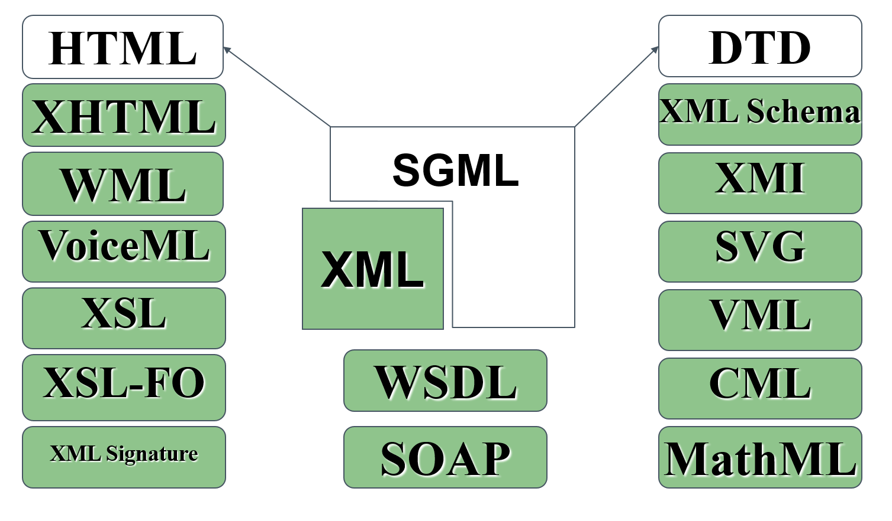

<!----------------- BEGIN SLIDE 001 -------------------------->
> 001


#  eXtensible Markup Language (XML)    

**Concetti di base**


Giuseppe Della Penna

Università degli Studi di L'Aquila    
giuseppe.dellapenna@univaq.it    
http://people.disim.univaq.it/dellapenna

**Versione documento: 051025**

> *Questo documento si basa sulle slide del corso di Web Engineering, riorganizzate per una migliore esperienza di lettura. Non è un libro di testo completo o un manuale tecnico, e deve essere utilizzato insieme a tutti gli altri materiali didattici del corso. Si prega di segnalare eventuali errori o omissioni all'autore.*

> Quest'opera è rilasciata con licenza CC BY-NC-SA 4.0. Per visualizzare una copia di questa licenza, visitate il sito https://creativecommons.org/licenses/by-nc-sa/4.0

<!----------------- BEGIN TOC -------------------------->

 - [1. Introduzione a XML](#1-introduzione-a-xml)

    - [1.1. La Famiglia di XML](#11-la-famiglia-di-xml)

    - [1.2. XML: Vantaggi e Svantaggi](#12-xml-vantaggi-e-svantaggi)

    - [1.3. XML: Applicazioni](#13-xml-applicazioni)

    - [1.4. Un Esempio di Documento XML](#14-un-esempio-di-documento-xml)

 - [2. La Struttura di un Documento XML](#2-la-struttura-di-un-documento-xml)

 - [3. Prologo: Dichiarazione XML](#3-prologo-dichiarazione-xml)

    - [3.1. Codifica del testo](#31-codifica-del-testo)

    - [3.2. Unicode](#32-unicode)

 - [4. Document Type Definitions e grammatiche XML](#4-document-type-definitions-e-grammatiche-xml)

 - [5. Prologo: Dichiarazione DOCTYPE](#5-prologo-dichiarazione-doctype)

 - [6. Elementi](#6-elementi)

    - [6.1. Struttura](#61-struttura)

    - [6.2. Regole di Base](#62-regole-di-base)

    - [6.3. Sintassi](#63-sintassi)

    - [6.4. Gerarchia](#64-gerarchia)

 - [7. Attributi](#7-attributi)

    - [7.1. Regole di Base](#71-regole-di-base)

    - [7.2. Sintassi](#72-sintassi)

 - [8. Namespaces](#8-namespaces)

    - [8.1. Sintassi](#81-sintassi)

 - [9. Entità](#9-entità)

    - [9.1. Uso](#91-uso)

    - [9.2. Sintassi](#92-sintassi)

 - [10. Testo](#10-testo)

 - [11. Sezioni CDATA](#11-sezioni-cdata)

 - [12. Processing Instructions](#12-processing-instructions)

 - [13. Commenti](#13-commenti)

 - [14. Validazione di Documenti XML](#14-validazione-di-documenti-xml)

 - [15. Riferimenti](#15-riferimenti)


<!------------------- END TOC -------------------------->

<!------------------- END SLIDE 001 -------------------------->

<!----------------- BEGIN SLIDE 002 -------------------------->
> 002

## 1. Introduzione a XML


XML è un metalinguaggio, cioè un linguaggio sulla cui base vengono creati nuovi linguaggi.

In particolare, XML definisce le regole di base per la creazione **di linguaggi markup**, cioè linguaggi il cui contenuto (testuale) è strutturato tramite particolari delimitatori detti tag.

XML deriva da SGML, un altro metalinguaggio noto ma diffuso solo in ambienti professionali (coe l'editoria).

Rispetto a SGML, XML è stato notevolmente **semplificato** e sono state aggiunte piccole **estensioni** per renderne l'uso più agevole.

<!------------------- END SLIDE 002 -------------------------->

<!----------------- BEGIN SLIDE 003 -------------------------->
> 003

### 1.1. La Famiglia di XML




<!------------------- END SLIDE 003 -------------------------->

<!----------------- BEGIN SLIDE 004 -------------------------->
> 004

### 1.2. XML: Vantaggi e Svantaggi

XML è semplice da imparare e usare:

- XML permette agli sviluppatori di creare facilmente **linguaggi ad-hoc** per contenere informazione strutturata.

- XML è completamente **text-based** , quindi leggibile anche dagli esseri umani e facilmente editabile anche a mano. Supporta UNICODE, quindi è adatto a ogni tipo di scrittura.

- Le strutture definite con XML sono utili anche per creare **strutture dati** indipendenti dalla piattaforma ed auto-descrittive.

- **L'elaborazione automatica** di un linguaggio XML è particolarmente semplice ed efficiente. Le rigide regole di formato e di identificazione dei linguaggi basati su XML ne rendono il trattamento automatico molto conveniente.

- Essendo puro testo (strutturati esattamente come HTML), i dati XML possono essere trasportati usando il **protocollo HTTP** anche attraverso firewall (SOAP, servizi web).

<!------------------- END SLIDE 004 -------------------------->

<!----------------- BEGIN SLIDE 005 -------------------------->
> 005

D'altra parte, XML introduce alcune nuove problematiche realtive alla complessità:

- I documenti XML, a causa della loro struttura testuale e dei tag, tendono ad essere molto più ingombranti dei corrispondenti in formato binario.

- Le librerie di manipolazione XML non sono veloci come i parser scritti ad-hoc per formati specifici, soprattutto se binari.  

- In generale, quindi, l'uso di XML si presenta più oneroso in termini di risorse necessarie (tempi di trasmissione, memoria e tempo CPU necessari alla sua decodifica, ecc.)

<!------------------- END SLIDE 005 -------------------------->

<!----------------- BEGIN SLIDE 006 -------------------------->
> 006

### 1.3. XML: Applicazioni


Nonostante gli svantaggi visti, l'uso di XML è diffusissimo:

- **Web Services**    
SOAP, WSDL, …

- **Science**   
MathML, CML,… 

- **Web and Publishing**     
XHTML, WML, VoiceML, XSL, XSL-FO, …  

- **Multimedia**    
SMIL, SVG,…

- **Definition of formal structures**       
XMLSchema, XMI,… 

- **Security**    
XML Encryption, XML Signature   

<!------------------- END SLIDE 006 -------------------------->

<!----------------- BEGIN SLIDE 007 -------------------------->
> 007

### 1.4. Un Esempio di Documento XML


```xml
<?xml version="1.0" encoding="UTF-8"?>    
<?xml-stylesheet type="text/xsl" href="C:\Documenti\Collection.xsl"?>        
<!DOCTYPE collection SYSTEM "C:\DocumentiCollection.dtd">  
<collection xmlns="www.univaq.it/~gdellape/esempio/">        
 <CD owner="giuseppe">       
  <song album="darkside" track="13">         
   <title>Eclipse</title>       
   <length>67</length>       
  </song>   
  <song album="darkside" track="6">         
   <artist>Gilmour, Wright</artist>       
   <title>Time</title>       
   <length>120</length>     
   <comment> <!CDATA[Time has gone…]]></comment>           
  </song>   
  <album ID="darkside">      
    <artist>Pink Floyd</artist>       
    <title>The Dark Side of the Moon</title>       
    <year>1963</year>       
  </album>   
 </CD>   
</collection>  
```

<!------------------- END SLIDE 007 -------------------------->

<!----------------- BEGIN SLIDE 008 -------------------------->
> 008

## 2. La Struttura di un Documento XML


Un documento XML è composto da un prologo e da un corpo

Il corpo del documento può contenere:

- **testo**, 

- **tag** (delimitatori della struttura),

- annotazioni (**commenti**),

- **processing instructions**   (indicazioni per l'elaborazione automatica),

- **entità** (simili da macro testuali)

- I tag possono anche contenere **attributi** e **namespaces**.

<!------------------- END SLIDE 008 -------------------------->

<!----------------- BEGIN SLIDE 009 -------------------------->
> 009

## 3. Prologo: Dichiarazione XML


```xml
<?xml version="1.0" encoding="UTF-8"?> 
```

<!----------------- COLUMN 001  -------------------------->

La prima riga del prologo è la **dichiarazione XML**, che è obbligatoria e deve essere posta all'immediato inizio del documento. 

L'espressione `<?xml` è detta **tag di apertura** della dichiarazione XML. La dichiarazione è chiusa dal simbolo `?>`. 

All'interno della dichiarazione, troviamo due espressioni della forma **nome="valore"**. Questo tipo di notazione è usata per definire un **attributo** del tag in cui è contenuta. Un attributo modifica o completa il significato di un tag, ed è un concetto largamente usato in XML.

Gli attributi della dichiarazione XML sono:

- `version`: (obbligatorio) indica la versione di XML usata.

- `encoding`: (opzionale) è nome della codifica dei caratteri usata nel documento (default: UTF-8)

- `standalone`: (opzionale) se vale yes indica che il file non fa riferimento ad altri file esterni. (default: *no*)


<!------------------- END SLIDE 009 -------------------------->

<!----------------- BEGIN SLIDE 010 -------------------------->
> 010

### 3.1. Codifica del testo


**I documenti XML, sono costituiti soprattutto da testo**, per cui è importante capire come questo può essere rappresentato su una macchina.

Un **set di caratteri** (*character set* , *charset*) definisce l'insieme di caratteri (lettere, numeri, punteggiatura, simboli,…) necessari per un particolare scopo (non necessariamente legato alla trasmissione e conservazione digitale).  

Un **set di caratteri codificato**  è un set di caratteri a ciascuno dei quali è stato assegnato un numero univoco. Gli elementi di un set di caratteri codificato sono anche noti come       **code points** . Un code point, quindi, rappresenta la posizione di un carattere nel set di caratteri codificato: ad esempio, il code point per la lettera "á" nel set di caratteri codificati Unicode è 225.                

La **codifica dei caratteri** (*character* *encoding*) definisce infine il modo in cui il set di caratteri codificato (o meglio i suoi code point numerici) verranno mappati su bytes per essere salvati su supporti digitali e trasmessi in rete.          

Molti standard storici di codifica dei caratteri (ad esempio gli ISO 8859, ancora largamente diffusi) utilizzano un singolo byte per ogni code point che rappresenta semplicemente la posizione del carattere nel set. Ad esempio, la "A" nel set codificato ISO 8859-1 è il 65° carattere, ed è quindi codificata per la rappresentazione un byte con il valore di 65.                    

Quando si comunicano informazioni testuali è quindi necessario specificare il set in uso e il corrispondente encoding, in modo che tali caratteri possano essere rappresentati in modo affidabile.     

<!------------------- END SLIDE 010 -------------------------->

<!----------------- BEGIN SLIDE 011 -------------------------->
> 011

### 3.2. Unicode


Lo **Unicode Consortium**   ha definito un ampio set di caratteri che include tutti quelli necessari a qualsiasi sistema di scrittura nel mondo.          

Lo standard Unicode è fondamentale per l'architettura del Web e dei sistemi operativi, e sta gradualmente sostituendo i set di caratteri specifici creati in passato da diverse organizzazioni, quali l'ISO.      

I primi 65536 code points nel set di caratteri Unicode costituiscono il        **Basic Multilingual Plane**     (BMP), che include la maggior parte dei caratteri più comunemente usati. Sono inoltre disponibili circa un milione di code points aggiuntivi per        **caratteri supplementari**, comprese le emoji.  

Sebbene il set di caratteri Unicode sia unico, le codifiche disponibili sono più di una:   **UTF-8**, **UTF-16** e **UTF-32**. 

- UTF-8 utilizza  **un byte**  per rappresentare i caratteri nel set **ASCII**, **due byte** per i caratteri più comuni in altri alfabeti,  **tre byte** per il resto del BMP e  **quattro byte** per i caratteri supplementari.   

- UTF-16 utilizza 2 byte per qualsiasi carattere nel BMP e 4 byte per i caratteri supplementari.  

- UTF-32 utilizza 4 byte per tutti i caratteri. 

Quindi, sebbene il code point per la lettera "á" nel set di caratteri Unicode sia sempre 225, in UTF-8 è rappresentato da due byte.             

In HTML, e in generale su Internet, attualmente si considera come **standard lo Unicode con codifica UTF-8**.  

Incredibilmente, persino l'uso malizioso dei *character encoding*    Unicode può evidenziare **vulnerabilità** e permettere, ad esempio, il furto di informazioni.

**UTF-7, originariamente definito per codificare il solo BMP, permetteva codifiche alternative di caratteri ASCII come "\<" e "\>". Le vecchie versioni**  **di Internet Explorer** potevano essere indotte a interpretare una pagina come UTF-7, e in questo caso le sequenze +ADw- e +AD4-, che le maggior parte dei validatori tratta come come testo semplice, venivano trasformate in "\<" e "\>" permettendo attacchi                 **XSS**.

Poiché **molti caratteri di lingue diverse possono somigliarsi visivamente**, è possibile indurre un utente a navigare su un sito il cui indirizzo è visivamente simile a quello di un sito sicuro, anche se in realtà i caratteri in esso contenuti sono diversi, e quindi porteranno a un sito malevolo (attacchi di **omografia**), ad esempio usando il carattere cirillico "а" (Unicode 0430) invece di quello ASCII (Unicode 0041)         

<!------------------- END SLIDE 011 -------------------------->

<!----------------- BEGIN SLIDE 012 -------------------------->
> 012

## 4. Document Type Definitions e grammatiche XML


Ai documenti XML possono (e dovrebbero) essere associate delle specifiche che **definiscono formalmente il linguaggio** utilizzato nel documento e le sue regole sintattiche.

Il sistema predefinito in XML per creare queste specifiche è la *document type definition*     (DTD)

Se a un documento è associata una **DTD**, è necessario inserire nel prologo una dichiarazione DOCTYPE che dichiari l'associazione. Questa dichiarazione eredita la sintassi del corrispondente SGML.

Esistono tuttavia altri sistemi di definizione per le specifiche dei linguaggi XML, come gli **schemi**, che usano metodi di associazione diversi.

<!------------------- END SLIDE 012 -------------------------->

<!----------------- BEGIN SLIDE 013 -------------------------->
> 013

## 5. Prologo: Dichiarazione DOCTYPE

```java
<!DOCTYPE RootElement ExternalDTDReference [InternalDTDSubset ]>
```

La dichiarazione si apre con il tag `<!DOCTYPE` ed è chiusa dal simbolo `>`. Al suo interno appaiono i seguenti elementi.

- **RootElement** (obbligatorio) è il nome dell'elemento radice del documento, cioè il nome del tag che conterrà l'intero documento.

- **ExternalDTDReference** (opzionale) punta a un file che contiene la DTD vera e propria, e può valere:

    - `SYSTEM "uri"`, dove *uri* identifica un file esterno.

    - `PUBLIC "pubid" "uri"`  , dove *pubid* è un identificatore univoco per la DTD e *uri* punta a un file di riferimento che la contiene.  

- **InternalDTDSubset** *(opzionale)* è un DTD, o un suo frammento, che può essere specificato direttamente all'interno del documento.


<!------------------- END SLIDE 013 -------------------------->

<!----------------- BEGIN SLIDE 014 -------------------------->
> 014

## 6. Elementi


Gli **elementi** sono alla base della struttura dei documenti XML.

Un elemento è un **frammento di dati**, *limitato* ed *indentificato* (tramite un nome) da un tag.

Il contenuto di un elemento è tutto ciò che appare tra il suo tag di apertura e il suo tag di chiusura.

Gli elementi possono essere nidificati, cioè degli elementi possono far parte del contenuto di un elemento più esterno.

<!------------------- END SLIDE 014 -------------------------->

<!----------------- BEGIN SLIDE 015 -------------------------->
> 015

### 6.1. Struttura


<!------------------- END SLIDE 015 -------------------------->

<!----------------- BEGIN SLIDE 016 -------------------------->
> 016

### 6.2. Regole di Base


I nomi degli elementi sono **case-sensitive**.

**Ogni elemento deve essere chiuso**, cioè il suo tag di chiusura deve apparire prima della fine del documento.

Nel caso di elementi nidificati, **i tag di chiusura devono apparire in ordine inverso a quello di apertura**, cioè i contenuti degli elementi non si possono "accavallare".

Ogni documento XML deve avere un unico elemento "**radice**", in cui tutti gli altri sono nidificati.

<!------------------- END SLIDE 016 -------------------------->

<!----------------- BEGIN SLIDE 017 -------------------------->
> 017

### 6.3. Sintassi


```xml
[1] <nome>  
   
[2] </nome>  

[3] <nome/>  

<a>
 <b/>
 <c>
  Text 
  <d>
   <e/>
  </d>
 </c>
</a>
```

<!----------------- COLUMN 001  -------------------------->

Il tag di apertura di un elemento ha la forma mostrata in (1), dove *nome* è il nome dell'elemento. Il corrispondente tag di chiusura è mostrato in (2)  

Infine, alcuni elementi possono essere privi di contenuto: in questo caso è possibile omettere il tag di chiusura scrivendo quello di apertura nella forma abbreviata mostrata in (3).

<!------------------- END SLIDE 017 -------------------------->

<!----------------- BEGIN SLIDE 018 -------------------------->
> 018

### 6.4. Gerarchia


```xml
<a>
  <b>
   Testo 
  </b>
  <c>
   <d/>
  </c>
</a>
```

<!----------------- COLUMN 001  -------------------------->

Gli elementi, nidificandosi, creano la **struttura ad albero** tipica dei documenti XML.

All'interno di questa struttura si definiscono alcuni "rapporti di parentela" utili per individuare gli elementi:

- *a* è il nodo **radice**

- *b* e *c* sono **figli** di *a*, il *testo* è figlio di *b*, *d* è figlio di *c*

- *c* è il **genitore** di *d*, *b* è il genitore del *testo*, *a* è il genitore di *b* e *c*

- *b* e *c* sono **fratelli**

- *b*, *c*, *d* e il *testo* sono **discendenti** di *a*, *d* è un discendente di *c*, il *testo* è un discendente di *b*

- *a* è un **predecessore** di *b*, *c*, *d* e del *testo*, *b* è un predecessore del *testo*, *c* è un predecessore di *d*.

<!------------------- END SLIDE 018 -------------------------->

<!----------------- BEGIN SLIDE 019 -------------------------->
> 019

## 7. Attributi


Gli attributi permettono di specificare **proprietà degli elementi**, modificandone o meglio definendone il significato.

Gli attributi vengono **inseriti all'interno dei tag di apertura** degli elementi.

**L'ordine** con cui gli attributi appaiono nel tag di apertura non è considerato significativo.

Il valore di un attributo deve essere **semplice**: in caso contrario è meglio usare un elemento nidificato per contenerlo.

<!------------------- END SLIDE 019 -------------------------->

<!----------------- BEGIN SLIDE 020 -------------------------->
> 020

### 7.1. Regole di Base


I nomi degli attributi sono **case-sensitive**.

Lo stesso elemento non può contenere due attributi con lo stesso nome.

Non sono ammessi attributi senza valore (solo nome).

Il valore degli attributi deve essere specificato **tra virgolette semplici o doppie**.

Il valore può contenere **riferimenti ad entità** ma nessun altra struttura XML (elementi, processing instructions, ecc...).  

<!------------------- END SLIDE 020 -------------------------->

<!----------------- BEGIN SLIDE 021 -------------------------->
> 021

### 7.2. Sintassi


```xml
[1] <tag attributo="valore">     

[2] <tag attr1="val1" attr2="val2">     

[3] <tag attributo=' "valore" '>   


<a x="txt" y="2">  
 <c> Testo
  <d>
   <e z="abc123"/>
  </d>
 </c>
</a>
```

<!----------------- COLUMN 001  -------------------------->

La sintassi di base per un attributo inserito nel tag di apertura di un elemento è mostrata in (1)

Per specificare più attributi è sufficiente elencarli separandone la definizione con uno o più spazi come mostrato in (2) 

Per includere virgolette nel valore, è necessario usare un tipo diverso da quello usato per delimitare il valore stesso (3) 

<!------------------- END SLIDE 021 -------------------------->

<!----------------- BEGIN SLIDE 022 -------------------------->
> 022

## 8. Namespaces


I namespaces servono a dichiarare **l'appartenenza di elementi e attributi a un particolare linguaggio** XML, fornendone una semantica. 

Sono particolarmente utili se **più linguaggi vengono mescolati nello stesso documento**, con possibili di collisioni tra nomi.

Le **dichiarazioni di namespace** sono inserite nei tag di apertura, in modo simile a un attributo, e sono valide per l'elemento e il suo contenuto.

<!------------------- END SLIDE 022 -------------------------->

<!----------------- BEGIN SLIDE 023 -------------------------->
> 023

### 8.1. Sintassi


```xml
[1] <tag xmlns:prf="uri">      

[2] <tag xmlns="uri">      

[3] <tag xmlns="uri" xmlns:prf="uri">       
```

<!----------------- COLUMN 001  -------------------------->

Le dichiarazione di namespace esplicito (1), inserita in un tag di apertura, indica che tutti gli elementi il cui nome è prefissato da "*prf*: " (prefisso di namespace) andranno considerati appartenenti al namespace identificato da *uri*.

La speciale dichiarazione di namespace standard (2) indica il namespace di appartenenza per tutti gli elementi privi di un prefisso esplicito di namespace.

In ogni elemento si possono dichiarare più prefissi di namespace espliciti, ma solo un namespace di default (3)

Gli uri usati nelle dichiarazioni sono solo identificatori convenzionali per associati ai diversi namespaces, e non puntano ad alcuna informazione particolare.  

<!------------------- END SLIDE 023 -------------------------->

<!----------------- BEGIN SLIDE 024 -------------------------->
> 024

####  Esempi


```xml
<a xmlns="ns1" xmlns:html="ns2">
 <b/>
 <html:p>< html:b>testo</ html:b> 
  <c xmlns="ns3" ><d/></c>
  <d/>
  <e xmlns:xsl="ns4" xsl:attr="val"> 
   <xsl:f>text</ xsl:f> 
  </e>
 </html:p> 
</a>
```

<!----------------- COLUMN 001  -------------------------->

Saper manipolare e comprendere i namespace è importante per poter gestire i documenti XML complessi e la loro semantica.  

In questo esempio:

- Il namespace "*ns1*" contiene gli elementi *a*, *b*, *d*, *e*.  

- Il namespace "*ns2*" contiene gli elementi *html:p*, *html:b*.    

- Il namespace "*ns3*" contiene gli elementi *c* e *d*.  

- Il namespace "*ns4*" contiene l'elemento *xsl:f* e l'attributo *xsl:attr*.    

*Notare che esistono due elementi d nel documento, appartenenti a namespace diversi*.   

<!------------------- END SLIDE 024 -------------------------->

<!----------------- BEGIN SLIDE 025 -------------------------->
> 025

## 9. Entità


Nel gergo XML, i documenti sono costituiti da una serie di *entità*. 

Ogni carattere è una *character entity*, ogni tag è un'entità e il documento stesso è un'entità.    

Ogni entità, tranne il documento e il DTD esterno, ha un nome.

Le entità si distinguono in *parsed* e *unparsed*:

- Ogni entità *parsed* ha un suo corrispondente valore testuale. Il parser XML sostituisce l'entità col suo valore quando analizza il documento.    

- Una entità *unparsed*, invece, non viene sostituita dal parser, e può avere un valore anche non testuale, accessibile tramite le *notazioni*.    

<!------------------- END SLIDE 025 -------------------------->

<!----------------- BEGIN SLIDE 026 -------------------------->
> 026

### 9.1. Uso


Le entità parsed sono un modo pratico per inserire stringhe nel documento facendo riferimento a una definizione esterna, invece di scriverle esplicitamente.

Sono utili nel caso ci siano **caratteri non digitabili** direttamente, o per **espandere stringhe** usate di frequente, oppure per scrivere **caratteri che non sono ammessi in maniera esplicita in un contesto**, perché riservati (come le virgolette o i simboli '\<' e '\>').

<!------------------- END SLIDE 026 -------------------------->

<!----------------- BEGIN SLIDE 027 -------------------------->
> 027

### 9.2. Sintassi


```xml
[1] &nome; 

[2] &#numero; 

[3] &#xnumero;  


&gt;   =  >    
&lt;   = <  
&quot; =  "    
&amp;  =  &    
&#32;  =  [spazio]     
&#x20; =  [spazio]   
```

<!----------------- COLUMN 001  -------------------------->

Nel caso delle entità **parsed**:

- Le **entità generali**, che possono rappresentare stringhe qualsiasi, sono definite nel DTD e si richiamano nel documento XML con la sintassi (1), dove *nome* è il nome dell'entità.

- Le **entità carattere**, che rappresentano singoli caratteri UNICODE, si richiamano con la sintassi (2), dove numero è il codice decimale UNICODE per il carattere, oppure con la sintassi (3), dove numero è il codice esadecimale UNICODE per il carattere.

<!------------------- END SLIDE 027 -------------------------->

<!----------------- BEGIN SLIDE 028 -------------------------->
> 028

## 10. Testo


Il testo inseribile nei documenti XML comprende tutti i caratteri **definiti nel set di caratteri dichiarato nel documento**.

È possibile inserire caratteri speciali o riservati tramite **entità carattere**.

È possibile inserire stringhe predefinite tramite **entità generali**.

**Non è possibile usare esplicitamente i caratteri '\>', '\<' e '&'**, per i quali è sempre necessario usare le corrispondenti entità carattere.

<!------------------- END SLIDE 028 -------------------------->

<!----------------- BEGIN SLIDE 029 -------------------------->
> 029

## 11. Sezioni CDATA


```xml
<![CDATA[ 
<< &pippo;   
solo testo!<
>> 
]]>
```

<!----------------- COLUMN 001  -------------------------->

Le sezioni CDATA di definire esplicitamente **aree in cui si trova solo testo**.

All'interno delle sezioni CDATA il parser non effettua alcuna operazione di riconoscimento ed espansione per elementi, attributi, entità e altre strutture XML  

Il tag di apertura di una sezione CDATA è la stringa `<![CDATA[`, mentre il tag d chiusura è `]]>`, che ovviamente non può comparire nel contenuto.

<!------------------- END SLIDE 029 -------------------------->

<!----------------- BEGIN SLIDE 030 -------------------------->
> 030

## 12. Processing Instructions


Le Processing Instructions (PI) vengono usate per   **passare informazioni extra ai programmi che manipoleranno il file XML** e possono apparire ovunque nel documento.

La forma generale di una PI prevede un tag di apertura del tipo `<?target`, dove *target* identifica quale applicazione dovrà elaborare la processing instruction, e un tag di chiusura `?>`.   

Notare che la dichiarazione XML non è altro che una processing instruction.  

All'interno del tag è possibile scrivere qualsiasi tipo di dati testuali. L'unica regola è che i dati non possono contenere la sequenza "?\>". I due esempi riportati sotto sono rispettivamente (1) la PI che associa a un documento il suo foglio di stile XSL e (2) uno script PHP.

-------
<!----------------- COLUMN 001  -------------------------->

```java
<?xml-stylesheet type="text/xsl" href="sms_pdf.xslt"?>      
<?php echo "hello" ?>  
```

```java
<?target  data ?>
```

<!------------------- END SLIDE 030 -------------------------->

<!----------------- BEGIN SLIDE 031 -------------------------->
> 031

## 13. Commenti

```java
<!-- Questo è un commento XML (e SGML) -->    
```

I commenti sono utili agli esseri umani, e vengono ignorati dai programmi di manipolazione XML. 

I commenti possono apparire ovunque, tranne che all'interno del valore di un attributo.

I commenti XML seguono la sintassi SGML, e sono quindi identici a quelli usati, ad esempio, in HTML.

Il tag di apertura di un commento è la sequenza `<!--`, mentre il tag di chiusura è la sequenza `-->`

Il contenuto del commento è testo generico, che non deve però contenere la sequenza di chiusura.


<!------------------- END SLIDE 031 -------------------------->

<!----------------- BEGIN SLIDE 032 -------------------------->
> 032

## 14. Validazione di Documenti XML


**Un documento XML è** ***ben formato*** se rispetta le regole generali di sintassi viste nella parte precedente.

**Un documento XML è** ***valido*** se è ben formato e rispetta le regole sintattiche e semantiche contenute del DTD associato. *Un documento senza DTD non è mai valido*.

Esistono **parser validanti e non validanti** . Questi ultimi possono ignorare tutto l'eventuale DTD, tranne le dichiarazioni di entità generali.

<!------------------- END SLIDE 032 -------------------------->

<!----------------- BEGIN SLIDE 033 -------------------------->
> 033

## 15. Riferimenti


**Specifica di XML dal W3C**    
http://www.w3c.org/TR/XML/  

<!------------------- END SLIDE 033 -------------------------->

